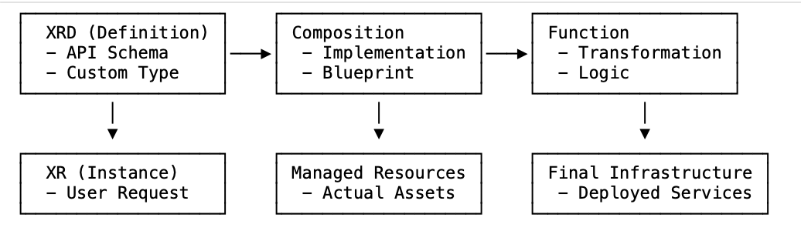

---
products:
   - Alauda Container Platform
kind:
   - Solution
ProductsVersion:
   - 4.x
id: 虚位以待
---

# Best Practices for Developing Custom Components and Application with Crossplane

## Objective
Crossplane empowers users to manage all infrastructure through familiar Kubernetes constructs, aiming to promote the adoption and practice of Infrastructure as Code (IaC) in multi-cloud and hybrid cloud environments. By utilizing Kubernetes YAML for resource definitions, Crossplane enables the simultaneous deployment of applications and their dependent infrastructure. Deployments are performed using `kubectl`, ensuring secure and efficient data sharing.

To allow developers to focus more on application logic, this document will explain how to use Crossplane to develop custom components for packaging application models. Ultimately, this enables developers to flexibly and efficiently build and deploy applications without needing to understand the underlying implementation details of the cloud resources.

## Prerequisites
 - Install Crossplane. Please refer to [How to Install Crossplane](How_to_Install_Crossplane.md) for installation steps.
 - Learn more about [Build custom APIs by composing Kubernetes resources](https://docs.crossplane.io/latest/composition/).

## Guide
This guide shows how to create a new kind of custom resource named App. When a user calls the custom resource API to create an App, Crossplane creates a Deployment and a Service.

Crossplane calls this Composition. The App is composed of the Deployment and the Service.
> Tip: The guide shows how to configure Composition using YAML, templated YAML, Python, and KCL. You can pick your preferred language.

Crossplane builds on Kubernetes, so users can use kubectl or any other tool from the Kubernetes ecosystem to work with apps.
> Tip: Kubernetes custom resources are just JSON REST APIs, so users can use any tool that supports REST APIs to work with apps.

### Crossplane Core Components Relationship

#### Concise Description:
- **Composite Resource Definition (XRD)** defines the schema and API for a custom infrastructure type.
- **Composite Resource (XR)** is an instance created from XRD, representing user's infrastructure request.
- **Composition** defines the implementation blueprint - how to transform XR into actual resources.
- **Function** executes the transformation logic within Composition's pipeline.

#### Component Relationship Diagram


> Flow: XRD defines what can be requested → Users create XR instances → Composition uses Functions to transform XR into real infrastructure.

### Create the custom resource 

#### Define the schema
Crossplane calls a custom resource that’s powered by Composition a Composite Resource (XR).
> Note:
>
> Kubernetes calls user-defined API resources custom resources.
>
> Crossplane calls user-defined API resources that use Composition Composite Resources (XRs).
>
> A Composite Resource (XR) is a kind of custom resource.

Create this Composite Resource Definition (XRD) to define the schema of the new App Composite Resource (XR).
```yaml
apiVersion: apiextensions.crossplane.io/v2
kind: CompositeResourceDefinition
metadata:
  name: apps.example.crossplane.io
spec:
  scope: Namespaced
  group: example.crossplane.io
  names:
    kind: App
    plural: apps
  versions:
  - name: v1
    served: true
    referenceable: true
    schema:
     openAPIV3Schema:
       type: object
       properties:
        spec:
          type: object
          properties:
            image:
              description: The app's OCI container image.
              type: string
          required:
          - image
        status:
          type: object
          properties:
            replicas:
              description: The number of available app replicas.
              type: integer
            address:
              description: The app's IP address.
              type: string
```
Save the XRD as xrd.yaml and apply it:
```bash
$ kubectl apply -f xrd.yaml
```
Check that Crossplane has established the XRD:
```bash
$ kubectl get -f xrd.yaml
NAME                         ESTABLISHED   OFFERED   AGE
apps.example.crossplane.io   True                    21s
```
Now that Crossplane has established the XRD, Kubernetes is serving API requests for the new App XR.
Crossplane now knows it’s responsible for the new App XR, but it doesn’t know what to do when you create or update one.

#### Install the Function
You can use different Composition functions to configure what Crossplane does when someone creates or updates a Composite Resource (XR). Composition functions are like configuration language plugins.

Pick what language to use to configure how Crossplane turns an App XR into a Deployment and a Service.

YAML is a good choice for small, static compositions. It doesn’t support loops or conditionals.

Create this Composition Function to install YAML support:
```yaml
apiVersion: pkg.crossplane.io/v1
kind: Function
metadata:
  name: crossplane-contrib-function-patch-and-transform
spec:
  package: xpkg.crossplane.io/crossplane-contrib/function-patch-and-transform:v0.8.2
```
Save the Function as fn.yaml and apply it:
```bash
$ kubectl apply -f fn.yaml
```
Check that Crossplane installed the Function:
```bash
$ kubectl get -f fn.yaml
NAME                                              INSTALLED   HEALTHY   PACKAGE                                                                     AGE
crossplane-contrib-function-patch-and-transform   True        True      xpkg.crossplane.io/crossplane-contrib/function-patch-and-transform:v0.8.2   10s
```

#### Configure the Composition
A composition tells Crossplane what functions to call when you create or update a Composite Resource (XR).

Create a Composition to tell Crossplane what to do when you create or update an App XR.

Create this Composition to use YAML to configure Crossplane:
```yaml
apiVersion: apiextensions.crossplane.io/v1
kind: Composition
metadata:
  name: app-yaml
spec:
  compositeTypeRef:
    apiVersion: example.crossplane.io/v1
    kind: App
  mode: Pipeline
  pipeline:
  - step: create-deployment-and-service
    functionRef:
      name: crossplane-contrib-function-patch-and-transform
    input:
      apiVersion: pt.fn.crossplane.io/v1beta1
      kind: Resources
      resources:
      - name: deployment
        base:
          apiVersion: apps/v1
          kind: Deployment
          spec:
            replicas: 2
            template:
              spec:
                containers:
                - name: app
                  command:
                  - /bin/sh
                  - -c
                  - sleep 1000000
                  ports:
                  - containerPort: 80
        patches:
        - type: FromCompositeFieldPath
          fromFieldPath: metadata.name
          toFieldPath: metadata.labels[example.crossplane.io/app]
        - type: FromCompositeFieldPath
          fromFieldPath: metadata.name
          toFieldPath: spec.selector.matchLabels[example.crossplane.io/app]
        - type: FromCompositeFieldPath
          fromFieldPath: metadata.name
          toFieldPath: spec.template.metadata.labels[example.crossplane.io/app]
        - type: FromCompositeFieldPath
          fromFieldPath: spec.image
          toFieldPath: spec.template.spec.containers[0].image
        - type: ToCompositeFieldPath
          fromFieldPath: status.availableReplicas
          toFieldPath: status.replicas
        readinessChecks:
        - type: MatchCondition
          matchCondition:
            type: Available
            status: "True"
      - name: service
        base:
          apiVersion: v1
          kind: Service
          spec:
            ports:
            - protocol: TCP
              port: 8080
              targetPort: 80
        patches:
        - type: FromCompositeFieldPath
          fromFieldPath: metadata.name
          toFieldPath: metadata.labels[example.crossplane.io/app]
        - type: FromCompositeFieldPath
          fromFieldPath: metadata.name
          toFieldPath: spec.selector[example.crossplane.io/app]
        - type: ToCompositeFieldPath
          fromFieldPath: spec.clusterIP
          toFieldPath: status.address
        readinessChecks:
        - type: NonEmpty
          fieldPath: spec.clusterIP
```
Save the Composition as composition.yaml and apply it:
```bash
$ kubectl apply -f composition.yaml
```
> Note:
>
> A composition can include multiple functions.
>
> Functions can change the results of earlier functions in the pipeline. Crossplane uses the result returned by the last function.

> Tip: If you edit this Composition to include a different kind of resource you might need to grant Crossplane access to compose it. Read more about [How to grant Crossplane access](https://docs.crossplane.io/latest/composition/compositions/#grant-access-to-composed-resources)

#### Use the custom resource
Crossplane now understands App custom resources.

Create an App:
```yaml
apiVersion: example.crossplane.io/v1
kind: App
metadata:
  namespace: default
  name: my-app
spec:
  image: <platform-registry-address>/ops/alpine:3
```
(Replace <platform-registry-address> with your actual registry address. The platform registry address can be obtained from the `global` cluster details page at: [Administrator] -> [Clusters] -> [Clusters] -> [global])

Save the App as app.yaml and apply it:
```bash
$ kubectl apply -f app.yaml
```
Check that the App is ready:
```bash
$ kubectl get -f app.yaml
NAME     SYNCED   READY   COMPOSITION   AGE
my-app   True     True    app-yaml      56s
```

> Note:

> The COMPOSITION column shows what Composition the App is using.

> You can create multiple compositions for each kind of XR. Read the [XR page](https://docs.crossplane.io/latest/composition/composite-resources/) to learn how to select which composition Crossplane uses.

Check that Crossplane created a Deployment and a Service:
```bash
$ kubectl get deploy,service -l example.crossplane.io/app=my-app
NAME                           READY   UP-TO-DATE   AVAILABLE   AGE
deployment.apps/my-app-2r2rk   2/2     2            2           11m

NAME                   TYPE        CLUSTER-IP     EXTERNAL-IP   PORT(S)    AGE
service/my-app-xfkzg   ClusterIP   10.96.148.56   <none>        8080/TCP   11m
```
> Tip:
>
> Use kubectl edit -f app.yaml to edit the App’s image. Crossplane updates the Deployment’s image to match.

Delete the App:
```bash
kubectl delete -f app.yaml
```
When you delete the App, Crossplane deletes the Deployment and Service.
