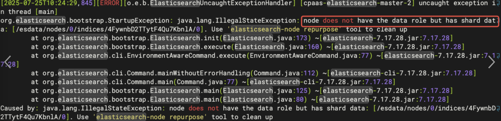

# How to Correct the Issue of Node Role Settings in Big Cluster ElasticSearch

## Issue

The Big Cluster ElasticSearch upgrade from ACP version 3.18.2 to ACP version 4.x will have the following failures: `node does not have the data role but has shard data`


It is necessary to use this solution to correct node roles setting before the upgrade

## Environment

v3.18.2

## Diagnostic Steps

Step 0: Prepare ElasticSearch connection info

```shell
# Log in to a master node in cluster
 
# Retrieve ElasticSearch connection details and credentials
ES_HOST=$(kubectl -n cpaas-system get feature log-center -o jsonpath='{.spec.accessInfo.elasticsearch.address}')
USERNAME=$(kubectl -n cpaas-system get secrets elasticsearch-basic-auth -o yaml | grep username | awk '{print $2}' | base64 -d)
PASSWORD=$(kubectl -n cpaas-system get secrets elasticsearch-basic-auth -o yaml | grep password | awk '{print $2}' | base64 -d)

```

Step 1: Ensure ElasticSearch is ready

```shell
# Log in to a master node in cluster
 
# Use _cluster/health to ensure ElasticSearch is green
curl -sk -u $USERNAME:$PASSWORD "$ES_HOST/_cluster/health?pretty"
```

Step 2: Modify the roles of cpaas-elasticsearch to data

```shell
# Edit statefulset cpaas-elasticsearch roles to data
kubectl edit sts -n cpaas-system cpaas-elasticsearch
 
apiVersion: apps/v1
kind: StatefulSet
metadata:
  annotations:
    configmap.reloader.stakater.com/reload: es-config-v7
    secret.reloader.stakater.com/reload: elasticsearch-basic-auth,elasticsearch-node0-cert
  labels:
    service_name: cpaas-elasticsearch
  name: cpaas-elasticsearch
  namespace: cpaas-system
spec:
  .......
  template:
    metadata:
      creationTimestamp: null
      labels:
        cluster_name: cpaas-elasticsearch
        cpaas.io/product: Platform-Center
        service_name: cpaas-elasticsearch
      namespace: cpaas-system
    spec:
      affinity:
        podAffinity: {}
        podAntiAffinity:
          requiredDuringSchedulingIgnoredDuringExecution:
          - labelSelector:
              matchExpressions:
              - key: service_name
                operator: In
                values:
                - cpaas-elasticsearch
            topologyKey: kubernetes.io/hostname
      automountServiceAccountToken: false
      containers:
      - env:
        - name: CPU_LIMIT
          valueFrom:
            resourceFieldRef:
              containerName: cpaas-elasticsearch
              divisor: "0"
              resource: limits.cpu
        - name: MEM_LIMIT
          valueFrom:
            resourceFieldRef:
              containerName: cpaas-elasticsearch
              divisor: "0"
              resource: limits.memory
#        - name: node.data                          # Remove
#          value: "true"                            # Remove
#        - name: node.master                        # Remove
#          value: "false"                           # Remove
        - name: node.roles                          # Add
          value: "data"                             # Add  
        - name: ALAUDA_ES_CLUSTERS
          value: 192.168.132.253,192.168.134.8,192.168.139.41
        - name: COMP_NAME
          value: elasticsearch
        - name: ES_JAVA_OPTS
        - name: HOST_IP
          valueFrom:
            fieldRef:
              apiVersion: v1
              fieldPath: status.podIP
        - name: MAX_USED_PERCENT
          value: "80"
        - name: STAKATER_ELASTICSEARCH_NODE0_CERT_SECRET
          value: efc426f206130a89261b082a9f6b48d677b0fd63
  ......
 
 
# Wait the pod running
 
# Check the roles is data
curl -sk -u $USERNAME:$PASSWORD "$ES_HOST/_nodes/cpaas-elasticsearch-0?pretty" | grep -A10 roles
```

Step 3: Prohibit the allocation of shards to the master node

```shell
# Get all the master node
ES_MASTER_NODES=$(kubectl get po -n cpaas-system --no-headers -o custom-columns=":metadata.name" | grep 'cpaas-elasticsearch-master' | paste -sd, -)
 
# Prohibit the allocation of shards to the master node
curl -sk -X PUT -u $USERNAME:$PASSWORD "$ES_HOST/_cluster/settings" -H 'Content-Type: application/json' -d "{\"transient\": {\"cluster.routing.allocation.exclude._name\": \"$ES_MASTER_NODES\"}}"
 
# Check the cluster settings have been set
curl -sk -u $USERNAME:$PASSWORD "$ES_HOST/_cluster/settings?pretty"
```

Step 4: Wait for allocation to complete

```shell
# Use the following command to view the shards allocation until there is no shards on the master node at all
curl -sk -u $USERNAME:$PASSWORD "$ES_HOST/_cat/shards?v" | grep cpaas-elasticsearch-master
```

Step 5: Modify the roles of cpaas-elasticsearch-master to master

```shell
# Edit statefulset cpaas-elasticsearch-master roles to master
kubectl edit sts -n cpaas-system cpaas-elasticsearch-master
 
apiVersion: apps/v1
kind: StatefulSet
metadata:
  annotations:
    configmap.reloader.stakater.com/reload: es-config-v7
    secret.reloader.stakater.com/reload: elasticsearch-basic-auth,elasticsearch-node0-cert
  creationTimestamp: "2025-08-04T02:10:29Z"
  generation: 3
  labels:
    service_name: cpaas-elasticsearch
  name: cpaas-elasticsearch-master
  namespace: cpaas-system
spec:
  ......
  template:
    metadata:
      creationTimestamp: null
      labels:
        cluster_name: cpaas-elasticsearch
        cpaas.io/product: Platform-Center
        service_name: cpaas-elasticsearch-master
      namespace: cpaas-system
    spec:
      affinity:
        podAffinity: {}
        podAntiAffinity:
          requiredDuringSchedulingIgnoredDuringExecution:
          - labelSelector:
              matchExpressions:
              - key: service_name
                operator: In
                values:
                - cpaas-elasticsearch-master
            topologyKey: kubernetes.io/hostname
      containers:
      - env:
#        - name: node.data                          # Remove
#          value: "false"                           # Remove
#        - name: node.master                        # Remove
#          value: "true"                            # Remove
        - name: node.roles                          # Add
          value: "master"                           # Add  
        - name: ALAUDA_ES_CLUSTERS
          value: 192.168.132.253,192.168.134.8,192.168.139.41
        - name: COMP_NAME
          value: elasticsearch
        - name: ES_JAVA_OPTS
        - name: HOST_IP
          valueFrom:
            fieldRef:
              apiVersion: v1
              fieldPath: status.podIP
        - name: MAX_USED_PERCENT
          value: "80"
        - name: STAKATER_ELASTICSEARCH_NODE0_CERT_SECRET
          value: efc426f206130a89261b082a9f6b48d677b0fd63
  ......
 
 
# Wait the pod running
 
# Check the roles is master
curl -sk -u $USERNAME:$PASSWORD "$ES_HOST/_nodes/cpaas-elasticsearch-master-0?pretty" | grep -A10 roles
```

Step 6: Restore the prohibition of allocating shards to the master node

```shell
# Restore the prohibition of allocating shards to the master node
curl -sk -X PUT -u $USERNAME:$PASSWORD "$ES_HOST/_cluster/settings" -H 'Content-Type: application/json' -d '{"transient": {"cluster.routing.allocation.exclude._name": null}}'
 
# Check the cluster settings have been restored
curl -sk -u $USERNAME:$PASSWORD "$ES_HOST/_cluster/settings?pretty"
```
