---
kind:
  - Solution
products:
  - Alauda Application Services
ProductsVersion:
  - 4.x
---

# Migrate resources from OCP to ACP (Move2Kube and Velero)

## Overview

This document provides a comprehensive guide for migrating resources from **Red Hat OpenShift (OCP)** to Alauda Container Platform (ACP). It covers key steps including resource transformation, data migration, and permission handling, helping teams achieve a smooth and rollback-capable migration.

## Applicable Scenarios

| Scenario | Applicable | Description |
|----------|------------|-------------|
| OCP → ACP (Alauda Container Platform) | ✅ | Applicable, ACP is based on K8s |
| Stateful Applications (StatefulSet/PVC) | ✅ | Supports PV data migration + fsGroup permission handling |
| Stateless Applications (Deployment) | ✅ | Fully supported |
| DeploymentConfig → Deployment | ✅ | Automatically converted by Move2Kube |
| Route → Gateway API (HTTPRoute/TLSRoute) | ✅ | Auto-conversion, supports passthrough TLS |
| Database Migration (MySQL/PostgreSQL/MongoDB) | ⚠️ | Recommended to use native backup tools, not Velero |
| Cache Migration (Redis/Memcached) | ❌ | Recommended to rebuild on target, no data migration needed |

## Migration Flow Overview

```mermaid
flowchart LR
    subgraph prep ["0. Prep (T-3)"]
        A[Tool Check] --> B[Velero Dual Install]
        B --> C[Inc. Backup Warm-up]
        C --> D[DNS TTL → 60s]
    end

    subgraph backup ["1. Backup"]
        E[Replica Snapshot] --> F[Hot Backup]
        F --> G[Shutdown]
    end

    subgraph transform ["2. Transform"]
        H[Export Resources] --> I[Move2Kube]
        I --> J[Starlark Post-proc]
        J --> K[Route→Gateway]
    end

    subgraph restore ["3. Restore"]
        L[Modifier Config] --> M[SC Mapping]
        M --> N[Velero Restore]
        N --> O[Clean Temp Pods]
    end

    subgraph deploy ["4. Deploy"]
        P[kubectl apply]
    end

    subgraph cutover ["5. Cutover"]
        Q[Status Verify] --> R[DNS Switch]
        R --> S[✅ Done]
    end

    prep --> backup --> transform --> restore --> deploy --> cutover

    style prep fill:#e1f5fe
    style backup fill:#fff3e0
    style transform fill:#f3e5f5
    style restore fill:#e8f5e9
    style deploy fill:#e3f2fd
    style cutover fill:#fce4ec
```



> [!NOTE] **Reading Guide**: Execute tasks in each phase from left to right. Each phase has detailed commands and verification steps.

## 0. Environment and Tool Preparation

### 0.1 Tool Check

Confirm installation on **Operation Machine (Bastion Host)**: `oc`, `kubectl`, `velero`, `move2kube`, `yq`.

**Download Links**:

- **oc**: [OpenShift Mirror](https://mirror.openshift.com/pub/openshift-v4/clients/ocp/latest/) (Note: Archive usually includes `kubectl`)
- **kubectl**: [Kubernetes Docs](https://kubernetes.io/docs/tasks/tools/)
- **velero CLI**: [GitHub Releases](https://github.com/vmware-tanzu/velero/releases)
- **move2kube**: [Konveyor Docs](https://move2kube.konveyor.io/installation/cli)
- **yq**: [GitHub Releases](https://github.com/mikefarah/yq/releases) or `brew install yq`

### 0.2 Velero Cluster Installation

:::info
Velero Server components must be installed on both **Source Cluster (OCP)** and **Target Cluster (ACP)**, and must use the **same Object Storage** (S3/MinIO) as the backup repository.
:::

#### OCP Cluster (Source)

**Recommended to use OADP (OpenShift API for Data Protection)**, which is the Red Hat officially supported Velero distribution:

```bash
# 1. Install OADP Operator
# Open OpenShift Console → Ecosystem → Software Catalog → Search "oadp" → Install

# 2. Create Credential Secret
oc create secret generic cloud-credentials -n openshift-adp \
  --from-file=cloud=<(cat <<EOF
[default]
aws_access_key_id=YOUR_ACCESS_KEY
aws_secret_access_key=YOUR_SECRET_KEY
EOF
)

# 3. Create DataProtectionApplication CR
cat << EOF | oc apply -f -
apiVersion: oadp.openshift.io/v1alpha1
kind: DataProtectionApplication
metadata:
  name: velero
  namespace: openshift-adp
spec:
  configuration:
    velero:
      defaultPlugins:
        - aws           # S3 compatible storage
        - openshift     # OCP specific resources
    nodeAgent:
      enable: true      # Enable Node Agent (File System Backup)
      uploaderType: kopia
  backupLocations:
    - velero:
        provider: aws
        default: true
        objectStorage:
          bucket: velero-backups
          prefix: migration
        config:
          region: us-east-1
          s3ForcePathStyle: "true"
          s3Url: https://minio.example.com  # Your S3/MinIO Address
        credential:
          name: cloud-credentials
          key: cloud
EOF

# 4. Verify Installation
oc get pods -n openshift-adp
```

#### ACP Cluster (Target)

Refer to [Velero installation docs](https://docs.alauda.io/container_platform/4.1/configure/backup/install.html) to install Velero, then configure BSL.

```bash
# 1. Create Secret for Object Storage Access (ak/sk must match source cluster)
cat <<EOF | kubectl apply -f -
apiVersion: v1
kind: Secret
metadata:
  name: cloud-credentials
  namespace: cpaas-system  # Velero namespace
type: Opaque
stringData:
  cloud: |
    [default]
    aws_access_key_id = YOUR_ACCESS_KEY
    aws_secret_access_key = YOUR_SECRET_KEY
EOF

# 2. Create BackupStorageLocation (All values must match source cluster)
cat <<EOF | kubectl apply -f -
apiVersion: velero.io/v1
kind: BackupStorageLocation
metadata:
  name: default
  namespace: cpaas-system
spec:
  provider: aws
  objectStorage:
    bucket: velero-backups      # Must match source
    prefix: migration           # Must match source
  credential:
    name: cloud-credentials
    key: cloud
  config:
    region: us-east-1              # Must match source
    s3ForcePathStyle: "true"       # Required for MinIO/Non-AWS S3
    s3Url: https://minio.example.com  # Must match source
EOF

# 3. Verify BSL Status
kubectl get bsl -n cpaas-system -w
# Wait for Phase to become Available
```

:::info
The Target Cluster's Velero BSL must be **identical** to the Source Cluster's configuration to access backups created by the source.
:::

### 0.3 Image Registry Preparation

To ensure the smooth deployment of applications in the target ACP cluster, you need to ensure that the container images are accessible. You can choose one of the following methods based on your network environment and security requirements:

#### Option 1: Connect OCP Registry to ACP (Recommended for Direct Connectivity)

If the ACP cluster can directly access the network where the OCP registry resides, you can configure ACP to trust and pull images from the OCP registry.

1. **Trust CA Certificate**: Import the CA certificate of the OCP internal registry into the ACP cluster's trust store. This ensures that ACP can establish a secure connection with the OCP registry.
2. **Configure Pull Secrets**: Create a global pull secret in the ACP cluster containing the valid credentials (username and password/token) for the OCP registry. This authorizes ACP to pull images from the protected OCP registry.

#### Option 2: Manually Push Images to ACP Registry (For Isolated Environments)

If there is no direct network connectivity between the clusters, or if you prefer to consolidate images, you can manually transfer them.

1. **Pull from OCP**: On a bastion host that has access to the OCP registry, pull the required application images to the local machine.
2. **Retag Images**: Retag the local images to match the target ACP registry's address and project structure.
3. **Push to ACP**: Push the retagged images to the ACP cluster's built-in registry or your external organization registry.

## 1. Countdown Prep Phase

**Goal**: Expose risks early and compress data sync time from "hours" to "minutes". Start this 3 days before the maintenance window.

### 1.1 Enable Incremental Backup Warm-up

**Backup Strategy**:

- **💡 Warm-up Skip Logic**: If total PV data is small (e.g., **< 20GB**), warm-up backup typically takes only minutes, **you can choose to skip this phase** and execute the final backup directly during the downtime window.
- **✅ Must Backup**: Configuration data, static files, user uploads (ReadWriteMany/ReadWriteOnce).
- **❌ Recommended Exclusions**:
  - **Databases (MySQL/PgSQL/Mongo/Elasticsearch, etc.)**: Recommended to use native tools like `mysqldump` / `pg_dump` for migration to ensure strong consistency.
  - **Temporary Caches (Redis/Memcached)**: Recommended to rebuild on target, no data migration needed.
  - **Exclusion Method**:

    ```bash
    # Example: Exclude PVC named "cache-volume"
    oc annotate pod <pod-name> backup.velero.io/backup-volumes-excludes=cache-volume -n ${SOURCE_NS} --overwrite
    ```

```bash
# 1. Set Environment Variables (Modify as needed)
export SOURCE_NS="demo"

# 2. Execute Warm-up Backup on OCP side (Recommended to configure Crontab daily)
# --default-volumes-to-fs-backup: Use File System Backup for cross-cloud/cross-storage compatibility
# Backup entire Namespace (including Pods) so Node Agent can access PV data
velero -n openshift-adp backup create migration-warmup-$(date +%F) \
  --include-namespaces ${SOURCE_NS} \
  --default-volumes-to-fs-backup

# Check Backup Progress
velero -n openshift-adp backup describe migration-warmup-$(date +%F)
```

> [!WARNING] `SOURCE_NS="demo"` -> Change to your actual migration Namespace name.<br/>
> `openshift-adp` is the namespace for Velero, replace if deployed elsewhere.

### 1.2 Lower DNS TTL

**Action**: Log in to DNS provider console, change the TTL of business domains (e.g., `myapp.example.com`) from default to **60s**.

## 2. Final Backup and Shutdown

> [!CAUTION] **Velero File System Backup Scope**  
> ✅ File Storage Data (Logs, Static Files, Configs, etc.)  
> ❌ **Database Data** (MySQL, PostgreSQL, MongoDB, etc.) - Please use database native backup tools.

### 2.1 Execute Final Hot Backup

:::info
**Hot Backup Principle**: Execute backup while Pod is running, then **immediately shut down** after backup completes.
Since warm-up backup was performed, this is an **Incremental Backup** (transfers differences only), extremely fast, compressing downtime window to minimum (seconds/minutes).
:::

**Backup Strategy**:

- **✅ Must Backup**: Config data, static files, user uploads.
- **❌ Suggest Skip**: Databases (use dump), Temp Caches (Redis/Memcached).
- **Operation Commands**:

  ```bash
  # If unexcluded temp volumes found, add annotation to exclude
  oc annotate pod <pod-name> backup.velero.io/backup-volumes-excludes=temp-vol -n <namespace> --overwrite
  ```

```bash
export SOURCE_NS="demo"
export BACKUP_NAME="migration-final-cutover"

# 1. Export current replica snapshot (Lifesaver for rollback)
oc get dc,deploy,sts -n ${SOURCE_NS} -o jsonpath='{range .items[*]}{.kind}/{.metadata.name}{"="}{.spec.replicas}{"\n"}{end}' > replicas_backup.txt

# 2. Execute Final Backup (Pod running, Velero Node Agent can access PV data)
velero -n openshift-adp backup create ${BACKUP_NAME} \
  --include-namespaces ${SOURCE_NS} \
  --default-volumes-to-fs-backup \
  --wait

# Verify: Phase must be "Completed", Errors must be 0
velero -n openshift-adp backup describe ${BACKUP_NAME} --details

# 3. Shutdown immediately after backup (Prevent new data writes)
oc scale --replicas=0 dc,deploy,statefulset --all -n ${SOURCE_NS}

# 4. Check that migration business Pods are no longer running
oc get pods -n ${SOURCE_NS} --field-selector=status.phase=Running
```

> [!WARNING] `demo` → Your actual Namespace name.

## 3. Resource Transformation and Auto Injection

> [!NOTE] **Scheme**: Move2Kube runs all built-in transformations (DeploymentConfig→Deployment, Route→Ingress, etc.), post-processing script **deletes Ingress**, and generates HTTPRoute/TLSRoute based on original Routes.

### 3.1 Prepare Transformation Workspace

Please copy the entire command block below and execute in terminal:

```bash
mkdir -p migration_workdir && cd migration_workdir

# 0. Export Source Cluster Resources (Recommended: Individual files + Filter System Config + Exclude STS PVC)
mkdir -p source
# Define resource types to export
# No need to export PV/PVC here, Velero has backed them up
KINDS="deployment,deploymentconfig,statefulset,daemonset,cronjob,service,route,configmap,secret,serviceaccount,role,rolebinding"
# Exclusion List: System Certs, Tokens, Builder Configs, etc.
EXCLUDE_REGEX="^(kube-root-ca\.crt|openshift-service-ca\.crt|config-service-cabundle|config-trusted-cabundle|builder-.*|deployer-.*|default-dockercfg-.*|default-token-.*)$"

for kind in $(echo $KINDS | tr ',' ' '); do
  oc get $kind -n ${SOURCE_NS} -o name 2>/dev/null | while read -r resource; do
    name=${resource#*/}
    if [[ "$name" =~ $EXCLUDE_REGEX ]]; then
      echo "Skip (System): $kind/$name"
      continue
    fi
    echo "Export: $kind/$name"
    oc get "$resource" -n ${SOURCE_NS} -o yaml > "source/${kind}-${name}.yaml"
  done
done

# 1. Process ImageStream Image References (Auto-scan cluster-wide & replace)
# DeploymentConfig may reference ImageStream, and the 'image' field in converted YAML might be:
# - OCP Internal Address: image-registry.openshift-image-registry.svc:5000/...
# - ImageStream Tag: my-app:latest (No full registry prefix)
# - Reference other namespace: other-project/my-app:dev
# These cannot be resolved in target ACP cluster, need to replace with externally accessible image address (Docker Reference)

# 1.1 Export Mapping Table

# 1.1.1 Export full path mappings for all namespaces (namespace/name:tag)
oc get is -A -o go-template='{{range .items}}{{$ns := .metadata.namespace}}{{$name := .metadata.name}}{{range .status.tags}}{{$ns}}/{{$name}}:{{.tag}}={{(index .items 0).dockerImageReference}}{{"\n"}}{{end}}{{end}}' > image_mappings.txt

# 1.1.2 Export short name mappings for current namespace (name:tag)
oc get is -n ${SOURCE_NS} -o go-template='{{range .items}}{{$name := .metadata.name}}{{range .status.tags}}{{$name}}:{{.tag}}={{(index .items 0).dockerImageReference}}{{"\n"}}{{end}}{{end}}' >> image_mappings.txt

# 1.1.3 Export OCP Internal Registry Full Address Mappings
# Format: image-registry.openshift-image-registry.svc:5000/ns/name:tag=dockerRef
INTERNAL_REG="image-registry.openshift-image-registry.svc:5000"
oc get is -A -o go-template='{{range .items}}{{$ns := .metadata.namespace}}{{$name := .metadata.name}}{{range .status.tags}}'"${INTERNAL_REG}"'/{{$ns}}/{{$name}}:{{.tag}}={{(index .items 0).dockerImageReference}}{{"\n"}}{{end}}{{end}}' >> image_mappings.txt

echo "Exported $(wc -l < image_mappings.txt) image mappings"

# 1.2 Execute Batch Replacement
echo "Executing image address replacement..."
# Backup source directory
cp -r source source_bak_images

# Iterate mappings for replacement
# Note: Only replace exact matches after 'image: ' in yaml
while IFS='=' read -r key value; do
  if [[ -n "$key" && -n "$value" ]]; then
     # Find files containing this key reference (Improve efficiency)
     grep -l "image: .*[\"']\?${key}[\"']\?$" source/*.yaml 2>/dev/null | sort | uniq | while read -r file; do
       # Use sed to replace: match image: followed by optional quote, then key, then optional quote, end of line
       # Replace with image: value
       sed -i.bak "s|image: \([\"']\{0,1\}\)${key}\1$|image: $value|g" "$file"
       echo "Updated $file: $key"
     done
  fi
done < image_mappings.txt

# 2. Create Transformer Config
mkdir -p customizations/ocp-to-acp

cat << 'EOF' > customizations/ocp-to-acp/transformer.yaml
apiVersion: move2kube.konveyor.io/v1alpha1
kind: Transformer
metadata:
  name: ocp-to-acp
  labels:
    move2kube.konveyor.io/built-in: "false"
    # Set sort order to 9999, ensuring it runs before Parameterizer (10000)
    move2kube.konveyor.io/sort-order: "9999"
spec:
  class: "Starlark"
  config:
    starFile: "transformer.star"

  # Consumes KubernetesYamlsInSource (Output type of KubernetesVersionChanger)
  consumes:
    KubernetesYamlsInSource:
      merge: false
  
  # Produces same type, allowing Parameterizer to continue processing
  produces:
    KubernetesYamlsInSource:
      disabled: false
EOF

# 3. Create Starlark Script
cat << 'EOF' > customizations/ocp-to-acp/transformer.star
# Move2Kube Starlark: OCP to ACP Transformation
# 
# Features:
# 1. Clean up invalid/temp fields (status, uid, resourceVersion, generation, creationTimestamp, etc.)
# 2. Clean up invalid annotations (pv.kubernetes.io, revision, etc.)
# 3. Set Pod SecurityContext fsGroup (Handle PVC permissions)
# 4. Clean up dynamic fields in Service like clusterIP, nodePort
# 5. Replace StorageClass names (Cross-cluster migration scenario)

# Config Parameters
APP_GID = 1000
FS_GROUP_CHANGE_POLICY = "OnRootMismatch"

# StorageClass Mapping: {"SourceClusterSC": "TargetClusterSC"}
# Example: OCP ocs-storagecluster-ceph-rbd maps to ACP's sc-topolvm
STORAGECLASS_MAPPING = {
    "ocs-storagecluster-ceph-rbd": "sc-topolvm",
    "ocs-storagecluster-cephfs": "sc-topolvm",
    # Add more mappings...
}

# Fields to remove from metadata
METADATA_FIELDS_TO_REMOVE = [
    "namespace",
    "uid", "resourceVersion", "generation", "creationTimestamp",
    "selfLink", "managedFields", "ownerReferences", "finalizers",
]

# Fields to remove from root level
ROOT_FIELDS_TO_REMOVE = ["status"]

# Fields to remove from Service.spec
SERVICE_SPEC_FIELDS_TO_REMOVE = ["clusterIP", "clusterIPs"]

# Fields to remove from Pod spec (Workload template.spec) (OCP specific)
POD_SPEC_FIELDS_TO_REMOVE = [
    "nodeSelector",       # Target cluster node labels might differ
    "runtimeClassName",   # Remove OCP specific runtime
    "priorityClassName",  # Target cluster might not have same PriorityClass
    "schedulerName",      # Use default scheduler
    "securityContext",    # Clear OCP SCC related configs
]

# Fields to remove from containers (containers/initContainers)
CONTAINER_FIELDS_TO_REMOVE = [
    "securityContext",    # Clear container-level security context
]

def directory_detect(dir):
    return {}

def transform(new_artifacts, old_artifacts):
    path_mappings = []
    created_artifacts = []
    
    for artifact in new_artifacts:
        paths = artifact.get("paths", {})
        yaml_paths = paths.get("KubernetesYamls", [])
        
        for yaml_dir in yaml_paths:
            modified_files = process_yaml_directory(yaml_dir)
            for filepath in modified_files:
                path_mappings.append({
                    "type": "Default",
                    "sourcePath": filepath,
                    "destinationPath": filepath
                })
        
        created_artifacts.append(artifact)
    
    return {"pathMappings": path_mappings, "createdArtifacts": created_artifacts}

def process_yaml_directory(yaml_dir):
    modified_files = []
    if not fs.exists(yaml_dir):
        return modified_files
    
    files = fs.read_dir(yaml_dir)
    for filename in files:
        if filename.endswith(".yaml") or filename.endswith(".yml"):
            filepath = fs.path_join(yaml_dir, filename)
            if process_yaml_file(filepath):
                modified_files.append(filepath)
    return modified_files

def process_yaml_file(filepath):
    content = fs.read_as_string(filepath)
    if content == None or content == "":
        return False
    
    doc = yaml.loads(content)
    if doc == None:
        return False
    
    kind = doc.get("kind", "")
    modified = False
    
    # 1. Clean up invalid fields for all resources
    if cleanup_resource(doc):
        modified = True
    
    # 2. Clean up dynamic fields for Service
    if kind == "Service":
        if cleanup_service(doc):
            modified = True
    
    # 3. Handle workload resources
    if kind in ["Deployment", "StatefulSet", "DaemonSet"]:
        # Fix labels and selector mismatch (Common issue in DeploymentConfig conversion)
        if fix_selector_labels(doc):
            modified = True
        # Clean up Pod template first (including securityContext)
        if cleanup_pod_template(doc):
            modified = True
        # Inject fsGroup (if PVC exists)
        if check_has_pvc(doc):
            if inject_fsgroup(doc):
                modified = True
        # StatefulSet volumeClaimTemplates also need StorageClass replacement
        if kind == "StatefulSet":
            if replace_storageclass_in_vcts(doc):
                modified = True
    
    if modified:
        new_content = yaml.dumps(doc)
        fs.write(filepath, new_content)
    
    return modified

def cleanup_resource(doc):
    modified = False
    for field in ROOT_FIELDS_TO_REMOVE:
        if field in doc:
            doc.pop(field)
            modified = True
    
    metadata = doc.get("metadata")
    if metadata != None:
        for field in METADATA_FIELDS_TO_REMOVE:
            if field in metadata:
                metadata.pop(field)
                modified = True
        
        # Clear all annotations directly
        if "annotations" in metadata:
            metadata.pop("annotations")
            modified = True
    
    return modified

def cleanup_service(doc):
    modified = False
    spec = doc.get("spec")
    if spec == None:
        return False
    
    for field in SERVICE_SPEC_FIELDS_TO_REMOVE:
        if field in spec:
            spec.pop(field)
            modified = True
    
    service_type = spec.get("type", "ClusterIP")
    if service_type not in ["NodePort", "LoadBalancer"]:
        ports = spec.get("ports", [])
        if ports != None:
            for port in ports:
                if "nodePort" in port:
                    port.pop("nodePort")
                    modified = True
    
    if "healthCheckNodePort" in spec:
        spec.pop("healthCheckNodePort")
        modified = True
    
    return modified

def replace_storageclass_in_vcts(doc):
    """Replace StorageClass in StatefulSet volumeClaimTemplates
    
    StatefulSet uses volumeClaimTemplates to dynamically create PVCs, needs separate handling
    """
    spec = doc.get("spec")
    if spec == None:
        return False
    
    vcts = spec.get("volumeClaimTemplates")
    if vcts == None or len(vcts) == 0:
        return False
    
    modified = False
    for vct in vcts:
        vct_spec = vct.get("spec")
        if vct_spec == None:
            continue
        
        storage_class = vct_spec.get("storageClassName")
        if storage_class == None:
            continue
        
        if storage_class in STORAGECLASS_MAPPING:
            new_sc = STORAGECLASS_MAPPING[storage_class]
            vct_spec["storageClassName"] = new_sc
            modified = True
    
    return modified

def fix_selector_labels(doc):
    """Fix labels and selector mismatch for Deployment/StatefulSet/DaemonSet
    
    Issue: Move2Kube conversion from DeploymentConfig might produce:
    - spec.selector.matchLabels inconsistent with spec.template.metadata.labels
    - Causes Deployment failure to create ReplicaSet
    
    Solution: Ensure selector.matchLabels is a subset of template.metadata.labels
    """
    modified = False
    kind = doc.get("kind", "")
    
    spec = doc.get("spec")
    if spec == None:
        return False
    
    # Get selector
    selector = spec.get("selector")
    if selector == None:
        return False
    
    # For Deployment/StatefulSet, use matchLabels
    if kind in ["Deployment", "StatefulSet"]:
        match_labels = selector.get("matchLabels")
        if match_labels == None:
            return False
    else:
        # DaemonSet uses selector directly as matchLabels
        match_labels = selector
    
    # Get template metadata labels
    template = spec.get("template")
    if template == None:
        return False
    
    template_metadata = template.get("metadata")
    if template_metadata == None:
        # Create template.metadata if not exists
        template["metadata"] = {"labels": {}}
        template_metadata = template["metadata"]
        modified = True
    
    template_labels = template_metadata.get("labels")
    if template_labels == None:
        template_metadata["labels"] = {}
        template_labels = template_metadata["labels"]
        modified = True
    
    # Check if matchLabels are all in template labels
    for key, value in match_labels.items():
        if key not in template_labels:
            # label in selector but not in template -> Add to template
            template_labels[key] = value
            modified = True
        elif template_labels[key] != value:
            # Values inconsistent -> Selector wins, update template
            template_labels[key] = value
            modified = True
    
    return modified

def cleanup_pod_template(doc):
    modified = False
    spec = doc.get("spec")
    if spec == None:
        return False
    
    template = spec.get("template")
    if template == None:
        return False
    
    template_metadata = template.get("metadata")
    if template_metadata == None:
        return False
    
    for field in METADATA_FIELDS_TO_REMOVE:
        if field in template_metadata:
            template_metadata.pop(field)
            modified = True
    
    extra_fields = ["name", "namespace", "resourceVersion", "uid"]
    for field in extra_fields:
        if field in template_metadata:
            template_metadata.pop(field)
            modified = True
    
    # Clean OCP specific fields from Pod spec
    template_spec = template.get("spec")
    if template_spec != None:
        for field in POD_SPEC_FIELDS_TO_REMOVE:
            if field in template_spec:
                template_spec.pop(field)
                modified = True
        
        # Clean container level fields
        for container_list in ["containers", "initContainers"]:
            containers = template_spec.get(container_list, [])
            if containers != None:
                for container in containers:
                    for field in CONTAINER_FIELDS_TO_REMOVE:
                        if field in container:
                            container.pop(field)
                            modified = True
    
    return modified

def get_template_spec(resource):
    spec = resource.get("spec", {})
    if spec == None:
        return None
    template = spec.get("template", {})
    if template == None:
        return None
    return template.get("spec", None)

def ensure_template_spec(resource):
    if "spec" not in resource:
        resource["spec"] = {}
    spec = resource["spec"]
    if "template" not in spec:
        spec["template"] = {}
    template = spec["template"]
    if "spec" not in template:
        template["spec"] = {}
    return template["spec"]

def get_pvc_volume_names(resource):
    template_spec = get_template_spec(resource)
    if template_spec == None:
        return []
    
    volumes = template_spec.get("volumes", [])
    if volumes == None:
        volumes = []
    
    kind = resource.get("kind", "")
    spec = resource.get("spec", {})
    if spec == None:
        spec = {}
    
    pvc_vol_names = []
    for v in volumes:
        if v.get("persistentVolumeClaim") != None:
            vol_name = v.get("name", "")
            if vol_name != "":
                pvc_vol_names.append(vol_name)
    
    if kind == "StatefulSet":
        vcts = spec.get("volumeClaimTemplates", [])
        if vcts == None:
            vcts = []
        for vct in vcts:
            meta = vct.get("metadata", {})
            if meta == None:
                continue
            vct_name = meta.get("name", "")
            if vct_name != "":
                pvc_vol_names.append(vct_name)
    
    return pvc_vol_names

def check_has_pvc(resource):
    pvc_vol_names = get_pvc_volume_names(resource)
    return len(pvc_vol_names) > 0

def inject_fsgroup(resource):
    template_spec = ensure_template_spec(resource)
    
    if "securityContext" not in template_spec:
        template_spec["securityContext"] = {}
    
    security_context = template_spec["securityContext"]
    if security_context == None:
        template_spec["securityContext"] = {}
        security_context = template_spec["securityContext"]
    
    existing_fsgroup = security_context.get("fsGroup")
    if existing_fsgroup != None:
        return False
    
    security_context["fsGroup"] = APP_GID
    security_context["fsGroupChangePolicy"] = FS_GROUP_CHANGE_POLICY
    return True
EOF

# 4. Create Route → Gateway API Post-processing Script
# Feature: Delete Ingress + Generate HTTPRoute/TLSRoute from source Route
cat << 'SCRIPT' > convert_routes_to_gateway.sh
#!/bin/bash
# Route to Gateway API Converter
# Read Route from SOURCE, Delete Ingress in TARGET, Generate HTTPRoute/TLSRoute
set -euo pipefail

GATEWAY_NAME="${GATEWAY_NAME:-default-gateway}"
GATEWAY_NS="${GATEWAY_NAMESPACE:-gateway-system}"

log() { echo -e "\033[0;32m[INFO]\033[0m $1"; }
step() { echo -e "\033[0;34m[STEP]\033[0m $1"; }

# Delete Ingress
delete_ingress() {
    local count=0
    while IFS= read -r -d '' f; do
        yq -e '.kind == "Ingress"' "$f" &>/dev/null && { rm -f "$f"; log "Deleted: $f"; ((count++)) || true; }
    done < <(find "$1" -name "*.yaml" -type f -print0 2>/dev/null)
    log "Deleted $count Ingress resources"
}

# Generate HTTPRoute/TLSRoute
convert_route() {
    local rf="$1" od="$2"
    local name=$(yq '.metadata.name' "$rf")
    local host=$(yq '.spec.host' "$rf")
    local path=$(yq '.spec.path // "/"' "$rf")
    local svc=$(yq '.spec.to.name' "$rf")
    local port=$(yq '.spec.port.targetPort // 80' "$rf")
    local tls=$(yq '.spec.tls.termination // "none"' "$rf")
    [[ ! "$port" =~ ^[0-9]+$ ]] && port=80

    if [[ "$tls" == "passthrough" ]]; then
        [[ "$port" == "80" ]] && port=443
        cat > "${od}/${name}-tlsroute.yaml" << EOF
apiVersion: gateway.networking.k8s.io/v1alpha2
kind: TLSRoute
metadata:
  name: ${name}
spec:
  parentRefs:
    - name: ${GATEWAY_NAME}
      namespace: ${GATEWAY_NS}
      sectionName: tls
  hostnames:
    - "${host}"
  rules:
    - backendRefs:
        - name: ${svc}
          port: ${port}
EOF
        log "Created TLSRoute: ${name}"
    else
        cat > "${od}/${name}-httproute.yaml" << EOF
apiVersion: gateway.networking.k8s.io/v1
kind: HTTPRoute
metadata:
  name: ${name}
spec:
  parentRefs:
    - name: ${GATEWAY_NAME}
      namespace: ${GATEWAY_NS}
  hostnames:
    - "${host}"
  rules:
    - matches:
        - path:
            type: PathPrefix
            value: "${path}"
      backendRefs:
        - name: ${svc}
          port: ${port}
EOF
        log "Created HTTPRoute: ${name}"
    fi
}

main() {
    [[ $# -lt 2 ]] && { echo "Usage: $0 <source_dir> <target_dir>"; exit 1; }
    local src="$1" tgt="$2"
    echo ""; echo "=== Route to Gateway API Converter ==="; echo ""
    log "Source: $src, Target: $tgt, Gateway: ${GATEWAY_NS}/${GATEWAY_NAME}"
    
    step "1. Delete Ingress"; delete_ingress "$tgt"; echo ""
    step "2. Generate HTTPRoute/TLSRoute from source"
    
    local cnt=0 od="$tgt"
    [[ -d "$tgt/source/source-versionchanged-parameterized/kustomize/base" ]] && od="$tgt/source/source-versionchanged-parameterized/kustomize/base"
    
    while IFS= read -r -d '' f; do
        yq -e '.kind == "Route" and .apiVersion == "route.openshift.io/v1"' "$f" &>/dev/null && { convert_route "$f" "$od"; ((cnt++)) || true; }
    done < <(find "$src" -name "*.yaml" -type f -print0 2>/dev/null)
    
    log "Processed $cnt Routes"; echo ""; log "✅ Done!"
}
main "$@"
SCRIPT
chmod +x convert_routes_to_gateway.sh
```

> [!WARNING] **Config Parameters**:
>
> - `APP_GID = 1000` → Container GID, fsGroup will use this
> - `FS_GROUP_CHANGE_POLICY = "OnRootMismatch"` → Only change permissions on mismatch (Improve performance)
> - `STORAGECLASS_MAPPING = {...}` → StorageClass name mapping, for StatefulSet volumeClaimTemplates
> - **TLS Mapping**: `passthrough` → TLSRoute, Other → HTTPRoute

### 3.2 Execute Transformation

```bash
# 6. Manual Check: Confirm source directory contains no unwanted resources (e.g. PV/PVC omitted in exclude list)
ls -l source/

# 7. Generate Plan and Execute Transformation
move2kube plan -s source -c customizations
move2kube transform --qa-skip

# 8. Post-processing: Delete Ingress, Generate HTTPRoute/TLSRoute based on original Route
# Arg1 source: Source resource directory (Used to read Route definitions)
# Arg2 output: Transformed artifact directory (Will scan Deployments here for Init injection/Ingress deletion)
./convert_routes_to_gateway.sh source myproject/source/source-versionchanged
```

:::tip Custom Gateway
**GATEWAY_NAME**=my-gw **GATEWAY_NAMESPACE**=ingress ./convert_routes_to_gateway.sh source myproject/source/source-versionchanged
:::

### 3.3 Artifact Correction and Namespace Prep

> [!NOTE] **Output Directory Selection**: We use `source-versionchanged` directory, which contains converted ACP YAMLs (Deployment, Service, etc.) and has the clearest structure.

#### 3.3.1 fsGroup Configuration

Starlark script uses `APP_GID = 1000` as default, generally suitable for most app images.

**Mechanism**: Kubernetes automatically sets the group of PVC mount point to `fsGroup`, ensuring container process RW access.

| Config Item | Default | Description |
|---|---|---|
| `APP_GID` | `1000` | Mount directory Group ID, compatible with most images |
| `fsGroupChangePolicy` | `OnRootMismatch` | Only change permissions on mismatch, improves performance |

> [!TIP]
> To modify GID, edit `APP_GID` constant in `customizations/ocp-to-acp/transformer.star` and re-run `move2kube transform`.

#### 3.3.2 Artifact Verification List

Adjust artifacts under `myproject/source/source-versionchanged` directory as needed.

:::warning
Make sure the image registry is accessible to the ACP cluster.
:::

#### 3.3.3 Namespace and PSA Configuration

```bash
# 1. Create Target Namespace (If not exists)
kubectl create ns ${TARGET_NS} 2>/dev/null || true

# 2. Optional: Pod Security Admission Config
# Only consider relaxing if Pod fails with permission errors:
kubectl label ns ${TARGET_NS} pod-security.kubernetes.io/enforce=baseline --overwrite
```

## 4. Restoration

**Order**: Restore PVC Data → Deploy Applications (fsGroup handles permissions).

### 4.1 Restore Storage Layer

:::info
**Cross-cluster Prerequisite**: Target Cluster Velero must be configured with same BackupStorageLocation (BSL) as Source Cluster to access backups.
:::

#### 4.1.1 Prepare Restore Config

Since backed-up Pods may contain OCP-specific configs (like `runtimeClassName`, `priorityClassName`, special schedulers), direct restore will fail to start Pods. We need to create:

**1. Resource Modifier ConfigMap** - Modify Pod Config:

**Modifications Explanation**:

| Field | Modification | Reason |
|---|---|---|
| `metadata.annotations` | Clear | Remove OCP specific annotations |
| `spec.serviceAccountName` | Set to `default` | Avoid dependency on source SA |
| `spec.nodeSelector` | Clear | Target nodes may have different labels |
| `spec.runtimeClassName` | Clear | Remove OCP specific runtime |
| `spec.priorityClassName` | Clear | Target might not have same PriorityClass |
| `spec.schedulerName` | Clear | Use default scheduler |
| `spec.securityContext` | Clear | Remove Pod level security context (OCP SCC related) |
| `spec.containers` | **Replace with Temp Container** | Only need to restore data, not run original app |

```yaml
apiVersion: v1
data:
  modifier.yaml: |-
    version: v1
    resourceModifierRules:
    - conditions:
        groupResource: pods
        resourceNameRegex: ".*"
      mergePatches:
      - patchData: |
          {
            "metadata": {
              "annotations": null
            },
            "spec": {
              "serviceAccountName": "default",
              "nodeSelector": null,
              "runtimeClassName": null,
              "priorityClassName": null,
              "schedulerName": null,
              "securityContext": null,
              "containers": [
                {
                  "name": "restore-data",
                  "image": "alpine:latest",
                  "command": ["sleep", "3600"],
                  "resources": {
                    "limits": {
                      "cpu": "100m",
                      "memory": "128Mi"
                    },
                    "requests": {
                      "cpu": "100m",
                      "memory": "128Mi"
                    }
                  },
                  "securityContext": {
                    "allowPrivilegeEscalation": false,
                    "capabilities": {
                      "drop": ["ALL"]
                    },
                    "runAsNonRoot": true,
                    "runAsUser": 1000
                  }
                }
              ]
            }
          }
kind: ConfigMap
metadata:
  name: restore-helper-modifiers
  namespace: cpaas-system
```

[!WARNING] **UID Consistency**: The `runAsUser: 1000` must match the `APP_GID` configured in the Starlark transformer. If you modified APP_GID, update this value accordingly.

> [!TIP] **Image Replacement**: Replace `alpine:latest` with an accessible image in your environment.

**2. StorageClass Mapping ConfigMap** - Transform Storage Classes:

```yaml
apiVersion: v1
kind: ConfigMap
metadata:
  name: change-storage-class
  namespace: cpaas-system
  labels:
    velero.io/change-storage-class: RestoreItemAction
    velero.io/plugin-config: ""
data:
  # Format: <Source SC>: <Target SC>
  ocs-storagecluster-ceph-rbd: sc-topolvm
  ocs-storagecluster-cephfs: sc-topolvm
```

> [!WARNING] Replace `ocs-storagecluster-ceph-rbd` with Source OCP SC name, `sc-topolvm` with Target ACP SC name.

**Apply Configuration**:

```bash
# Save above ConfigMaps as YAML and apply
kubectl apply -f restore-helper-modifiers.yaml
kubectl apply -f change-storage-class.yaml
```

#### 4.1.2 Execute Data Restore

```bash
# 0. Confirm Target Cluster can see Source Backup
velero -n cpaas-system backup get
# If not visible, check BSL status:
velero -n cpaas-system backup-location get

# 1. Set Namespace Variables
export SOURCE_NS="demo"        # Source Namespace
export TARGET_NS="demo-new"    # Target Namespace
export BACKUP_NAME="migration-final-cutover"
export RESTORE_NAME="restore-data-v1"

# 2. Execute Restore
# - pods: Velero needs Pod to execute File System Restore (By injecting restore init container)
# - other resources for maintaining consistency/dependencies

velero -n cpaas-system restore create ${RESTORE_NAME} \
  --from-backup ${BACKUP_NAME} \
  --include-resources pods,configmaps,secrets,serviceaccounts,persistentvolumeclaims,persistentvolumes \
  --namespace-mappings ${SOURCE_NS}:${TARGET_NS} \
  --resource-modifier-configmap restore-helper-modifiers \
  --wait

# 3. Verify Restore Status
velero -n cpaas-system restore describe ${RESTORE_NAME}

# 4. Check Pod Status (Should all be running sleep command)
kubectl get pods -n ${TARGET_NS} -l velero.io/restore-name=${RESTORE_NAME}
```

> [!NOTE] **Restore Principle**:
>
> - Velero File System Backup requires **Running Pod** to restore data to PVC
> - Resource Modifier replaces original app container with simple `sleep` container
> - Velero injected restore init container runs **first** to restore data to PVC
> - After restore completes, `sleep` container starts and keeps Pod running

> [!WARNING] **About Pod Start Failure**:
>
> Since Resource Modifier **does not clean original initContainers**, some initContainer might fail due to specific configs (e.g., missing ConfigMap dependency).
>
> **This does not affect data restore!** Velero's restore init container executes **first**. As long as it completes successfully, data is restored to PVC. Subsequent failures in other initContainers or main container do not jeopardize restored data.

#### 4.1.3 Clean Restore Temp Resources

Once data restore is done, delete these temp Pods (Formal app will be deployed using Move2Kube converted YAMLs):

```bash
# 1. Delete temp Pods used for restore (PVC and Data retained)
kubectl delete pods -n ${TARGET_NS} -l velero.io/restore-name=${RESTORE_NAME}

# 2. Clean related temp resources (ServiceAccount, Secret, ConfigMap)
kubectl delete serviceaccounts -n ${TARGET_NS} -l velero.io/restore-name=${RESTORE_NAME} --ignore-not-found=true
kubectl delete secrets -n ${TARGET_NS} -l velero.io/restore-name=${RESTORE_NAME} --ignore-not-found=true
kubectl delete configmaps -n ${TARGET_NS} -l velero.io/restore-name=${RESTORE_NAME} --ignore-not-found=true

# 3. Verify PVC still exists and data intact
kubectl get pvc -n ${TARGET_NS}

# 4. Clean Velero Config ConfigMaps (Optional)
kubectl delete cm change-storage-class restore-helper-modifiers -n cpaas-system
```

> [!WARNING] **Note**: Deleting Pod does not delete PVC and its data. Subsequent app deployment will automatically mount these existing PVCs.

### 4.2 Deploy Application Layer

Starlark script has automatically injected fsGroup for StatefulSet and Deployment with PVC mounts. Kubernetes will handle permissions automatically.

```bash
# Apply all transformed resources in myproject/source/source-versionchanged
kubectl -n ${TARGET_NS} apply -f myproject/source/source-versionchanged/
```

## 5. Verification and Cutover

### 5.1 Status Check

```bash
# 1. Check Pod Status
kubectl get pods -n ${TARGET_NS}
# Normal: Running (No waiting for InitContainer)

# 2. Check App Logs (Confirm no Permission Denied errors)
kubectl logs -l app=my-core-app -n ${TARGET_NS}
```

> [!WARNING] `app=my-core-app` -> Your application Label Selector

### 5.2 Simulate User Verification

Simulate API calls or Web access according to business logic.

### 5.3 Formal DNS Cutover

Modify DNS A Record to point to Gateway IP. Traffic will switch to new cluster within 1 minute (TTL adjusted at T-3).

## 6. Rollback Scheme

If ACP side fails and cannot be fixed quickly, execute:

1. **DNS Revert**: Point back to OCP Router IP (Takes 60s).

2. **Source Recovery**:

    ```bash
    # Restore replica counts using backup file
    while IFS='=' read -r resource replicas; do
      oc scale --replicas=$replicas $resource -n ${SOURCE_NS}
    done < replicas_backup.txt
    ```

3. Restore DNS TTL to normal value (3600s).

## [Related Information]

- [Migrating Applications from Kubernetes to ACP](https://cloud.alauda.io/knowledges#solutions/How_to_Migrating_Applications_From_Kubernetes.html)
- [How_to_Migrating_Applications_From_OCP](https://cloud.alauda.io/knowledges#solutions/How_to_Migrating_Applications_From_OCP.html)
