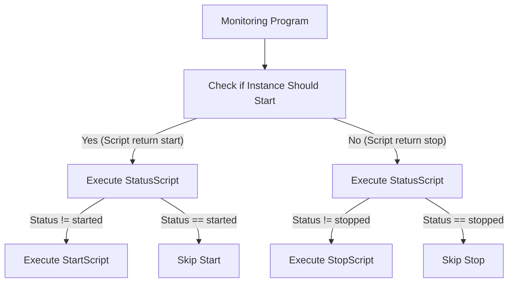

---
kind:
   - Solution
products: 
  - Alauda DevOps
ProductsVersion:
   - 4.x
id: KB251000012
---

# How to Perform Disaster Recovery for Harbor

## Issue

This solution describes how to build a Harbor disaster recovery solution based on Object Storage and PostgreSQL disaster recovery capabilities. The solution primarily focuses on data disaster recovery processing, and users need to implement their own Harbor access address switching mechanism.

## Environment

Harbor CE Operator: >=v2.12.4

## Terminology

| Term                    | Description                                                                 |
|-------------------------|-----------------------------------------------------------------------------|
| **Primary Harbor**      | The active Harbor instance that serves normal business operations and user requests. This instance is fully operational with all components running. |
| **Secondary Harbor**    | The standby Harbor instance deployed in a different cluster/region with zero replicas. It remains dormant until activated during disaster recovery scenarios. |
| **Primary PostgreSQL**  | The active PostgreSQL database cluster that handles all data transactions and serves as the source for data replication to the secondary database. |
| **Secondary PostgreSQL**| The hot standby PostgreSQL database that receives real-time data replication from the primary database. It can be promoted to primary role during failover. |
| **Primary Object Storage**| The active S3-compatible object storage system that stores all Harbor registry data and serves as the source for storage replication. |
| **Secondary Object Storage**| The synchronized backup object storage system that receives data replication from the primary storage. It ensures data availability during disaster recovery. |
| **Recovery Point Objective (RPO)** | The maximum acceptable amount of data loss measured in time (e.g., 5 minutes, 1 hour). It defines how much data can be lost during a disaster before it becomes unacceptable. |
| **Recovery Time Objective (RTO)** | The maximum acceptable downtime measured in time (e.g., 15 minutes, 2 hours). It defines how quickly the system must be restored after a disaster. |
| **Failover**            | The process of switching from the primary system to the secondary system when the primary system becomes unavailable or fails. |
| **Data Synchronization**| The continuous process of replicating data from primary systems to secondary systems to maintain consistency and enable disaster recovery. |
| **Cold Standby**        | A standby system that is not continuously synchronized with the primary system and requires manual activation with potential data loss during disaster recovery. |

## Architecture


### Architecture Overview

The Harbor disaster recovery solution implements a **cold-standby architecture** for Harbor services with **hot-standby database replication**. This hybrid approach provides disaster recovery capabilities through real-time database synchronization and manual Harbor service failover procedures. The architecture consists of two Harbor instances deployed across different clusters or regions, with the secondary Harbor instance remaining dormant until activated during disaster scenarios, while the database layer maintains continuous synchronization.

#### Core Components

- **Primary Harbor**: Active instance serving normal business operations and user requests
- **Secondary Harbor**: Standby instance with zero replicas, ready for failover scenarios
- **Primary PostgreSQL**: Active database handling all data transactions
- **Secondary PostgreSQL**: Hot standby database with real-time data replication
- **Primary Object Storage**: Active S3-compatible storage for registry data
- **Secondary Object Storage**: Synchronized backup storage with data replication

#### Data Synchronization Strategy

The solution leverages two independent data synchronization mechanisms:

1. **Database Layer**: PostgreSQL streaming replication ensures real-time transaction log synchronization between primary and secondary databases
2. **Storage Layer**: Object storage replication maintains data consistency across primary and secondary storage systems

#### Disaster Recovery Configuration

1. **Deploy Primary Harbor**: Configure the primary instance to connect to the primary PostgreSQL database and use primary object storage as the registry backend
2. **Deploy Secondary Harbor**: Configure the secondary instance to connect to the secondary PostgreSQL database and use secondary object storage as the registry backend
3. **Initialize Standby State**: Set replica count of all secondary Harbor components to 0 to prevent unnecessary background operations and resource consumption

#### Failover Procedure

When a disaster occurs, the following steps ensure transition to the secondary environment:

1. **Verify Primary Failure**: Confirm that all primary Harbor components are non-functional
2. **Promote Database**: Elevate secondary PostgreSQL to primary role using database failover procedures (no data loss due to hot standby)
3. **Promote Storage**: Activate secondary object storage as the primary storage system
4. **Activate Harbor**: Scale up secondary Harbor components by setting replica count greater than 0
5. **Update Routing**: Switch external access addresses to point to the secondary Harbor instance

## Harbor Disaster Recovery Setup Procedure with `Alauda Build of Rook-Ceph` and `Alauda support for PostgreSQL`

### Prerequisites

1. Prepare a primary cluster and a disaster recovery cluster (or a cluster containing different regions) in advance.
2. Complete the deployment of `Alauda Build of Rook-Ceph` and `Alauda support for PostgreSQL`.
3. Refer to `Alauda Build of Rook-Ceph`, `Alauda support for PostgreSQL` and [Harbor Instance Deployment guide](https://docs.alauda.io/alauda-build-of-harbor/2.12/install/03_harbor_deploy.html) to plan the system resources needed in advance.

### Building PostgreSQL Disaster Recovery Cluster with `Alauda support for PostgreSQL`

Refer to `PostgreSQL Hot Standby Cluster Configuration Guide` to build a disaster recovery cluster using `Alauda support for PostgreSQL`.

Ensure that Primary PostgreSQL and Secondary PostgreSQL are in different clusters (or different regions).

You can search for `PostgreSQL Hot Standby Cluster Configuration Guide` on [Alauda Knowledge](https://cloud.alauda.io/knowledges#/) to obtain it.

:::warning

`PostgreSQL Hot Standby Cluster Configuration Guide` is a document that describes how to build a disaster recovery cluster using `Alauda support for PostgreSQL`. Please ensure compatibility with the appropriate ACP version when using this configuration.

:::

### Building Object Storage Disaster Recovery Cluster with `Alauda Build of Rook-Ceph`

Build a disaster recovery cluster using `Alauda Build of Rook-Ceph`. Refer to [Object Storage Disaster Recovery](https://docs.alauda.io/container_platform/4.1/storage/storagesystem_ceph/how_to/disaster_recovery/dr_object.html) to build a disaster recovery cluster.

You need to create a CephObjectStoreUser in advance to obtain the access credentials for Object Storage, and prepare a Harbor registry bucket on Primary Object Storage:

1. Create a CephObjectStoreUser on Primary Object Storage to obtain access credentials: [Create CephObjectStoreUser](https://docs.alauda.io/container_platform/4.1/storage/storagesystem_ceph/how_to/create_object_user.html).

   :::info
   You only need to create the CephObjectStoreUser on the Primary Object Storage. The user information will be automatically synchronized to the Secondary Object Storage through the disaster recovery replication mechanism.
   :::

2. This `PRIMARY_OBJECT_STORAGE_ADDRESS` is the access address of the Object Storage, you can get it from the step [Configure External Access for Primary Zone](https://docs.alauda.io/container_platform/4.1/storage/storagesystem_ceph/how_to/disaster_recovery/dr_object.html#address) of `Object Storage Disaster Recovery`.

3. Create a Harbor registry bucket on Primary Object Storage using mc, in this example, the bucket name is `harbor-registry`.

    ```bash
    $ mc alias set primary-s3 <PRIMARY_OBJECT_STORAGE_ADDRESS> <PRIMARY_OBJECT_STORAGE_ACCESS_KEY> <PRIMARY_OBJECT_STORAGE_SECRET_KEY>
    Added `primary-s3` successfully.
    $ mc alias list
    primary-s3  
    URL       : <PRIMARY_OBJECT_STORAGE_ADDRESS> 
    AccessKey : <PRIMARY_OBJECT_STORAGE_ACCESS_KEY>
    SecretKey : <PRIMARY_OBJECT_STORAGE_SECRET_KEY>
    API       : s3v4
    Path      : auto
    Src       : /home/demo/.mc/config.json
    $ mc mb primary-s3/harbor-registry
    Bucket created successfully `primary-s3/harbor-registry`
    $ mc ls primary-s3/harbor-registry
    ```

### Set Up Primary Harbor

Deploy the Primary Harbor instance by following the [Harbor Instance Deployment](https://docs.alauda.io/alauda-build-of-harbor/2.12/install/03_harbor_deploy.html) guide. Configure it to connect to the Primary PostgreSQL database and use the Primary Object Storage as the [Registry storage backend](https://docs.alauda.io/alauda-build-of-harbor/2.12/install/03_harbor_deploy.html#storage-yaml-snippets).

Configuration example:

```yaml
apiVersion: operator.alaudadevops.io/v1alpha1
kind: Harbor
metadata:
  name: dr-harbor
spec:
  externalURL: http://dr-harbor.example.com
  helmValues:
    core:
      replicas: 1
      resources:
        limits:
          cpu: 400m
          memory: 512Mi
        requests:
          cpu: 200m
          memory: 256Mi
    database:
      external:
        coreDatabase: harbor
        existingSecret: primary-pg
        existingSecretKey: password
        host: acid-primary-pg.harbor.svc
        port: 5432
        sslmode: require
        username: postgres
      type: external
    existingSecretAdminPassword: harbor-account
    existingSecretAdminPasswordKey: password
    expose:
      ingress:
        hosts:
          core: dr-harbor.example.com
      tls:
        enabled: false
      type: ingress
    jobservice:
      replicas: 1
      resources:
        limits:
          cpu: 400m
          memory: 512Mi
        requests:
          cpu: 200m
          memory: 256Mi
    persistence:
      enabled: true
      imageChartStorage:
        disableredirect: true
        s3:
          existingSecret: object-storage-secret
          bucket: harbor-registry
          regionendpoint: <PRIMARY_OBJECT_STORAGE_ADDRESS>
          v4auth: true
        type: s3
      persistentVolumeClaim:
        jobservice:
          jobLog:
            accessMode: ReadWriteMany
            size: 10Gi
            storageClass: nfs
        trivy:
          accessMode: ReadWriteMany
          size: 10Gi
          storageClass: nfs
    portal:
      replicas: 1
      resources:
        limits:
          cpu: 400m
          memory: 512Mi
        requests:
          cpu: 200m
          memory: 256Mi
    redis:
      external:
        addr: primary-redis-0.primary-redis-hl.harbor.svc:26379
        existingSecret: redis-redis-s3-default-credential
        existingSecretKey: password
        sentinelMasterSet: mymaster
      type: external
    registry:
      controller:
        resources:
          limits:
            cpu: 200m
            memory: 410Mi
          requests:
            cpu: 100m
            memory: 200Mi
      registry:
        resources:
          limits:
            cpu: 600m
            memory: 1638Mi
          requests:
            cpu: 300m
            memory: 419Mi
      replicas: 1
    trivy:
      offlineScan: true
      replicas: 1
      resources:
        limits:
          cpu: 800m
          memory: 2Gi
        requests:
          cpu: 400m
          memory: 200Mi
      skipUpdate: true
  version: 2.12.4
```

### Set Up Secondary Harbor

Deploy the Secondary Harbor instance by following the [Harbor Instance Deployment](https://docs.alauda.io/alauda-build-of-harbor/2.12/install/03_harbor_deploy.html) guide. Configure it to connect to the Secondary PostgreSQL database and use the Secondary Object Storage as the [Registry storage backend](https://docs.alauda.io/alauda-build-of-harbor/2.12/install/03_harbor_deploy.html#storage-yaml-snippets).

:::info

The instance names for both Primary Harbor and Secondary Harbor must be identical.
:::

Set the replica count of all Secondary Harbor instances to 0 to prevent Secondary Harbor from performing unnecessary background operations.

Configuration YAML snippet example:

```yaml
apiVersion: operator.alaudadevops.io/v1alpha1
kind: Harbor
metadata:
  name: dr-harbor
spec:
  helmValues:
    core:
      replicas: 0
    portal:
      replicas: 0
    jobservice:
      replicas: 0
    registry:
      replicas: 0
    trivy:
      replicas: 0
```

### Failover

1. First confirm that all Primary Harbor components are not in working state, otherwise stop all Primary Harbor components first.
2. Promote Secondary PostgreSQL to Primary PostgreSQL. Refer to `PostgreSQL Hot Standby Cluster Configuration Guide`, the switchover procedure.
3. Promote Secondary Object Storage to Primary Object Storage. Refer to [Alauda Build of Rook-Ceph Failover](https://docs.alauda.io/container_platform/4.1/storage/storagesystem_ceph/how_to/disaster_recovery/dr_object.html#procedures-1), the switchover procedure.

4. Scale up all Secondary Harbor components by modifying the replica count to greater than 0:

    Configuration YAML snippet example:

    ```yaml
    apiVersion: operator.alaudadevops.io/v1alpha1
    kind: Harbor
    metadata:
      name: dr-harbor
    spec:
      helmValues:
        core:
          replicas: 1
        portal:
          replicas: 1
        jobservice:
          replicas: 1
        registry:
          replicas: 1
        trivy:
          replicas: 1
    ```

5. Test image push and pull to verify that Harbor is working properly.
6. Switch external access addresses to Secondary Harbor.

### Disaster Recovery

When the primary cluster recovers from a disaster, you can restore the original Primary Harbor to operate as a Secondary Harbor. Follow these steps to perform the recovery:

1. Set the replica count of all Harbor components to 0.
2. Configure the original Primary PostgreSQL to operate as Secondary PostgreSQL according to the `PostgreSQL Hot Standby Cluster Configuration Guide`.
3. Convert the original Primary Object Storage to Secondary Object Storage.

  ```bash
  # From within the recovered zone, pull the latest realm configuration from the current master zone:
  radosgw-admin realm pull --url={url-to-master-zone-gateway} \
                            --access-key={access-key} --secret={secret}
  # Make the recovered zone the master and default zone:
  radosgw-admin zone modify --rgw-realm=<realm-name> --rgw-zonegroup=<zone-group-name> --rgw-zone=<primary-zone-name> --master
  ```

After completing these steps, the original Primary Harbor will operate as a Secondary Harbor.

If you need to restore the original Primary Harbor to continue operating as the Primary Harbor, follow the Failover procedure to promote the current Secondary Harbor to Primary Harbor, and then configure the new Primary Harbor to operate as Secondary Harbor.

### Data sync check

Check the synchronization status of Object Storage and PostgreSQL to ensure that the disaster recovery is successful.

- Check Ceph Object Storage Synchronization Status: [Object Storage Disaster Recovery](https://docs.alauda.io/container_platform/4.1/storage/storagesystem_ceph/how_to/disaster_recovery/dr_object.html#check-ceph-object-storage-synchronization-status)
- Check PostgreSQL Synchronization Status: Refer to `PostgreSQL Hot Standby Cluster Configuration Guide` for status check section.

### Recovery Objectives

#### Recovery Point Objective (RPO)

The RPO represents the maximum acceptable data loss during a disaster recovery scenario. In this Harbor disaster recovery solution:

- **Database Layer**: Near-zero data loss due to PostgreSQL hot standby with streaming replication
- **Storage Layer**: Near-zero data loss due to synchronous object storage replication
- **Overall RPO**: Near-zero data loss due to synchronous replication of both database and object storage layers

**Factors affecting RPO:**

- Network latency between primary and secondary clusters
- Object storage synchronous replication and consistency model
- Database replication lag and commit acknowledgment settings

#### Recovery Time Objective (RTO)

The RTO represents the maximum acceptable downtime during disaster recovery. This solution provides:

- **Manual Components**: Harbor service activation and external routing updates require manual intervention
- **Typical RTO**: 5-15 minutes for complete service restoration

**RTO Breakdown:**

- Database failover: 1-2 minutes (manual)
- Storage failover: 1-2 minutes (manual)
- Harbor service activation: 2-5 minutes (manual, cold standby requires startup time)
- External routing updates: 1-5 minutes (manual, depends on DNS propagation)

## Building Harbor Disaster Recovery Solution with Other Object Storage and PostgreSQL

The operational steps are similar to building a Harbor disaster recovery solution with `Alauda Build of Rook-Ceph` and `Alauda support for PostgreSQL`. Simply replace Object Storage and PostgreSQL with other object storage and PostgreSQL solutions.

Ensure that the Object Storage and PostgreSQL solutions support disaster recovery capabilities.

## Automatic Start/Stop of Disaster Recovery Instance

This mechanism enables automatic activation of the Secondary Harbor instance when a disaster occurs. It supports custom check mechanisms through user-defined scripts and provides control over Harbor dependency configurations.



### How to Configure and Run the Auto Start/Stop Program

1. Prepare the configuration file `config.yaml`:

    ```yaml
    condition_check_script: /path/to/condition_check.sh # Path to the condition check script. Executed periodically at check_interval intervals. Returns "start" to trigger start_script or "stop" to trigger stop_script.
    start_script: /path/to/start.sh # Path to the script that activates Harbor and its dependencies. Performs operations such as promoting PostgreSQL to primary, activating object storage, and scaling up Harbor components.
    stop_script: /path/to/stop.sh # Script path that deactivates Harbor and dependencies (e.g., scales down Harbor components, configures dependencies to standby mode).
    status_script: /path/to/status.sh # Script path that checks system state. Must output "started", "stopped", or "unknown".
    check_interval: 30s # Interval between condition check script executions
    failure_threshold: 6 # Number of consecutive failures required to trigger stop script. Prevents false positives from transient network issues.
    script_timeout: 120s # Maximum execution time for each script. Scripts exceeding this timeout will be terminated.
    ```

2. Create the corresponding script files:

    - **condition_check.sh**: Please customize this script according to your actual failover decision process. The script should output `start` if the cluster node should be activated, and output `stop` if it should be deactivated. If the script execution fails, no scripts will be called. Below is an example for reference—a simple DNS IP check (not recommended for production use):

      ```bash
      set -euo pipefail
      HARBOR_DOMAIN="${HARBOR_DOMAIN:-}"
      HARBOR_IP="${HARBOR_IP:-}"

      RESOLVED_IP=$(nslookup "$HARBOR_DOMAIN" 2>/dev/null | grep -A 1 "Name:" | grep "Address:" | awk '{print $2}' | head -n 1)
      if [ "$RESOLVED_IP" = "$HARBOR_IP" ]; then
        echo start
        exit 0
      else
        echo stop
        exit 0
      fi
      ```

    - **status.sh**: Script path that checks system state. Must output "started", "stopped", or "unknown". If script execution fails, it will be treated as unknown status and no changes will be made.

      ```bash
      set -euo pipefail
      
      # Status script for disaster recovery
      # This script will be executed before stop script to verify harbor is actually running
      
      # Read environment variables with validation
      HARBOR_NAMESPACE="${HARBOR_NAMESPACE:-harbor-ns}"
      HARBOR_NAME="${HARBOR_NAME:-harbor}"
      HARBOR_REPLICAS="${HARBOR_REPLICAS:-1}"
      
      # Check Harbor health status via health endpoint
      # Use HTTPS if available, fallback to HTTP for internal cluster communication
      HARBOR_SVC="${HARBOR_NAME}-core.${HARBOR_NAMESPACE}.svc"
      
      set +e
      # Check health endpoint with proper timeout and error handling
      HTTP_CODE=$(curl -sf --max-time 10 --connect-timeout 5 \
        -o /dev/null -w "%{http_code}" \
        "http://${HARBOR_SVC}/api/v2.0/health" 2>/dev/null)
      set -e
      
      # Get running pods count with proper error handling
      RUNNING_PODS=$(kubectl -n "$HARBOR_NAMESPACE" \
        get pods -l release="$HARBOR_NAME" \
        --field-selector=status.phase=Running \
        --no-headers \
        --request-timeout=5s 2>/dev/null | wc -l | tr -d ' ')
      
      # Validate pod count is numeric
      if [[ ! "$RUNNING_PODS" =~ ^[0-9]+$ ]]; then
        RUNNING_PODS="0"
      fi
      
      # Determine status based on HTTP code and running pods count
      # At least MIN_PODS_REQUIRED running pods are required (core, portal, jobservice, registry, trivy)
      # When service has no endpoints (pods not running), curl will fail and HTTP_CODE will be empty or "000"
      if [ "$HTTP_CODE" = "200" ] && [ -n "$RUNNING_PODS" ] && [ "$RUNNING_PODS" -ge 5 ]; then
        # Harbor is healthy: HTTP 200 and sufficient pods running
        echo "started"
      elif ([ -z "$HTTP_CODE" ] || [ "$HTTP_CODE" = "000" ] || [ "$HTTP_CODE" = "" ]) && \
           ([ -z "$RUNNING_PODS" ] || [ "$RUNNING_PODS" -eq 0 ]); then
        echo "stopped"
      else
        # Other network errors, unexpected HTTP codes, or inconsistent states
        # This includes cases like:
        # - HTTP 5xx errors (service degraded but pods running)
        # - HTTP 4xx errors (authentication/authorization issues)
        # - Partial pod failures (some pods running but not all)
        # - Network timeouts or connection refused
        echo "unknown"
      fi
      ```

    - **start.sh**: The start script should include checks for Harbor dependencies and the startup of the Harbor instance.

      ```bash
      set -euo pipefail
      # Check and control dependencies, such as verifying if the database is the primary instance
      # and if the object storage is ready
      #####################################
      # Add your PostgreSQL start script here.
      # This script should promote the secondary PostgreSQL to primary role and ensure
      # the database is ready to serve Harbor before starting Harbor components.
      #####################################

      #####################################
      # Add your S3/Object Storage start script here.
      # This script should promote the secondary object storage to primary role and ensure
      # the storage system is ready to serve Harbor before starting Harbor components.
      #####################################

      # Start Harbor script - this section is required
      HARBOR_NAMESPACE="${HARBOR_NAMESPACE:-harbor-ns}"
      HARBOR_NAME="${HARBOR_NAME:-harbor}"
      HARBOR_REPLICAS="${HARBOR_REPLICAS:-1}"
      kubectl -n "$HARBOR_NAMESPACE" patch harbor "$HARBOR_NAME" --type=merge -p "{\"spec\":{\"helmValues\":{\"core\":{\"replicas\":$HARBOR_REPLICAS},\"portal\":{\"replicas\":$HARBOR_REPLICAS},\"jobservice\":{\"replicas\":$HARBOR_REPLICAS},\"registry\":{\"replicas\":$HARBOR_REPLICAS},\"trivy\":{\"replicas\":$HARBOR_REPLICAS}}}}"
      ```

    - **stop.sh**: The stop script should include shutdown procedures for Harbor dependencies and the Harbor instance.

      ```bash
      set -euo pipefail
      # Stop Harbor script - this section is required
      HARBOR_NAMESPACE="${HARBOR_NAMESPACE:-harbor-ns}"
      HARBOR_NAME="${HARBOR_NAME:-harbor}"
      kubectl -n "$HARBOR_NAMESPACE" patch harbor "$HARBOR_NAME" --type=merge -p '{"spec":{"helmValues":{"core":{"replicas":0},"portal":{"replicas":0},"jobservice":{"replicas":0},"registry":{"replicas":0},"trivy":{"replicas":0}}}}'
      
      # Check and control dependencies, such as setting the database to replica mode
      #####################################
      # Add your PostgreSQL stop script here.
      # This script should configure the PostgreSQL cluster to operate as a replica
      # and scale down instances when stopping Harbor components.
      #####################################

      #####################################
      # Add your S3/Object Storage stop script here.
      # This script should handle any necessary cleanup or configuration changes
      # for the object storage when stopping Harbor components.
      #####################################
      ```

3. Deploy the control program as a Deployment in the Harbor namespace:

```yaml
---
apiVersion: v1
automountServiceAccountToken: true
kind: ServiceAccount
metadata:
  name: disaster-recovery
  namespace: system # replace with your own namespace
---
apiVersion: rbac.authorization.k8s.io/v1
kind: ClusterRole
metadata:
  name: disaster-recovery-clusterrole
rules: []  # Add necessary permissions
---
apiVersion: rbac.authorization.k8s.io/v1
kind: ClusterRoleBinding
metadata:
  name: disaster-recovery-clusterrolebinding
roleRef:
  apiGroup: rbac.authorization.k8s.io
  kind: ClusterRole
  name: disaster-recovery-clusterrole
subjects:
- kind: ServiceAccount
  name: disaster-recovery
  namespace: system # replace with your own namespace
---
apiVersion: v1
data:
  check.sh: |
    # replace with your own script
  config.yaml: |
    condition_check_script: /scripts/check.sh
    start_script: /scripts/start.sh
    stop_script: /scripts/stop.sh
    status_script: /scripts/status.sh
    check_interval: 10s
    failure_threshold: 3
    script_timeout: 120s
  start.sh: |
    # replace with your own script
  status.sh: |
    # replace with your own script
  stop.sh: |
    # replace with your own script
kind: ConfigMap
metadata:
  name: disaster-recovery-config
  namespace: system # replace with your own namespace
---
apiVersion: apps/v1
kind: Deployment
metadata:
  labels:
    app: disaster-recovery
  name: disaster-recovery
  namespace: system # replace with your own namespace
spec:
  replicas: 1
  selector:
    matchLabels:
      app: disaster-recovery
  template:
    metadata:
      labels:
        app: disaster-recovery
    spec:
      containers:
      - command:
        - sh
        - -c
        - |
          exec /opt/bin/disaster-recovery -config /opt/config/config.yaml
        image: build-harbor.alauda.cn/devops/harbor-disaster-recovery:v2.13.0-ga4650ef
        name: controller
        resources:
          limits:
            cpu: 500m
            memory: 512Mi
          requests:
            cpu: 100m
            memory: 128Mi
        volumeMounts:
        - mountPath: /opt/bin/
          name: bin
          readOnly: true
        - mountPath: /opt/config
          name: config
          readOnly: true
        - mountPath: /opt/script
          name: scripts
          readOnly: true
      initContainers:
      - command:
        - sh
        - -c
        - |
          cp /disaster-recovery /opt/bin/disaster-recovery && chmod +x /opt/bin/disaster-recovery
        image: build-harbor.alauda.cn/devops/harbor-disaster-recovery:v2.13.0-ga4650ef # replace you image.
        imagePullPolicy: Always
        name: copy-binary
        volumeMounts:
        - mountPath: /opt/bin/
          name: bin
      serviceAccountName: disaster-recovery
      volumes:
      - emptyDir: {}
        name: bin
      - configMap:
          name: disaster-recovery-config
        name: scripts
      - configMap:
          items:
          - key: config.yaml
            path: config.yaml
          name: disaster-recovery-config
        name: config
```

> **Note**: Ensure that the ServiceAccount used by the Deployment has the necessary RBAC permissions to operate on Harbor resources and any other resources controlled by your custom scripts (such as database resources, object storage configurations, etc.) in the target namespace. The control program needs permissions to modify Harbor CRD resources to start and stop Harbor components, as well as permissions for any resources managed by the custom start/stop scripts. The following are the permissions required for Harbor operations:

  ```yaml
  apiVersion: rbac.authorization.k8s.io/v1
  kind: ClusterRole
  metadata:
    name: disaster-recovery-clusterrole
  rules:
  - apiGroups:
    - operator.alaudadevops.io
    resources:
    - harbors
    verbs:
    - get
    - list
    - watch
    - update
    - patch
  - apiGroups:
    - ""
    resources:
    - pods
    verbs:
    - get
    - list
    - watch
  - apiGroups:
    - ""
    resources:
    - pods/exec
    verbs:
    - create
  ```

### `Alauda support for PostgreSQL` Start/Stop Script Examples

When using the `Alauda support for PostgreSQL` solution with the `PostgreSQL Hot Standby Cluster Configuration Guide` to configure a disaster recovery cluster, you need to configure replication information in both Primary and Secondary PostgreSQL clusters. This ensures that during automatic failover, you only need to modify `clusterReplication.isReplica` and `numberOfInstances` to complete the switchover:

**Primary Configuration:**

```yaml
clusterReplication:
  enabled: true
  isReplica: false
  peerHost: 192.168.130.206  # Secondary cluster node IP
  peerPort: 31661            # Secondary cluster NodePort
  replSvcType: NodePort
  bootstrapSecret: standby-bootstrap-secret
```

The `standby-bootstrap-secret` should be configured according to the `Standby Cluster Configuration` section in the `PostgreSQL Hot Standby Cluster Configuration Guide`, using the same value as the Secondary cluster.

**Secondary Configuration:**

```yaml
clusterReplication:
  enabled: true
  isReplica: true
  peerHost: 192.168.12.108  # Primary cluster node IP
  peerPort: 30078            # Primary cluster NodePort
  replSvcType: NodePort
  bootstrapSecret: standby-bootstrap-secret
```

**Note**: The following RBAC permissions are required:

```yaml
apiVersion: rbac.authorization.k8s.io/v1
kind: ClusterRole
metadata:
  name: disaster-recovery-clusterrole
rules:
- apiGroups:
  - acid.zalan.do
  resources:
  - postgresqls
  verbs:
  - get
  - list
  - watch
  - update
  - patch
- apiGroups:
  - ""
  resources:
  - pods
  verbs:
  - get
  - list
  - watch
- apiGroups:
  - ""
  resources:
  - pods/exec
  verbs:
  - create
```

#### Start Script Example

```bash
POSTGRES_NAMESPACE="${POSTGRES_NAMESPACE:-pg-namespace}"
POSTGRES_CLUSTER="${POSTGRES_CLUSTER:-acid-pg}"
kubectl -n "$POSTGRES_NAMESPACE" patch pg "$POSTGRES_CLUSTER" --type=merge -p '{"spec":{"clusterReplication":{"isReplica":false},"numberOfInstances":2}}'
```

#### Stop Script Example

```bash
POSTGRES_NAMESPACE="${POSTGRES_NAMESPACE:-pg-namespace}"
POSTGRES_CLUSTER="${POSTGRES_CLUSTER:-acid-pg}"
kubectl -n "$POSTGRES_NAMESPACE" patch pg "$POSTGRES_CLUSTER" --type=merge -p '{"spec":{"clusterReplication":{"isReplica":true},"numberOfInstances":1}}'
```

### Alauda Build of Rook-Ceph Start/Stop Script Examples

**Note**: The following RBAC permissions are required:

```yaml
apiVersion: rbac.authorization.k8s.io/v1
kind: ClusterRole
metadata:
  name: disaster-recovery-clusterrole
rules:
- apiGroups:
  - ""
  resources:
  - secrets
  verbs:
  - get
  - list
  - watch
- apiGroups:
  - ""
  resources:
  - configmaps
  verbs:
  - get
  - list
  - watch
- apiGroups:
  - ceph.rook.io
  resources:
  - cephobjectzones
  verbs:
  - get
  - list
  - watch
- apiGroups:
  - ""
  resources:
  - pods
  verbs:
  - get
  - list
  - watch
- apiGroups:
  - ""
  resources:
  - pods/exec
  verbs:
  - create
```

- **Start Script Example**: For more details, refer to [Object Storage Disaster Recovery](https://docs.alauda.io/container_platform/4.1/storage/storagesystem_ceph/how_to/disaster_recovery/dr_object.html)

  ```bash
  REALM_NAME="${REALM_NAME:-realm}"
  ZONE_GROUP_NAME="${ZONE_GROUP_NAME:-group}"
  ZONE_NAME="${ZONE_NAME:-zone}"

  ACCESS_KEY=$(kubectl -n rook-ceph get secrets "${REALM_NAME}-keys" -o jsonpath='{.data.access-key}' 2>/dev/null | base64 -d)
  SECRET_KEY=$(kubectl -n rook-ceph get secrets "${REALM_NAME}-keys" -o jsonpath='{.data.secret-key}' 2>/dev/null | base64 -d)
  ENDPOINT=$(kubectl -n rook-ceph get cephobjectzone realm-zone -o jsonpath='{.spec.customEndpoints[0]}')
  TOOLS_POD=$(kubectl -n rook-ceph get po -l app=rook-ceph-tools -o jsonpath='{.items[0].metadata.name}' 2>/dev/null)

  kubectl -n rook-ceph exec "$TOOLS_POD" -- radosgw-admin realm pull --url="$ENDPOINT" --access-key="$ACCESS_KEY" --secret="$SECRET_KEY";
  kubectl -n rook-ceph exec "$TOOLS_POD" -- radosgw-admin zone modify --rgw-realm="$REALM_NAME" --rgw-zonegroup="$ZONE_GROUP_NAME" --rgw-zone="$ZONE_NAME" --master
  ```

- **Stop Script**: No action is required when stopping Alauda Build of Rook-Ceph, so you can add an empty script or skip this step.
