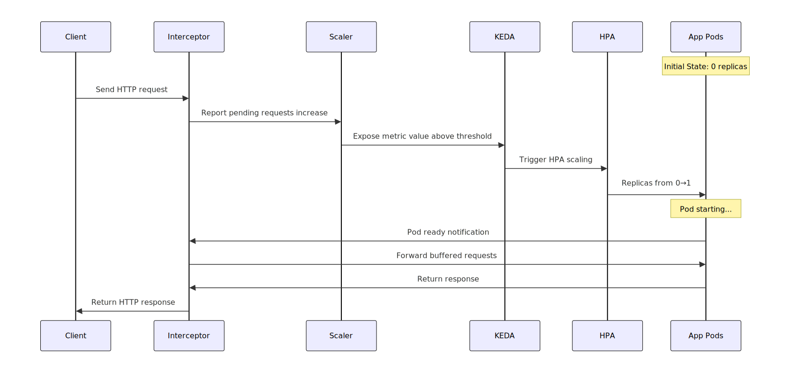
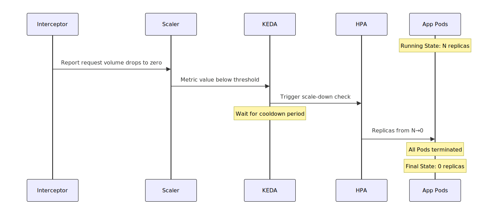

---
kind:
   - Solution
products:
  - Alauda Container Platform
ProductsVersion:
   - 4.x
id: KB251200008
---

# Traffic-Based Idle Application Solution

## Overview
The Traffic-Based Idle Application Solution is an innovative cloud-native technology that automatically adjusts resource allocation based on application HTTP traffic. This solution, built on the KEDA(Kubernetes-based Event Driven Autoscaling) [HTTP Add-on project](https://github.com/kedacore/http-add-on), delivers the following core capabilities:

### Introduction
Core Features:
- **Automatic Scale from Zero**: Automatically starts applications from zero replicas when HTTP requests arrive
- **Intelligent Scale to Zero**: Automatically scales applications to zero replicas during no-traffic periods, saving resource costs
- **Zero Request Loss**: Ensures no requests are lost during application startup through intelligent buffering mechanism
- **Fast Cold Start**: Optimized startup process ensures quick response to traffic spikes

Applicable Scenarios:
- Web services with fluctuating traffic
- Internal tools and dashboard applications
- API frontends for batch processing jobs
- Development and test environment resource optimization

### Core Architecture Components
The below diagram is the most common architecture that is shipped by default:


Component Responsibilities:
1. **Interceptor**: 
   - Receives and proxies all incoming HTTP traffic
   - Buffers requests during application startup
   - Routes requests to correct backend services based on Host header
   - Collects request queue metrics
2. **External Scaler**:
   - Exposes HTTP-related metrics to KEDA
   - Triggers scaling events based on configured thresholds
   - Monitors application readiness status
3. **KEDA-HTTP Operator**:
   - Manages `HTTPScaledObject` custom resources
   - Synchronizes configurations across components
   - Maintains system health status
4. **KEDA**:
   - Drives `HPA` based on external metrics
   - Supports multiple event sources and metric sources
   - Provides unified auto-scaling engine

## Installation and Practice

### Install KEDA
Follow the [How to Install KEDA Operator](/solutions/How_to_Install_KEDA_Operator.md) to install KEDA in your workload cluster.

### Install HTTP Add-on
Follow the [Installing the KEDA HTTP Add-on](https://github.com/kedacore/http-add-on/blob/main/docs/install.md) to install HTTP Add-on in your workload cluster.

### Application Demo
Create Sample Application:
```bash
kubectl apply -f - <<EOF
apiVersion: apps/v1
kind: Deployment
metadata:
  name: app-nginx
spec:
  replicas: 0  # Start with zero replicas
  selector:
    matchLabels:
      app: app-nginx
  template:
    metadata:
      labels:
        app: app-nginx
    spec:
      containers:
      - name: app
        image: nginx:latest
        ports:
        - containerPort: 80
        readinessProbe:
          httpGet:
            path: /
            port: 80
          initialDelaySeconds: 5
          periodSeconds: 5
---
apiVersion: v1
kind: Service
metadata:
  name: app-nginx
spec:
  ports:
  - port: 80
    targetPort: 80
  selector:
    app: app-nginx
EOF
```
Configure autoscaling:
```bash
kubectl apply -f - <<EOF
apiVersion: http.keda.sh/v1alpha1
kind: HTTPScaledObject
metadata:
  name: app-nginx-scaler
spec:
    hosts:
      - app.nginx.com
    pathPrefixes:
      - /nginx
    scaleTargetRef:
      name: app-nginx
      kind: Deployment
      apiVersion: apps/v1
      service: app-nginx
      port: 80
    replicas:
      min: 0
      max: 5
    scaledownPeriod: 300
    scalingMetric:
      requestRate:
        granularity: 1s
        targetValue: 100
        window: 1m
EOF
```

## Scale from Zero

### Practice Steps
1. Verify Initial State:
   ```bash
   kubectl get deployment app-nginx
   ```
2. Get Access Address:
   ```bash
   kubectl get svc -n keda keda-add-ons-http-interceptor-proxy
   ```
3. Send Test Requests to Trigger Scaling:
   ```bash
   # Send HTTP request to trigger scaling
   # Here, you must send request to /nginx endpoint with Host header: app.nginx.com, the same as the setting of HTTPScaledObject cr
   curl -H "Host: app.nginx.com" http://<service-ip>:8080/nginx

   # Or use load testing tool
   hey -n 100 -c 10 -H "Host: app.nginx.com" http://<service-ip>:8080/nginx
   ```
4. Monitor Scaling Process:
   ```bash
   # Real-time monitoring of Pod creation
   kubectl get pods -l app=app-nginx -w

   # Check HPA status
   kubectl get hpa -w

   # View detailed logs
   kubectl logs -f deployment/keda-add-ons-http-interceptor -n keda
   ```

### Scale from Zero Process


## Scale to Zero

### Practice Steps

1. Observe Running State:
   ```bash
   # Confirm application is running
   kubectl get deployment app-nginx
   # Output should show READY 1/1 or more

   kubectl get pods -l app=app-nginx
   # View running Pods
   ```
2. Stop Traffic Generation:
   ```bash
   # Stop all load testing tools
   # Wait for system to detect no-traffic state
   ```
3. Monitor Scale-down Process:
   ```bash
   # Watch HPA status
   kubectl get hpa -w

   # Check if replicas are scaling down to zero
   kubectl get deployment app-nginx -w
   # Output should show 0/0 replicas
   ```
4. Verify Scale-down Result:
   ```bash
   # After waiting, confirm scale-down complete
   kubectl get deployment app-nginx
   # Output should show READY 0/0

   kubectl get pods -l app=app-nginx
   # Should show No resources found
   ```

### Scale to Zero Process


## Conclusion

The traffic-driven idle application solution based on KEDA HTTP Add-on brings significant value to modern cloud-native environments:
1. Ultimate Cost Optimization: Maximize cost efficiency by scaling idle applications to zero
2. Intelligent Elastic Scaling: Automatically adjust based on actual traffic, no manual intervention required
3. High Availability Assurance: Zero request loss ensured through request buffering mechanism
4. Simple and Easy to Use: Standard Kubernetes-native experience with low learning curve
