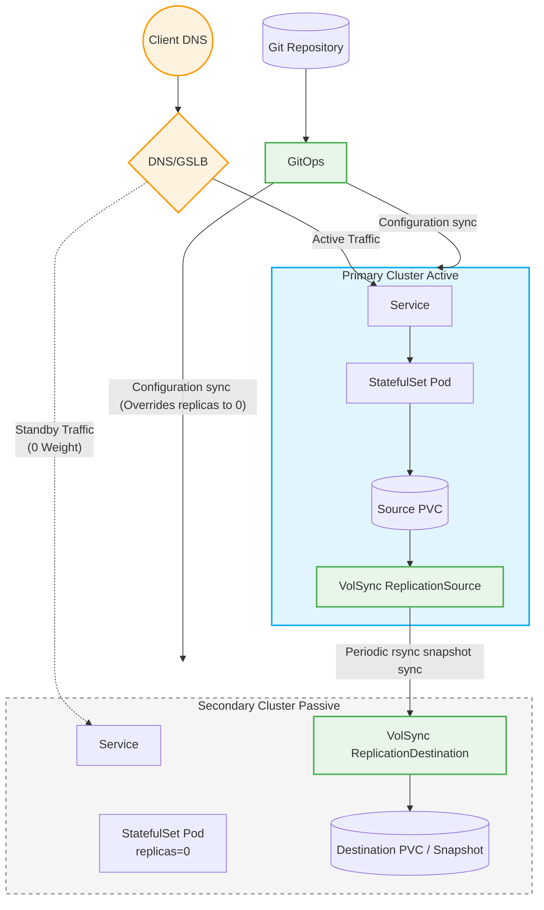
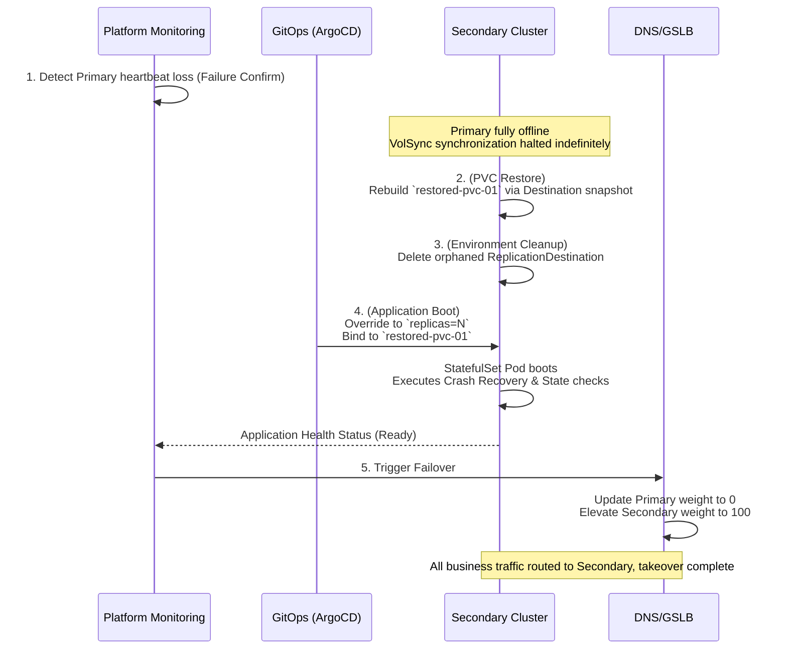

---
products:
   - Alauda Container Platform
kind:
   - Solution
id: KB260400007
---

# Cross-Cluster Application Disaster Recovery for Stateful Applications

## 1. Architecture Overview

This solution addresses the disaster recovery (DR) requirements of stateful applications (such as MySQL, Redis, or business modules that maintain storage state) on Kubernetes. It combines multi-cluster service traffic distribution capabilities with underlying PVC asynchronous data synchronization provided by [Alauda Build of VolSync](https://docs.alauda.cn/container_platform/main/en/configure/storage/how_to/configuring_pvc_dr.html#deploy-alauda-build-of-volsync) to achieve cross-region or cross-cluster application disaster recovery.

Compared to stateless applications that can achieve active-active geographic dispersion relatively easily, the core focus for stateful applications is **data consistency** and **conflict prevention**. This solution adopts an **Active-Passive DR model (Dual-Center)**. Under normal circumstances, the primary cluster handles all read and write traffic, while data snapshots are continuously and incrementally synchronized to the secondary cluster in the background. In the event of a disaster, storage volumes are recovered through platform orchestration, and external traffic is automatically directed to the secondary cluster to complete disaster-level failover.

### 1.1 Core Components and Responsibilities

* **Cluster Roles**:
  * **Primary Cluster**: Handles read and write traffic under normal conditions; runs the primary replica of the stateful application.
  * **Secondary Cluster (Standby)**: Remains in a standby or silent state; contains the full configuration but does not directly process primary business traffic; holds asynchronous backups of the storage data from the primary cluster.
* **Traffic Management (DNS/GSLB)**: External traffic gateways that manage requests using health checks. During a failure, they adjust domain name resolution priorities or weights to achieve traffic failover within minutes.
* **State Data Synchronization (VolSync)**: Relies on the snapshot capabilities of the underlying CSI storage to synchronize persistent configurations (PVCs) to remote clusters periodically (or via manual triggers) using methods like `rsync-tls`.
* **Configuration Synchronization (GitOps)**: Ensures that the application's foundational configuration files (StatefulSet, ConfigMap, Service, etc.) maintain a consistent baseline across both clusters, eliminating configuration drift.

### 1.2 Architecture Diagram



1. **Traffic Routing (GSLB)**: External user clients access the application via a Global Server Load Balancer (GSLB) or intelligent DNS. Under normal operational conditions, this routing gateway is configured to send 100% of the active traffic to the **Primary Cluster**, while the **Secondary Cluster** holds a 0 (or strictly standby) weight.
2. **GitOps Base Configuration Sync**: A centralized Git repository pushes identical baseline application manifests to both clusters via GitOps. In order to construct the "Active-Passive" setup, Kustomize overrides are utilized to manipulate the `replicas` count—ensuring the Primary is set to an active instance size (e.g., `N`) while the Secondary receives a `replicas=0` configuration, maintaining a quiet, resource-free standby state.
3. **Data Replication Pipeline (VolSync)**: The real-time application persists its operational state into a Source PVC on the Primary Cluster. A `ReplicationSource` mechanism continuously queries snapshot diffs through the CSI driver and pushes incremental `rsync` snapshots securely over to the `ReplicationDestination` waiting on the Secondary Cluster, thereby keeping a "warm" persistent state ready for any failover event.

---

## 2. DR Foundation Configuration Phase

### 2.1 Cross-Cluster GitOps Configuration Sync

When deploying stateful applications to disaster recovery clusters, GitOps best practices should also be followed. ACP GitOps delivers consistent environments to both sides, while `kustomize` is utilized to apply parameter differences for the primary and secondary clusters.

1. **Organize Code Repositories**: Store the application's Kubernetes manifests (including PVC, StatefulSet, and Service templates) in Git. For example:
   
   ```yaml
   apiVersion: v1
   kind: PersistentVolumeClaim
   metadata:
     name: pvc-01
     namespace: <application-namespace>
   spec:
     accessModes:
       - ReadWriteMany
     resources:
       requests:
         storage: 10Gi
     storageClassName: sc-cephfs
     volumeMode: Filesystem
   ---
   apiVersion: apps/v1
   kind: StatefulSet
   metadata:
     name: my-stateful-app
     namespace: <application-namespace>
   spec:
     replicas: 1 # This will be patched to 0 for the secondary cluster
     selector:
       matchLabels:
         app: my-stateful-app
     serviceName: "my-stateful-app-headless"
     template:
       metadata:
         labels:
           app: my-stateful-app
       spec:
         containers:
         - name: app-container
           image: my-app-image:latest
           volumeMounts:
           - name: data-volume
             mountPath: /data
         volumes:
         - name: data-volume
           persistentVolumeClaim:
             claimName: pvc-01
   ---
   apiVersion: v1
   kind: Service
   metadata:
     name: my-stateful-app-headless
     namespace: <application-namespace>
   spec:
     clusterIP: None
     selector:
       app: my-stateful-app
     ports:
     - name: tcp
       port: 80
       targetPort: 8080
   ```

2. **ApplicationSet Synchronization**: Configure an ApplicationSet to distribute resources simultaneously to both the primary and secondary clusters. Due to the **Active-Passive model**, during normal operations:
   - The instance `replicas` for the **primary cluster** is set to `N`.
   - The instance `replicas` for the **secondary cluster** must be set to `0` using `patches` in kustomize (to avoid invalid connections and data corruption when failover has not occurred).

### 2.2 VolSync Asynchronous Data Sync Configuration

After deploying the stateful application and successfully creating the PVC, configure periodic synchronization of the underlying storage via VolSync.

> **Prerequisite**: Both primary and secondary clusters must have `Alauda Build of VolSync` installed, alongside corresponding CSI storage drivers that support snapshot functionality.

**1. Prepare Trust Credentials Secret**

Create a uniform `rsync-tls` Secret in both the primary and secondary clusters, defining the PSK for secure identity authentication.

```yaml
apiVersion: v1
data:
  psk.txt: MToyM2I3Mzk1ZmFmYzNlODQyYmQ4YWMwZmUxNDJlNmFkMQ==
kind: Secret
metadata:
  name: volsync-rsync-tls
  namespace: <application-namespace>
type: Opaque
```
**Parameters**:
| **Parameter**             | **Explanation**                                                                                                                                    |
| :------------------------ | :------------------------------------------------------------------------------------------------------------------------------------------------- |
| **application-namespace** | The namespace of secret, should same as application                                                                                                |
| **psk.txt**               | This field adheres to the format expected by stunnel: `<id>:<at least 32 hex digits>`. <br></br>for example, `1:23b7395fafc3e842bd8ac0fe142e6ad1`. |

**2. Configure the Receiver (ReplicationDestination) on the Secondary Cluster**

Create a `ReplicationDestination` to define the idle target on the DR receiving end, specifying the snapshot to be used for copying and the network exposure method (using `LoadBalancer` or `NodePort` is recommended in cross-cluster environments). This will generate an exposed address for the destination on the secondary cluster waiting to receive data.

```yaml
apiVersion: volsync.backube/v1alpha1
kind: ReplicationDestination
metadata:
  name: rd-pvc-01
  namespace: <application-namespace>
spec:
  rsyncTLS:
    copyMethod: Snapshot
    destinationPVC: pvc-01
    keySecret: volsync-rsync-tls
    serviceType: NodePort
    storageClassName: sc-cephfs
    volumeSnapshotClassName: csi-cephfs-snapshotclass
    moverSecurityContext:
      fsGroup: 65534
      runAsGroup: 65534
      runAsNonRoot: true
      runAsUser: 65534
      seccompProfile:
        type: RuntimeDefault
```

**Parameters**:
| **Parameter**               | **Explanation**                                                                                                                       |
| :-------------------------- | :------------------------------------------------------------------------------------------------------------------------------------ |
| **namespace**               | The namespace of the destination PVC, should be the same as the application                                                           |
| **destinationPVC**          | The name of a **pre-existing** PVC on the secondary cluster                                                                           |
| **keySecret**               | The name of the Secret that contains the TLS-PSK key for authentication, created at Step 1                                            |
| **serviceType**             | The type of Service created by VolSync to allow the source to connect. Allowed values are `ClusterIP`, `LoadBalancer`, or `NodePort`. |
| **storageClassName**        | The storage class used by the destination PVC                                                                                         |
| **volumeSnapshotClassName** | The snapshot class corresponding to the storage class                                                                                 |

**3. Configure the Sender (ReplicationSource) on the Primary Cluster**

Extract the exposed address of the secondary cluster generated above, and instantiate the corresponding `ReplicationSource` in the namespace where the primary business application resides. Define a Cron expression in `trigger.schedule` (e.g., `*/10 * * * *` indicates a snapshot-level incremental sync every 10 minutes) to ensure business changes are periodically persisted to the secondary cluster.

```yaml
apiVersion: volsync.backube/v1alpha1
kind: ReplicationSource
metadata:
  name: rs-pvc-01
  namespace: <application-namespace>
spec:
  rsyncTLS:
    address: <destination-address> # Address from ReplicationDestination on Secondary Cluster
    copyMethod: Snapshot
    keySecret: volsync-rsync-tls
    port: 30532 # Port from ReplicationDestination on Secondary Cluster
    storageClassName: sc-cephfs
    volumeSnapshotClassName: csi-cephfs-snapshotclass
    moverSecurityContext:
      fsGroup: 65534
      runAsGroup: 65534
      runAsNonRoot: true
      runAsUser: 65534
      seccompProfile:
        type: RuntimeDefault
  sourcePVC: pvc-01
  trigger:
    schedule: "*/10 * * * *"
```

**Parameters**:
| **Parameter**               | **Explanation**                                                                                                                                                                                                                                                                                         |
| :-------------------------- | :------------------------------------------------------------------------------------------------------------------------------------------------------------------------------------------------------------------------------------------------------------------------------------------------------ |
| **namespace**               | The namespace of the source PVC, identical to the application namespace                                                                                                                                                                                                                                 |
| **address**                 | The actual access address of the ReplicationDestination on the secondary cluster. The address is determined by the `serviceType` configured in the `ReplicationDestination`: for `NodePort`, use any node IP of the secondary cluster; for `LoadBalancer`, use the external IP assigned to the Service. |
| **port**                    | The port to connect to the ReplicationDestination on the secondary cluster. The port is determined by the `serviceType`: for `NodePort`, use the node port number assigned to the Service (`.spec.ports[*].nodePort`); for `LoadBalancer`, use the Service's port (`.spec.ports[*].port`).              |
| **keySecret**               | The name of the VolSync Secret created at Step 1                                                                                                                                                                                                                                                        |
| **storageClassName**        | The storage class used by the source PVC                                                                                                                                                                                                                                                                |
| **volumeSnapshotClassName** | The snapshot class corresponding to the storage class                                                                                                                                                                                                                                                   |
| **sourcePVC**               | The name of the active application PVC on the primary cluster                                                                                                                                                                                                                                           |
| **schedule**                | The synchronization schedule defined by a cronspec (e.g., `*/10 * * * *` for every 10 minutes)                                                                                                                                                                                                          |

**Alternative: Configure a One-Time Synchronization (ReplicationSource)**

If you only need to trigger a manual synchronization instead of an ongoing schedule, you can replace the `trigger.schedule` definition with `trigger.manual`. The sync job will run exactly once upon applying the configuration.

```yaml
apiVersion: volsync.backube/v1alpha1
kind: ReplicationSource
metadata:
  name: rs-pvc-01-latest
  namespace: <application-namespace>
spec:
  rsyncTLS:
    address: <destination-address>
    copyMethod: Snapshot
    keySecret: volsync-rsync-tls
    port: 30532
    storageClassName: sc-cephfs
    volumeSnapshotClassName: csi-cephfs-snapshotclass
    moverSecurityContext:
      fsGroup: 65534
      runAsGroup: 65534
      runAsNonRoot: true
      runAsUser: 65534
      seccompProfile:
        type: RuntimeDefault
  sourcePVC: pvc-01
  trigger:
    manual: single-sync-id-1 # Update this manual ID to re-trigger a new one-time sync
```

**4. Check Synchronization Status**

    Check synchronization from the `ReplicationSource`.

    ```bash
    kubectl -n <application-namespace> get ReplicationSource rs-pvc-01 -o jsonpath='{.status}'
    ```
    
    * The last synchronization was completed at `.status.lastSyncTime` and took `.status.lastSyncDuration` seconds.
    * The next scheduled synchronization is at `.status.nextSyncTime`.

---

## 3. Operating Procedures

Disaster recovery execution is categorized into **Planned Migration** (downtime maintenance/upgrades) and **Emergency Failover** (unexpected total failure of the primary cluster).

### 3.1 Scenario One: Planned Migration

**Applicable Context**: Both primary and secondary clusters are healthy; an active-standby inversion is executed smoothly due to datacenter migration or scheduled cutover.

1. **Halt Traffic and Writes**: Use GitOps to scale down the stateful workloads on the primary cluster by setting `replicas` to `0`, completely isolating underlying writes from the primary application.
2. **Execute Final Full Synchronization**:
   - Delete the original periodic `ReplicationSource` on the primary cluster.
   - Create a One-Time `ReplicationSource` with the `trigger.manual` label on the primary cluster. This ensures that any tail data generated just as the primary cluster shut down is transmitted to the secondary cluster.
3. **Sever Synchronization Link**:
   - Once the final sync is complete, delete the newly created One-Time `ReplicationSource` and the `ReplicationDestination` on the secondary cluster.
   - This signifies that the data on the secondary cluster is now a complete mirror of the primary disk and is independently decoupled.
4. **Start Secondary Cluster Services**: Through GitOps, restore the `replicas` on the secondary cluster to its normal quantity. The business Pods will fully boot up on the secondary cluster, mounting the synchronized PVC.
5. **Switch Network Traffic**: Manipulate the global GSLB or DNS to direct all external request ingress points to the secondary cluster.
6. **Establish Reverse Backup Chain**: Create a periodic `ReplicationSource` on the newly active secondary cluster, and transition the original primary cluster into a `ReplicationDestination`. The smooth active-standby inversion is complete.

### 3.2 Scenario Two: Active Disaster Failover

**Applicable Context**: The primary cluster suffers a major, irreversible failure and loses connectivity; the original data synchronization link breaks, rendering the business completely unavailable.

1. **Confirm Failure and Takeover**: Operations detects a complete loss of heartbeat from the primary cluster through monitoring system probes.

Before initiating failover, ensure the primary cluster is fully isolated (e.g., network fencing or administrative shutdown) to prevent split-brain scenarios.



2. **Rebuild Business Storage (PVC Restore)**:
   Because the primary cluster is down, the data last received by the secondary cluster becomes the sole source of truth (subject to an RPO dependent on the synchronization frequency). Within the secondary cluster, use a `dataSourceRef` to rebuild the persistent volume PVC from the most recent data:

   ```yaml
   apiVersion: v1
   kind: PersistentVolumeClaim
   metadata:
     name: restored-pvc-01
   spec:
     accessModes: [ReadWriteMany] # Must match original business storage access modes
     dataSourceRef:
       kind: ReplicationDestination
       apiGroup: volsync.backube
       name: rd-pvc-01
     storageClassName: sc-cephfs # Must match original business storage class
     resources:
       requests:
         storage: 10Gi
   ```

3. **(Optional) Data Validation**: Launch an ephemeral Local Copy Sync source on the secondary cluster utilizing the recovered `restored-pvc-01` to verify that the reconstructed data structure is secure and uncorrupted.
4. **Clean Up Orphaned Connections**: Delete the `ReplicationDestination` within that namespace to guarantee it rejects any interference from the failed primary side.
5. **Boot Secondary Cluster Business Modules**: Force update the `replicas` of the target module on the secondary cluster to the anticipated number via GitOps, and modify the volume declaration of the StatefulSet to mount the newly generated `restored-pvc-01` storage claim. The business will automatically restore.
6. **Traffic Failover**: Adjust DNS/GSLB, reconfigure the secondary cluster's weight to the maximum, and take over traffic.

### 3.3 Scenario Three: Failback (Post-Disaster Recovery)

**Applicable Context**: The previously failed primary cluster has been repaired and is back online.

1. **Scale Down and Isolate the Original Primary Cluster**: As soon as the original primary cluster comes online, guarantee that it remains in a silent, isolated State Down mode (i.e., `replicas=0`) as forced by GitOps pushes.
2. **Pull the Latest Data from the Secondary Cluster**:
   - The data on the (repaired) primary cluster is currently dirty/stale.
   - Delete the old `ReplicationSource` on the original primary cluster.
   - Create a `ReplicationDestination` on the primary cluster to receive data.
   - Manually trigger a One-Time `ReplicationSource` on the currently operational secondary cluster (which is actively serving traffic) to push the newly accumulated operational data back to the primary cluster.
3. **Complete Reverse Overwrite**: After the data has been pushed back completely, wipe out the Source and Destination generated by this reverse synchronization.
4. **Subsequent steps** are identical to `3.1 Planned Migration`: halt traffic to the secondary cluster, scale up application replicas on the primary cluster, and resume operations.

---

## 4. Solution Limitations and Risk Considerations

Although the stateful application DR solution based on VolSync decouples underlying storage hardware and lowers implementation costs, the following limitations and technical risks must be rigorously evaluated before rolling this out in a production environment:

* **Data Consistency Challenge (RPO > 0)**
  Bound by the scheduled asynchronous replication mechanism of `VolSync` (based on snapshots), data sync intrinsically experiences latency.
  * During a sudden disaster (Forced Failover), because the primary cluster crashes instantaneously and fails to finalize the ultimate sync cycle, **data generated during the most recent synchronization window will unquestionably be lost** (e.g., if syncing every 10 minutes, there is a risk of losing up to 10 minutes of newly added data).
  * This mechanism **only suffices for eventual consistency**. For core businesses in finance, trading, or order processing with stringent zero-data-loss requirements (RPO=0), this solution is **inapplicable**. Such applications must rely on the mandatory multi-point synchronization protocols native to highly available databases (meaning consistency is ensured at the application tier).
* **Extended Recovery Time Objective (RTO)**
  The failover in this solution is not a true "hot-standby takeover". The takeover process on the secondary cluster encompasses a sequence of provisioning actions and delays (i.e., RTO = Time to Rebuild PVC + Target StatefulSet spin-up + internal database/application recovery and initialization). Typically, the automatic disaster recovery time operates on a **minute-level scale**.
* **Inefficiency of Cold-Standby Resources**
  During routine operations, the storage volume on the secondary cluster functions solely as a `ReplicationDestination`. The storage and computational resources sit idle prior to a disaster, inaccessible to the external network, and incapable of offloading query pressure like an Active-Active architecture would. This inherently contributes to increased long-term infrastructure costs.
* **Application Data Compatibility Risks**
  Creating CSI snapshots (Crash-consistent) directly against running applications can cause the database to trigger lengthy transaction log rollbacks or even experience data page corruption when it is forcibly booted up on the secondary side. It is strongly advised to utilize `VolSync` or container-native pre-execution hooks (Pre-hook) to forcibly flush application memory/transactions to disk, and briefly quiesce the application mechanics before initiating the snapshot, thereby guaranteeing snapshot data consistency.
