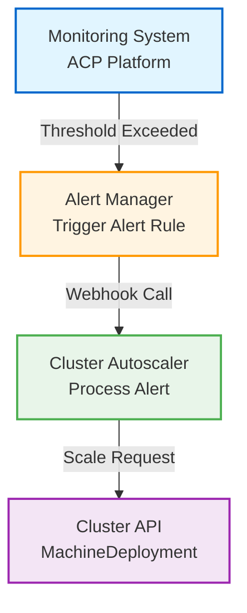

---
products:
   - Alauda Container Platform
ProductsVersion:
   - 4.2
kind:
   - Solution
id: KB260100025
---
# Cluster Autoscaler Solution

:::warning
This solution is currently in **Technical Preview** and is not recommended for production use. Features and functionality may change in future releases. Please test thoroughly in non-production environments before considering deployment.

For production deployment planning, please contact your Alauda Platform support representative.
:::

## Abstract

Alauda Container Platform Cluster Autoscaler is an alert-driven automatic scaling solution for Kubernetes clusters. By monitoring CPU utilization and memory utilization metrics, the solution automatically triggers compute node scaling when resource thresholds are breached. This solution enables enterprises to achieve elastic resource management for Kubernetes clusters, reduce operational costs, and improve business continuity.

---

## Architecture

### Overview

The solution implements an event-driven scaling mechanism through the following workflow:

1. **Monitoring Phase**: ACP platform continuously collects cluster-level CPU and memory utilization metrics
2. **Alert Triggering**: When metrics exceed thresholds, alert rules trigger and send notifications via Webhook
3. **Scaling Decision**: Autoscaler receives alerts and executes scaling based on configured policies (default interval: 3600s)
4. **Resource Adjustment**: Autoscaler adjusts MachineDeployment replica count via Kubernetes API
5. **Scaling Completion**: New nodes are provisioned and join the cluster; history is recorded in ConfigMap

### Diagram



---

## Prerequisites & Constraints

### Functional Limitations

| Limitation | Description |
|------------|-------------|
| **Alert Type** | Only supports cluster-level alerts (Cluster Alert). Does not support Pod or other resource-level alerts |
| **Metric Type** | Only supports default metric alerts (Default Metric Alert). Does not support custom metric alerts (Custom Metric Alert) |
| **Cluster Scope** | Only supports alert rules from workload clusters (Workload Cluster). Does not support alert rules from the global cluster (Global Cluster) |
| **Scaling Direction** | Current version primarily supports scale-out (horizontal scaling) |

### Scaling Interval Limitation

- **Default Scaling Interval**: 3600 seconds (1 hour)
- **Description**: If alerts are triggered repeatedly within a single cluster, only the first scaling operation is executed within the scaling interval
- **Configuration**: Modify interval time via component startup command `--scale-interval=<seconds>`

### Multiple MachineDeployment Selection

- When a cluster has multiple Worker Node Pools (i.e., multiple MachineDeployment resources), specify the target MachineDeployment via startup parameters
- **Configuration Parameters**:
  - `--machine-deployment-selector-key=<label-key>`
  - `--machine-deployment-selector-value=<label-value>`

### Resource Dependencies

- **DCSIpHostnamePool**: Automatic scaling requires that the DCSIpHostnamePool associated with the MachineDeployment's DCSMachineTemplate must have available IP addresses. Otherwise, newly scaled machines will fail to be created

---

## Before You Begin

### Requirements
- ACP Platform 4.2.x installed and running
- Global Cluster admin access
- `kubectl` configured with Global Cluster context
- At least one Workload Cluster with MachineDeployment configured
- DCSIpHostnamePool with available IP addresses

### Required Permissions
- Cluster admin permissions on Global Cluster
- Permission to create AlaudaFeatureGate resources
- Permission to create Notification Rules and Alert Rules

---

## Installation Guide

### Step 1: Download Image File

1. Log in to Alauda Customer Portal
2. Navigate to Marketplace
3. Download **Alauda Container Platform Cluster Autoscaler** plugin
4. The downloaded file is an image archive (`.tar` or `.tar.gz` format)

### Step 2: Load and Push Image

```bash
# Load image using nerdctl (containerd-native CLI)
nerdctl load -i alert-triggered-autoscaler.tar

# Push image to your ACP platform image registry
# Note: Replace <REGISTRY_ADD> with your platform image registry address
export REGISTRY_ADD=<Replace with the platform's image registry address>
nerdctl tag registry.alauda.cn:60080/ait/alert-triggered-autoscaler:v4.0.0-beta.4.g515c3af7-arm64 \
  $REGISTRY_ADD/ait/alert-triggered-autoscaler:v4.0.0-beta.4.g515c3af7
nerdctl push $REGISTRY_ADD/ait/alert-triggered-autoscaler:v4.0.0-beta.4.g515c3af7
```

**Note:** `nerdctl` is the containerd-native CLI tool with Docker-compatible syntax. Ensure `nerdctl` is installed on your system before proceeding.

### Step 3: Create YAML Configuration File

**Note**: All following operations must be performed in the **Global Cluster**

```bash
export REGISTRY_ADD=<Replace with the platform's image registry address>

cat <<EOF> alert-triggered-autoscaler.yaml
---
apiVersion: v1
kind: ServiceAccount
metadata:
  name: alert-triggered-autoscaler
  namespace: cpaas-system
---
apiVersion: rbac.authorization.k8s.io/v1
kind: ClusterRole
metadata:
  name: alert-triggered-autoscaler
rules:
  - apiGroups:
      - ""
    resources:
      - configmaps
    verbs:
      - get
      - list
      - watch
      - update
      - create
      - patch
  - apiGroups:
      - infrastructure.cluster.x-k8s.io
    resources:
      - "dcsmachinetemplates"
      - "dcsiphostnamepools"
    verbs:
      - get
      - list
      - watch
  - apiGroups:
      - cluster.x-k8s.io
    resources:
      - "machinedeployments"
    verbs:
      - get
      - list
      - watch
      - update
      - create
      - patch
---
apiVersion: rbac.authorization.k8s.io/v1
kind: ClusterRoleBinding
metadata:
  name: alert-triggered-autoscaler
roleRef:
  kind: ClusterRole
  apiGroup: rbac.authorization.k8s.io
  name: alert-triggered-autoscaler
subjects:
  - kind: ServiceAccount
    namespace: cpaas-system
    name: alert-triggered-autoscaler
---
apiVersion: apps/v1
kind: Deployment
metadata:
  labels:
    service_name: alert-triggered-autoscaler
  name: alert-triggered-autoscaler
  namespace: cpaas-system
spec:
  progressDeadlineSeconds: 600
  replicas: 1
  revisionHistoryLimit: 10
  selector:
    matchLabels:
      service_name: alert-triggered-autoscaler
  strategy:
    rollingUpdate:
      maxSurge: 1
      maxUnavailable: 1
    type: RollingUpdate
  template:
    metadata:
      creationTimestamp: null
      labels:
        service_name: alert-triggered-autoscaler
    spec:
      affinity:
        podAntiAffinity:
          requiredDuringSchedulingIgnoredDuringExecution:
          - labelSelector:
              matchExpressions:
              - key: service_name
                operator: In
                values:
                - alert-triggered-autoscaler
            topologyKey: kubernetes.io/hostname
      containers:
      - command:
        - /alert-triggered-autoscaler
        - --v=0
        # Optional: Configure scaling interval (default 3600 seconds)
        # - --scale-interval=3600
        # Optional: Specify target MachineDeployment (multi-node-pool scenario)
        # - --machine-deployment-selector-key=cluster.x-k8s.io/cluster-name
        # - --machine-deployment-selector-value=<cluster-name>
        env:
        - name: POD_NAME
          valueFrom:
            fieldRef:
              apiVersion: v1
              fieldPath: metadata.name
        - name: NAMESPACE
          valueFrom:
            fieldRef:
              apiVersion: v1
              fieldPath: metadata.namespace
        image: $REGISTRY_ADD/ait/alert-triggered-autoscaler:v4.0.0-beta.4.g515c3af7
        imagePullPolicy: Always
        name: alert-triggered-autoscaler
        ports:
        - containerPort: 8080
          protocol: TCP
        resources:
          limits:
            cpu: "2"
            memory: 4Gi
          requests:
            cpu: 95m
            memory: 32Mi
        securityContext:
          runAsGroup: 697
          runAsUser: 697
        terminationMessagePath: /dev/termination-log
        terminationMessagePolicy: File
      dnsPolicy: ClusterFirst
      nodeSelector:
        kubernetes.io/os: linux
      restartPolicy: Always
      schedulerName: default-scheduler
      securityContext:
        fsGroup: 697
      serviceAccount: alert-triggered-autoscaler
      serviceAccountName: alert-triggered-autoscaler
      terminationGracePeriodSeconds: 30
      tolerations:
      - effect: NoSchedule
        key: node-role.kubernetes.io/master
        operator: Exists
      - effect: NoSchedule
        key: node-role.kubernetes.io/control-plane
        operator: Exists
      - effect: NoSchedule
        key: node-role.kubernetes.io/cpaas-system
        operator: Exists
---
apiVersion: v1
kind: Service
metadata:
  labels:
    service_name: alert-triggered-autoscaler
  name: alert-triggered-autoscaler
  namespace: cpaas-system
spec:
  internalTrafficPolicy: Cluster
  ipFamilies:
  - IPv4
  ipFamilyPolicy: SingleStack
  ports:
  - name: api
    port: 8080
    protocol: TCP
    targetPort: 8080
  selector:
    service_name: alert-triggered-autoscaler
  type: ClusterIP
EOF
```

### Step 4: Deploy Autoscaler Component

```bash
# Apply YAML configuration
kubectl apply -f alert-triggered-autoscaler.yaml

# Verify deployment status
kubectl get deployment alert-triggered-autoscaler -n cpaas-system
kubectl get pods -n cpaas-system -l service_name=alert-triggered-autoscaler
```

---

## Configuration Guide

### Step 1: Enable Platform Webhook Features

Execute the following commands on any Control Plane Node of the global cluster:

```bash
# Enable Webhook Template feature
kubectl patch AlaudaFeatureGate webhook-template -n cpaas-system \
  --type='json' -p='[{"op": "replace", "path": "/spec/enabled", "value": true}]'

# Enable Webhook Notification Server feature
kubectl patch AlaudaFeatureGate webhook-notification-server -n cpaas-system \
  --type='json' -p='[{"op": "replace", "path": "/spec/enabled", "value": true}]'
```

### Step 2: Create Notification Template

1. Log in to ACP platform and enter **Administrator** view
2. Navigate to **Operations Center → Notifications**
3. Switch to **Templates** tab
4. Click **Create Template** button

#### Form Configuration

| Field | Configuration |
|-------|---------------|
| **Basic Info → Message Type** | Select `Alert Message` |
| **Basic Info → Language Type** | Default `English` (no functional impact) |
| **Template Setting → Webhook** | Enter the following JSON template |

#### Webhook JSON Template

```json
{
  "annotations": {{ MarshalIndent .annotations "  " "  "}},
  "labels": {{ MarshalIndent .labels "  " "  "}},
  "startsAt": "{{ .startsAt }}",
  "endsAt": "{{ .endsAt }}",
  "status": "{{ .status }}",
  "fingerprint": "{{ .fingerprint }}",
  "generatorURL": "{{ .generatorURL }}"
}
```

Other template types (Email, Slack, etc.) do not need modification; keep default values.

### Step 3: Create Receiver Group

1. On Notifications page, switch to **Receiver Group** tab
2. Click **Create Receiver Group** button
3. Enter the following address in the **Webhook** input field:

```
http://alert-triggered-autoscaler.cpaas-system.svc.cluster.local:8080/platform/alerts.cpaas.io/v1/autoscaler
```

Other optional fields can be left empty. Submit directly.

### Step 4: Create Notification Rule

1. On Notifications page, switch to **Rules** tab
2. Click **Create Rule** button
3. Configure the following fields:

| Field | Configuration |
|-------|---------------|
| **Receiver Group** | Select the Receiver Group created in Step 3 |
| **Notification Method** | Check `Webhook` |
| **Templates** | Select the Template created in Step 2 |

### Step 5: Associate Alert Rules

1. Navigate to **Operations Center → Alerts → Rules**
2. Switch to the target cluster at the top of the page
3. Filter alert rules named `cpaas-cluster-rules`
4. Click **Update** in the operation column
5. Enter and select the newly created Notification Rule name in **Rule Configuration → Notification Rules** input
6. Click **Update** to confirm

### Trigger Conditions

After completing the above configuration, the cluster will automatically execute compute node scaling when either of the following alert metrics reaches threshold:

- `Average cpu utilization of all cluster nodes`
- `Average memory utilization of all cluster nodes`

---

## Verification & Monitoring

### Verify Deployment Status

```bash
# Check Deployment status
kubectl get deployment alert-triggered-autoscaler -n cpaas-system

# Check Pod running status
kubectl get pods -n cpaas-system -l service_name=alert-triggered-autoscaler

# View Pod logs
kubectl logs -n cpaas-system -l service_name=alert-triggered-autoscaler --tail=50
```

### View Scaling History

After each scaling operation, the Autoscaler component records the scaling history in ConfigMap:

```bash
# View ConfigMap
kubectl get configmap scale-history-config -n cpaas-system -o yaml
```

#### ConfigMap Data Structure Example

```yaml
apiVersion: v1
data:
  cluster-1: |
    [
      {
        "alert_name": "autoscaler/cluster.resource.request.cpu.utilization-4pBud",
        "scale_time": 1749189108
      },
      {
        "alert_name": "autoscaler/cluster.resource.request.cpu.utilization-4pBud",
        "scale_time": 1749191210
      }
    ]
  cluster-2: |
    [
      {
        "alert_name": "autoscaler/cluster.resource.request.cpu.utilization-4pBud",
        "scale_time": 1749189108
      }
    ]
kind: ConfigMap
metadata:
  name: scale-history-config
  namespace: cpaas-system
```

### Monitoring Metrics

| Monitoring Item | Description |
|----------------|-------------|
| **Pod Status** | Ensure Pod is in `Running` state |
| **Scaling History** | View recent scaling records via ConfigMap |
| **MachineDeployment Replica Count** | Verify replica count is adjusted as expected |
| **Cluster Node Count** | Confirm new nodes have successfully joined the cluster |

---

## FAQ & Troubleshooting

### Common Questions

#### Q1: Why is scaling not triggered after alert is raised?

**Possible Causes and Troubleshooting Steps**:

1. **Check Scaling Interval Limit**
   - Check recent scaling time to confirm if within scaling interval (default 3600 seconds)
   - Solution: Wait for interval to expire or adjust `--scale-interval` parameter

2. **Check MachineDeployment Status**
   ```bash
   kubectl get machinedeployment -A
   ```

3. **Check DCSIpHostnamePool IP Resources**
   - Confirm associated DCSIpHostnamePool has available IPs
   - Insufficient IPs will cause new node creation failure

4. **Check Autoscaler Pod Logs**
   ```bash
   kubectl logs -n cpaas-system -l service_name=alert-triggered-autoscaler --tail=100
   ```

#### Q2: How to specify scaling target in multiple MachineDeployment scenario?

**Solution**:

Modify Deployment startup command to add label selector parameters:

```yaml
command:
  - /alert-triggered-autoscaler
  - --v=0
  - --machine-deployment-selector-key=<label-key>
  - --machine-deployment-selector-value=<label-value>
```

Reapply configuration:

```bash
kubectl apply -f alert-triggered-autoscaler.yaml
```

#### Q3: How to modify scaling interval time?

**Solution**:

Modify Deployment startup command parameter `--scale-interval`:

```yaml
command:
  - /alert-triggered-autoscaler
  - --v=0
  - --scale-interval=1800  # Change to 30 minutes
```

Reapply configuration:

```bash
kubectl apply -f alert-triggered-autoscaler.yaml
```

#### Q4: Are custom metric alerts supported?

**Answer**: Current version **does not support** custom metric alerts (Custom Metric Alert), only default metric alerts (Default Metric Alert):

- `Average cpu utilization of all cluster nodes`
- `Average memory utilization of all cluster nodes`

#### Q5: Is automatic scaling for global cluster supported?

**Answer**: Current version **does not support** global cluster (Global Cluster) alert rule triggering, only workload clusters (Workload Cluster).

#### Q6: Why do new nodes fail to create?

**Possible Causes**:

1. **Insufficient IP Addresses**
   - Check available IP count in DCSIpHostnamePool
   ```bash
   kubectl get dcsiphostnamepool -A
   ```

2. **DCSMachineTemplate Configuration Error**
   - Verify DCS VM Template is valid
   - Check association between MachineDeployment and DCSMachineTemplate

3. **Underlying DCS Platform Resource Limits**
   - Confirm DCS platform quotas and resource limits

### Troubleshooting Checklist

- [ ] Is Autoscaler Pod in `Running` state?
- [ ] Is Webhook URL configured correctly?
- [ ] Is Notification Rule associated with alert rules?
- [ ] Are alert rules enabled and triggering?
- [ ] Is it within scaling interval limit?
- [ ] Does DCSIpHostnamePool have available IPs?
- [ ] Is MachineDeployment label selector correct?
