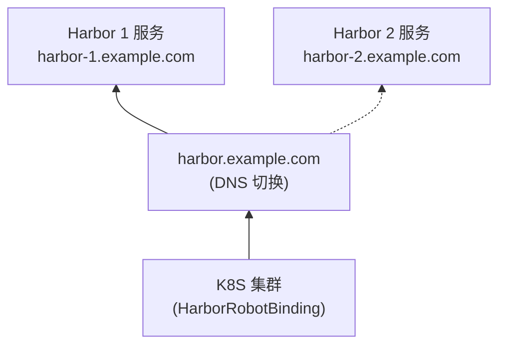

---
kind:
  - Solution
products:
  - Alauda DevOps
ProductsVersion:
  - '4.0,4.1'
id: KB251000010
sourceSHA: d15d988e60ac44862db2aed782cd98af4581f9443e911c597ef55893632d6734
---

# 在 K8S 中使用 Harbor 机器人账户生成器插件自动化 Harbor 机器人凭证同步和令牌轮换

## 介绍

### 什么是 Harbor 机器人账户生成器

在 K8S 集群中，为了拉取私有镜像，我们需要在 K8S 集群中配置一个 `Secret`，将此 Secret 绑定到服务账户（SA），或在创建工作负载时指定 `imagePullSecrets` 字段。在企业中，随着团队规模的扩大，管理的命名空间数量将增加。对于不同的团队，我们也希望每个团队命名空间中使用的凭证权限是有限且可控的。同时，如果凭证泄露，相关风险应足够小。

`Harbor 机器人账户生成器` 是为了解决这些问题而创建的。

### 兼容的 Harbor 版本

- Harbor >= v2.12

### 功能概述

- 根据命名空间信息自动在 Harbor 上创建相应的项目。
- 在 Harbor 项目上自动创建机器人账户，并使用机器人账户的凭证在相应的 K8S 命名空间中创建 K8S Secrets 以拉取镜像。
- 定期刷新机器人账户的凭证并将其同步到命名空间的 Secrets。
- 将创建的 Secrets 附加到服务账户的 `imagePullSecret` 中。

有关更多信息，请参阅：

- [快速开始](#quick-start)

## 安装 {#installation}

### 先决条件

1. 准备一台可以访问平台的 Windows、Linux 或 macOS 操作机器。推荐使用 Linux；以下说明以 Linux 为例。
2. 确保操作机器能够网络访问 `platform`。
3. 下载集群插件包并将其保存到操作机器的工作目录中。

:::info
在 Alauda Cloud Marketplace 中搜索 "Harbor 机器人账户生成器" 以找到集群插件包。
:::

### 获取上传工具

导航到 `平台管理` -> `Marketplace` -> `上架软件包` 下载上传工具。下载后，授予二进制文件执行权限。

### 上传集群插件

> 无论您是导入新的集群插件还是更新现有插件，都可以使用相同的命令和 `上传工具`。

在您的工作目录中运行以下命令：

```bash
./violet push \
    <plugin-package> \
    --platform-address <platform-address> \
    --platform-username <platform-username> \
    --platform-password <platform-password> \
    --clusters <clusters>
```

有关 `violet push` 命令的更多详细信息，请参阅 [violet push 文档](https://docs.alauda.io/container_platform/4.0/ui/cli_tools/index.html)。

### 安装集群插件

上传集群插件后，转到 `平台管理` -> `Marketplace` -> `集群插件`，切换到目标集群，并部署相应的集群插件。

### 卸载集群插件

要卸载集群插件，请导航到 **平台管理** → **Marketplace** → **集群插件**，切换到目标集群，并卸载相应的集群插件。

## 快速开始 {#quick-start}

本文档将帮助您快速了解和使用 Harbor 机器人账户生成器在指定的 k8s 命名空间中生成 Harbor 机器人账户凭证，使 Pods 以最小权限拉取镜像，并定期刷新这些凭证。

### 预计阅读时间

10-15 分钟

### 先决条件

- 一个安装了以下组件的 Kubernetes 集群：
  - Harbor 机器人账户生成器
  - 在集群中创建的三个命名空间：`team`、`team-ns1`、`team-ns2`
  - `team` 命名空间包含标签 `cpaas.io/inner-namespace`，值为 `team`
- 一个正常运行的 Harbor

### 操作步骤概述

| No | 操作步骤                            | 描述                                                                                                  |
| -- | ------------------------------------ | ------------------------------------------------------------------------------------------------------------ |
| 1  | 配置 Harbor 地址信息                | 配置 Harbor 地址、用户名、密码等。                                                                       |
| 2  | 创建 HarborRobotBinding 资源        | 创建同步机器人账户的配置                                                                                  |
| 3  | 验证结果                            | 自动在 Harbor 中创建项目，并验证机器人账户和凭证是否符合预期                                               |

### 步骤

#### 步骤 1：配置 Harbor 连接信息

为了让集群访问 Harbor 并调用 Harbor API，我们需要配置 Harbor 的连接信息。我们将通过一个 Secret 指定这些信息。

```
cat << 'EOF' | kubectl apply -f -
kind: Secret
apiVersion: v1
metadata:
  name: harbor
  namespace: harbor-robot-gen-system
  annotations:
    # 当自动创建 Harbor 项目时，使用命名空间上的标签：cpaas.io/inner-namespace 作为 Harbor 项目的名称
    harbor-robot-gen/projectFieldsPath: "{.metadata.labels.cpaas\\.io/inner-namespace}"
  labels:
    harbor-robot-gen: "true" # 将此 Secret 标记为可用于 Harbor Robot Gen
type: kubernetes.io/opaque
stringData:
  username: api-user # 用于调用 Harbor API 的用户名
  password: api-password # 用于调用 Harbor API 的密码
  url: https://harbor.example.com # Harbor 的地址
EOF
```

由于当前 Harbor 的设计，只有 Harbor 管理员才有权限创建项目，因此此处指定的用户必须是管理员。

有关配置 Harbor 连接信息的更多信息，请参阅 [Harbor 连接信息配置](#harbor-connection-information-configuration)。

#### 步骤 2：创建 HarborRobotBinding 资源

假设我们希望名为 `team-ns1` 和 `team-ns2` 的 k8s 命名空间访问 Harbor 中名为 `team` 的项目。（确保 k8s 命名空间已提前创建）

我们需要创建以下 `HarborRobotBinding` 资源：

```shell
cat << EOF | kubectl apply -f -
apiVersion: harbor-robot-gen.alaudadevops.alauda.io/v1alpha1
kind: HarborRobotBinding
metadata:
  name: harbor-secret-for-team
spec:
  # 将要创建 Secret 的 k8s 命名空间
  namespaces:
    names:
    - team-ns1
    - team-ns2
  generatedSecret:
    name: harbor-secret-for-team.robot  # 在集群中生成的 Secret 的名称
  serviceAccount:
    name: default # 自动将 Secret 绑定到默认服务账户的 imagePullSecrets 字段

  harbor:
    project: team # 预期访问的 Harbor 项目的名称
    robot:
      access: # 自动创建的 Robot 的权限
      - action: pull
        resource: repository
    secret: # Harbor 配置信息，如步骤 1 中配置
      name: harbor
      namespace: harbor-robot-gen-system

  refreshInterval: 6h # 机器人凭证的刷新时间
EOF
```

有关 HarborRobotBinding 配置的更多信息，请参阅 [HarborRobotBinding 配置](#harborrobotbinding)。

#### 步骤 3：验证结果

1. 检查名为 `team` 的 Harbor 项目是否已自动生成。

2. 检查在 Harbor 的 `team` 项目下是否生成了名为 `robot$team+harbor-secret-for-team-xxxx` 的机器人账户。

3. 检查 HarborRobotBinding 的状态是否为 Ready=True。

```bash
$ kubectl get HarborRobotBinding -A

NAME                     READY   LASTREFRESHTIME        NEXTREFRESHTIME        AGE
harbor-secret-for-team   True    2025-05-15T10:33:41Z   2025-05-15T16:33:41Z   20h
```

4. 检查目标命名空间中是否创建了名为 `harbor-secret-for-team.robot` 的 Secret。

```bash
$ kubectl get secret -n <namespace>

NAME                                   TYPE                             DATA   AGE
harbor-secret-for-team.robot           kubernetes.io/dockerconfigjson   1      20h
```

5. 检查目标命名空间中服务账户的 imagePullSecrets 是否自动包含上述 Secret。

```bash
$ kubectl get sa default -n <namespace> -o yaml

apiVersion: v1
imagePullSecrets:
- name: harbor-secret-for-team.robot
kind: ServiceAccount
metadata:
  name: default
```

6. 在目标命名空间中创建一个 Pod，并确认是否可以正常拉取镜像。

```bash
cat << EOF | kubectl apply -f -
kind: Pod
apiVersion: v1
metadata:
  name: test-pod
  namespace: <namespace>
spec:
  containers:
  - name: test
    image: <your-image-address-in-team-project>
    imagePullPolicy: Always
    command: ["sleep"]
    args: ["3600"]
EOF
```

此时，您已成功使用 `Harbor 机器人账户生成器` 在 Harbor 上自动创建团队项目，并生成一个仅具有 `pull repository` 权限的 K8S Secret，该 Secret 可以访问 `team-ns1` 和 `team-ns2` 命名空间中的名为 `team` 的 Harbor 项目。此外，此凭证将每 6 小时自动刷新一次。

### 工作原理

- `Harbor 机器人账户生成器` 检查系统中具有标签 `harbor-robot-gen: "true"` 的凭证，读取配置在凭证上的注释 `harbor-robot-gen/projectFieldsPath` 的值。该值是一个 JsonPath。在遍历当前集群的 k8s 命名空间时，它使用此 JsonPath 访问命名空间上的特定字段值，作为要创建的 Harbor 项目的名称，从而完成在 Harbor 中创建 Harbor 项目的操作。
- 创建 `HarborRobotBinding` 后，`Harbor Robot Gen` 将在指定的 Harbor 项目上创建机器人账户。同时，在指定的 k8s 命名空间范围内，使用机器人账户的凭证创建 k8s Secrets，并将其绑定到指定的服务账户。机器人账户的凭证将根据指定的刷新周期定期刷新，并将最新凭证同步到 k8s。

### 更多信息

- [Harbor 连接信息配置](#harbor-connection-information-configuration)
- [自动生成 Harbor 项目的配置](#configuring-the-name-used-when-automatically-generating-harbor-projects)
- [HarborRobotBinding 配置](#harborrobotbinding)
- [在 Harbor 灾难恢复故障转移中使用](#using-harbor-robot-gen-in-harbor-disaster-recovery-failover)

## HarborRobotBinding {#harborrobotbinding}

### 概述

`HarborRobotBinding` 是一个集群级别的资源，主要定义我们期望自动生成 Harbor 机器人账户凭证的 Kubernetes 命名空间。它还指定这些机器人账户可以访问的 Harbor 项目的权限。

- 目标命名空间的范围
- 机器人账户生成的可访问 Harbor 项目及其相关权限
- 机器人账户凭证的刷新间隔
- 生成的 Kubernetes Secret 的名称和预期绑定的服务账户（SA）的名称

### 预期的 Kubernetes 命名空间范围以自动生成 Secret

通过 `spec.namespaces` 指定预期的命名空间以自动生成 Kubernetes Secrets。通常，此范围表示具有相同类型 Harbor 访问权限的命名空间，例如一个团队的所有命名空间。

- 通过名称指定范围

```yaml
spec:
  namespaces:
    names:
    - default
    - dev-ns1
```

- 通过选择器指定范围；选择器的数据结构可以参考 [K8S LabelSelector](https://pkg.go.dev/k8s.io/apimachinery@v0.33.0/pkg/apis/meta/v1#LabelSelector)

```yaml
spec:
  namespaces:
    selector:
      matchLabels:
        goharbor.io/project: team-1
```

当同时指定名称和选择器时，将取并集。如果名称和选择器均为空，则目标命名空间视为空。

### Harbor 配置

#### 使用 Harbor 连接配置

通过 `spec.harbor.secret` 指定此信息。Secret 的格式可以参考 [Harbor 连接配置](#harbor-connection-information-configuration)

```yaml
spec:
  harbor:
    secret:
      name: harbor
      namespace: harbor-robot-gen-system
```

#### 机器人账户的项目和权限

通过 `spec.harbor.project` 指定机器人账户应创建在哪个 Harbor 项目下，并使用 `spec.harbor.robot` 定义机器人的权限。

```yaml
spec:
  harbor:
    project: team
    robot:
      access:
      - action: pull
        resource: repository
```

其中，`harbor.robot.access[].action` 和 `harbor.robot.access[].resource` 的参数配置可以参考 Harbor 官方 API 文档以创建机器人账户。

#### 机器人账户凭证的刷新间隔

```yaml
spec:
  refreshInterval: 6h
```

#### 生成的 Kubernetes Secret 的名称和预期绑定的服务账户名称

使用 `spec.generatedSecret` 指定生成的 Kubernetes Secret 的名称。请避免与命名空间中现有的 Secrets 命名冲突。Secret 的类型为 `kubernetes.io/dockerconfigjson`。使用 `spec.serviceAccount` 指定绑定的服务账户的名称；如果为空，则只会生成 Secret。

```yaml
apiVersion: harbor-robot-gen.alaudadevops.alauda.io/v1alpha1
kind: HarborRobotBinding
metadata:
  name: harbor-for-team
spec:
  generatedSecret:
    name: harbor-for-team.robot
  serviceAccount:
    name: default
```

### 示例

以下资源将：

- 在名为 `team` 的 Harbor 项目下生成一个仅具有仓库拉取权限的机器人账户。
- 将机器人账户的凭证同步到所有包含标签 `goharbor.io/project: team-1` 的命名空间，创建一个类型为 dockerconfigjson 的 Secret。
- 将 Secret 附加到相应命名空间中默认服务账户的 `imagePullSecrets` 字段。
- 每 6 小时刷新凭证。

```yaml
apiVersion: harbor-robot-gen.alaudadevops.alauda.io/v1alpha1
kind: HarborRobotBinding
metadata:
  name: harbor-for-team
spec:
  generatedSecret:
    name: harbor-for-team.robot
  serviceAccount:
    name: default
  namespaces:
    selector:
      matchLabels:
        goharbor.io/project: team-1

  harbor:
    project: team
    robot:
      access:
      - action: pull
        resource: repository
    secret:
      name: harbor
      namespace: harbor-robot-gen-system
  refreshInterval: 6h
```

## Harbor 连接信息配置 {#harbor-connection-information-configuration}

为了使集群能够访问 Harbor 并调用 Harbor 的 API，我们需要配置 Harbor 的连接信息。

我们通过一个 Secret 指定这些信息。

Secret 类型为 `kubernetes.io/opaque`，主要包含以下信息：

- 标记当前 Secret 将用于 Harbor 机器人账户生成器
- 连接信息，如地址/用户名/密码
- 自动生成 Harbor 项目时使用的字段

### 标记当前 Secret 供 Harbor 机器人账户生成器使用

通过以下标签在 Secret 中标记当前 Secret 供 Harbor 机器人账户生成器使用：

```yaml
metadata:
  labels:
    harbor-robot-gen: "true"
```

### 包含地址/用户名/密码的连接信息

Secret 中的数据必须包含以下字段：

- `url`: Harbor 的地址，例如 <https://harbor.example.com>
- `username`: 访问 Harbor 所需的用户名，例如 user1
- `password`: 访问 Harbor 所需的密码，例如 pass1

请注意，由于当前 Harbor 的设计，只有 Harbor 管理员才有权限创建项目，因此此处指定的用户必须是管理员。

请注意，由于当前 Harbor 版本 2.12 中的一个问题 [机器人账户无法管理机器人账户](https://github.com/goharbor/harbor/issues/21922)，此处的用户不能是机器人账户。建议为 `Harbor 机器人账户生成器` 创建一个专用用户。

### 配置自动生成 Harbor 项目时使用的名称 {#configuring-the-name-used-when-automatically-generating-harbor-projects}

如果您希望在 Harbor 上自动生成一个 Harbor 项目，可以通过使用 `harbor-robot-gen/projectFieldsPath` 注释定义 Harbor 项目的名称。其值是一个 [kubectl 风格的 JSONPath 模板](https://kubernetes.io/docs/reference/kubectl/jsonpath/)

在运行时，它将遍历集群中的所有命名空间，并使用指定 JSONPath 字段的值作为 Harbor 项目的名称。

例如，以下内容表示将使用命名空间中的注释 `goharbor.io/project` 作为 Harbor 项目的名称：

```yaml
metadata:
  annotations:
    harbor-robot-gen/projectFieldsPath: "{.metadata.annotations.goharbor\.io/project}"
```

#### 使用 JSONPath 进行 Harbor 项目命名的更多示例

| JSONPath                                       | 描述                                                                                                                                                                                                                  |
| ---------------------------------------------- | ---------------------------------------------------------------------------------------------------------------------------------------------------------------------------------------------------------------------------- |
| `{.metadata.name}`                             | 使用命名空间名称作为 Harbor 项目名称。Harbor 项目将与集群命名空间一一对应。                                                                                                                                                                 |
| `{.metadata.labels.cpaas\.io/inner-namespace}` | 在 ACP 集群中，具有相同项目的命名空间将包含此标签。这意味着 ACP 项目的名称将用作 Harbor 项目的名称，所有 ACP 项目将各自拥有一个同名的 Harbor 项目。                                                                 |
| `{.metadata.annotations.goharbor\.io/project}` | 使用命名空间上 `goharbor.io/project` 注释的值作为 Harbor 项目的名称。                                                                                                                                                                                           |

> **注意：**
> 请使用适当的 JSONPath 指定 Harbor 项目名称。避免有太多命名空间具有不同的值，这可能导致在 Harbor 中创建过多项目。此外，系统不会自动清理生成的 Harbor 项目；如有必要，您需要手动清理它们。

### 高级配置

#### 多个访问地址配置

当您的 Harbor 注册表可以通过多个地址访问时，您可能需要在使用 HarborRobotBinding 时为备用端点生成 `Image Pull Secrets`。这可以通过 `url.alias` 配置实现。

**配置参数：**

- `url.alias`: Harbor 注册表的备用访问地址（例如，`https://harbor.example.com` 作为 `https://harbor-1.example.com` 的别名）
- `url.alias.policy`: 确定何时为别名地址生成凭证的策略
  - `IfIPEqual`: 仅当 `url.alias` 和 `url` 的解析 IP 地址相同才为 `url.alias` 生成 `Image Pull Secret`
  - `Always`: 无论 IP 解析如何，总是为 `url.alias` 生成 `Image Pull Secret`
- `url.alias.check.interval`: 策略评估检查的间隔，以 [Go 持续时间格式](https://pkg.go.dev/time#ParseDuration) 指定（例如，`2m`）。默认值：`1m`
- `url.alias.ips`: 要与 `url.alias` 的解析 IP 地址进行匹配的 IP 地址列表。如果未设置，则当别名地址与 `url` 相同时，将生效 `IfIPEqual` 策略。如果设置，则当 `url.alias` 的解析 IP 地址包含在列表中时，将生效 `IfIPEqual` 策略。多个 IP 地址用逗号分隔。

**行为：**
为 `url.alias` 生成的 `Image Pull Secret` 具有与主 `url` Secret 相同的凭证，唯一不同的是注册表地址。

**用例：**
`url.alias.policy: IfIPEqual` 配置特别适合实现基于 DNS 的故障转移的 Harbor 灾难恢复场景。有关全面的实施指南，请参见 [在 Harbor 灾难恢复场景中使用](#using-harbor-robot-gen-in-harbor-disaster-recovery-failover)

### 示例

**示例 1**

```yaml
kind: Secret
apiVersion: v1
metadata:
  name: harbor
  namespace: harbor-robot-gen-system
  annotations:
    "harbor-robot-gen/projectFieldsPath": '{.metadata.annotations.goharbor\.io/project}'
  labels:
    harbor-robot-gen: "true"
type: kubernetes.io/opaque
stringData:
  username: user1
  password: pass1
  url: https://harbor-1.example.com
```

**示例 2**

```yaml
kind: Secret
apiVersion: v1
metadata:
  name: harbor
  namespace: harbor-robot-gen-system
  annotations:
    "harbor-robot-gen/projectFieldsPath": '{.metadata.annotations.goharbor\.io/project}'
  labels:
    harbor-robot-gen: "true"
type: kubernetes.io/opaque
stringData:
  username: user1
  password: pass1
  url: https://harbor-1.example.com
  url.alias: https://harbor.example.com
  url.alias.policy: IfIPEqual # 当 url.alias 和 url 的解析 IP 地址相同时，为 url.alias 生成一个 `Image Pull Secret`。默认是 IfIPEqual
  url.alias.check.interval: 2m # 检查策略的间隔，使用 [golang duration](https://pkg.go.dev/time#ParseDuration) 格式，例如 `2m`。默认是 1m。
```

**示例 3**

```yaml
kind: Secret
apiVersion: v1
metadata:
  name: harbor
  namespace: harbor-robot-gen-system
  annotations:
    "harbor-robot-gen/projectFieldsPath": '{.metadata.annotations.goharbor\.io/project}'
  labels:
    harbor-robot-gen: "true"
type: kubernetes.io/opaque
stringData:
  username: user1
  password: pass1
  url: https://harbor-1.example.com
  url.alias: https://harbor.example.com
  url.alias.policy: IfIPEqual
  url.alias.ips: 192.168.1.1,192.168.1.2 # 如果 harbor.example.com 被解析为 192.168.1.1 或 192.168.1.2，则为 url.alias 生成一个 `Image Pull Secret`。
  url.alias.check.interval: 2m

```

## 在 Harbor 灾难恢复故障转移中使用 Harbor 机器人账户生成器 {#using-harbor-robot-gen-in-harbor-disaster-recovery-failover}

在 Harbor 灾难恢复场景中，您可能有两个 Harbor 实例（主实例和备用实例），并实现 DNS 切换以实现主实例和备用实例之间的 Harbor 故障转移。

例如，考虑以下架构：

- Harbor 1 和 Harbor 2 同步镜像以确保镜像一致性
- harbor.example.com 使用 DNS 指向 Harbor 1 或 Harbor 2
- 业务集群通过 harbor.example.com 访问镜像注册表



本文档描述了如何在集群中使用 Harbor 机器人账户生成器，确保在发生 DNS 切换时，集群可以使用 Harbor 机器人账户生成器生成的凭证正常拉取镜像。

### 先决条件

- Kubernetes 集群
- 在集群中安装 `Harbor 机器人账户生成器`
- 准备好 Harbor 1 和 Harbor 2，分别可以通过 harbor-1.example.com 和 harbor-2.example.com 访问
- 准备好域名 harbor.example.com，并配置 Harbor，以便在 DNS 切换后，Harbor 1 和 Harbor 2 都可以通过 harbor.example.com 访问

### 概述

**过程概述**

| No. | 操作步骤                     | 描述                                                   |
| --- | ---------------------------- | ------------------------------------------------------- |
| 1   | 准备并应用 Harbor Secret    | 准备 Harbor secret 以连接到 Harbor                    |
| 2   | 应用 HarborRobotBinding 资源 | 为两个 Harbor 实例创建 HarborRobotBinding 资源         |
| 3   | 验证镜像拉取                | 创建 Pod 以验证镜像拉取功能                          |
| 4   | 切换 DNS 验证镜像拉取      | 切换 DNS 并验证镜像拉取是否继续正常工作              |

**关键配置**

- 在 [Harbor Secret](#harbor-connection-information-configuration) 配置中使用 `url.alias` 功能为 Harbor 1 和 Harbor 2 指定访问别名
- 使用 HarborRobotBinding 资源为 Harbor 1 和 Harbor 2 生成 Image Pull Secrets

### 操作步骤

#### 步骤 1：准备并应用 Harbor Secret

为了使集群能够访问 Harbor 并调用 Harbor API，我们需要配置 Harbor 的连接信息。我们将通过一个 Secret 指定这些信息。

为 Harbor 1 准备 Harbor Secret：

```bash
cat << 'EOF' | kubectl apply -f -
kind: Secret
apiVersion: v1
metadata:
  name: harbor1
  namespace: harbor-robot-gen-system
  annotations:
    "harbor-robot-gen/projectFieldsPath": '{.metadata.labels.cpaas\.io/inner-namespace}'
  labels:
    harbor-robot-gen: "true"
type: kubernetes.io/opaque
stringData:
  username: user1
  password: pass1
  url: https://harbor-1.example.com
  url.alias: https://harbor.example.com
  url.alias.policy: IfIPEqual
EOF
```

为 Harbor 2 准备 Harbor Secret：

```bash
cat << 'EOF' | kubectl apply -f -
kind: Secret
apiVersion: v1
metadata:
  name: harbor2
  namespace: harbor-robot-gen-system
  annotations:
    "harbor-robot-gen/projectFieldsPath": '{.metadata.labels.cpaas\.io/inner-namespace}'
  labels:
    harbor-robot-gen: "true"
type: kubernetes.io/opaque
stringData:
  username: user1
  password: pass1
  url: https://harbor-2.example.com
  url.alias: https://harbor.example.com
  url.alias.policy: IfIPEqual
EOF
```

我们将 `url.alias` 指定为 `https://harbor.example.com`，并将 `url.alias.policy` 指定为 `IfIPEqual`，因此 `HarborRobotBinding` 将在解析的 IP 地址相等时使用 `url.alias` 生成别名 Secret。

有关 `url.alias` 配置的更多信息，请参阅 [Harbor 连接信息配置](#harbor-connection-information-configuration)。

#### 步骤 2：应用 HarborRobotBinding 资源

我们需要为 Harbor 1 和 Harbor 2 创建 `HarborRobotBinding` 资源，以便为从 harbor-1.example.com 和 harbor-2.example.com 拉取生成镜像拉取凭证。根据步骤 1 中的配置，它还将为从 harbor.example.com 拉取生成镜像拉取凭证，这些凭证将从 Harbor 1 的镜像拉取凭证复制。

`HarborRobotBinding` 用于 harbor-1.example.com：

```bash
cat << EOF | kubectl apply -f -
apiVersion: harbor-robot-gen.alaudadevops.alauda.io/v1alpha1
kind: HarborRobotBinding
metadata:
  name: harbor1-for-team1
spec:
  generatedSecret:
    name: harbor1-for-team1.robot
  serviceAccount:
    name: default
  namespaces:
    names:
    - team1-demo
  harbor:
    project: team1
    robot:
      access:
      - action: pull
        resource: repository
    secret:
      name: harbor1
      namespace: harbor-robot-gen-system
  refreshInterval: 1h
EOF
```

`HarborRobotBinding` 用于 harbor-2.example.com：

```bash
cat << EOF | kubectl apply -f -
apiVersion: harbor-robot-gen.alaudadevops.alauda.io/v1alpha1
kind: HarborRobotBinding
metadata:
  name: harbor2-for-team1
spec:
  generatedSecret:
    name: harbor2-for-team1.robot # 注意：避免与 Harbor 1 生成的 HarborRobotBinding 的 Secret 名称冲突
  serviceAccount:
    name: default
  namespaces:
    names:
    - team1-demo
  harbor:
    project: team1
    robot:
      access:
      - action: pull
        resource: repository
    secret:
      name: harbor2
      namespace: harbor-robot-gen-system
  refreshInterval: 1h
EOF
```

应用配置后，我们可以验证两个 HarborRobotBinding 资源是否已成功创建：

```
$ kubectl get harborrobotbinding
NAME                  READY   LASTREFRESHTIME        NEXTREFRESHTIME        AGE
harbor1-for-team1     True    2025-06-19T05:28:12Z   2025-06-19T06:28:12Z   4h
harbor2-for-team1     True    2025-06-19T05:28:12Z   2025-06-19T06:28:12Z   4h
```

等待几秒钟以生成 Secrets：

```bash
$ kubectl get secret -n team1-demo

NAME                              TYPE                             DATA   AGE
harbor1-team1.robot             kubernetes.io/dockerconfigjson   1      4h1m
harbor1-team1.robot.alias       kubernetes.io/dockerconfigjson   1      4h
harbor2-team1.robot             kubernetes.io/dockerconfigjson   1      4h1m
```

由于 harbor.example.com 当前解析为与 harbor-1.example.com 相同的 IP，因此生成了名为 `harbor1-for-team1.robot.alias` 的 Secret。

我们可以验证 Secret `harbor1-for-team1.robot.alias` 使用注册表地址 `https://harbor.example.com`，而其余数据与 `harbor1-for-team1.robot` Secret 相同：

```
$ kubectl get secret -n team1-demo harbor1-for-team1.robot.alias -ojsonpath='{ .data.\.dockerconfigjson }' | base64 -d

{"auths":{"https://harbor.example.com":{"auth":"cm9ibxxxxx==","password":"sFM0Hxxxxxhwau","username":"robot$xxxxx"}}}

$ kubectl get secret -n team1-demo harbor1-for-team1.robot -ojsonpath='{ .data.\.dockerconfigjson }' | base64 -d

{"auths":{"https://harbor-1.example.com":{"auth":"cm9ibxxxxx==","password":"sFM0Hxxxxxhwau","username":"robot$xxxxx"}}}
```

默认服务账户现在包含 Secrets `harbor1-for-team1.robot`、`harbor2-for-team1.robot` 和 `harbor1-for-team1.robot.alias`：

```bash
$ kubectl get sa -n team1-demo default -oyaml

apiVersion: v1
imagePullSecrets:
- name: harbor1-for-team1.robot
- name: harbor2-for-team1.robot
- name: harbor1-for-team1.robot.alias
kind: ServiceAccount
metadata:
  name: default
  namespace: team1-demo
```

现在我们可以使用 `harbor1-for-team1.robot` Secret 从 harbor-1.example.com 拉取镜像，使用 `harbor2-for-team1.robot` Secret 从 harbor-2.example.com 拉取镜像，并使用 `harbor1-for-team1.robot.alias` Secret 从 harbor.example.com 拉取镜像。让我们验证此功能。

#### 步骤 3：验证镜像拉取

创建 Pods 以测试镜像拉取功能：

**注意：** 确保 `harbor-1.example.com` 和 `harbor-2.example.com` 中都有名为 `team1/busybox:stable` 的镜像。

```bash
kubectl run demo --image-pull-policy=Always --image=harbor.example.com/team1/busybox:stable -n team1-demo -- sleep 3600
kubectl run demo1 --image-pull-policy=Always --image=harbor-1.example.com/team1/busybox:stable -n team1-demo -- sleep 3600
kubectl run demo2 --image-pull-policy=Always --image=harbor-2.example.com/team1/busybox:stable -n team1-demo -- sleep 3600
```

验证所有 Pod 是否成功运行。

#### 步骤 4：切换 DNS 验证镜像拉取

现在，将 `harbor.example.com` 的 DNS 记录切换为指向 `harbor-2.example.com` 的 IP 地址。等待几分钟（确切时间取决于您在 DNS 服务器中的 TTL 设置），您应该在命名空间中看到以下 Secrets：

```bash
$ kubectl get secret -n team1-demo

NAME                              TYPE                             DATA   AGE
harbor1-for-team1.robot           kubernetes.io/dockerconfigjson   1      4h1m
harbor2-for-team1.robot           kubernetes.io/dockerconfigjson   1      4h1m
harbor2-for-team1.robot.alias     kubernetes.io/dockerconfigjson   1      4h
```

验证 Secret 内容：

```bash
$ kubectl get secret -n team1-demo harbor2-for-team1.robot -ojsonpath='{ .data.\.dockerconfigjson }' | base64 -d

{"auths":{"https://harbor-2.example.com":{"auth":"cm9ibxxxxx==","password":"sFM0Hxxxxxhwau","username":"robot$xxxxx"}}}

$ kubectl get secret -n team1-demo harbor2-for-team1.robot.alias -ojsonpath='{ .data.\.dockerconfigjson }' | base64 -d

{"auths":{"https://harbor.example.com":{"auth":"cm9ibxxxxx==","password":"sFM0Hxxxxxhwau","username":"robot$xxxxx"}}}
```

服务账户中的镜像拉取凭证也已更改：

```bash
$ kubectl get sa -n team1-demo default -oyaml

apiVersion: v1
imagePullSecrets:
- name: harbor1-for-team1.robot
- name: harbor2-for-team1.robot
- name: harbor2-for-team1.robot.alias
kind: ServiceAccount
metadata:
  name: default
  namespace: team1-demo
```

现在我们可以使用 `harbor2-for-team1.robot.alias` 从 `harbor.example.com` 拉取镜像。让我们验证这一点：

```bash
kubectl run demo --image-pull-policy=Always --image=harbor.example.com/team1/busybox:stable -n team1-demo -- sleep 3600
kubectl run demo2 --image-pull-policy=Always --image=harbor-2.example.com/team1/busybox:stable -n team1-demo -- sleep 3600
```

创建 Pods 后，您应该看到所有 Pods 成功运行。

### 总结

通过上述过程，我们成功演示了如何在 Harbor 灾难恢复场景中使用 Harbor 机器人账户生成器，通过 DNS 切换从主 Harbor 实例和备用 Harbor 实例拉取镜像。

此解决方案为 Harbor 灾难恢复实施提供了坚实的基础，同时保持操作的简便性。

### 相关文档

- [Harbor 连接信息配置](#harbor-connection-information-configuration)
- [理解 HarborRobotBinding](#harborrobotbinding)
