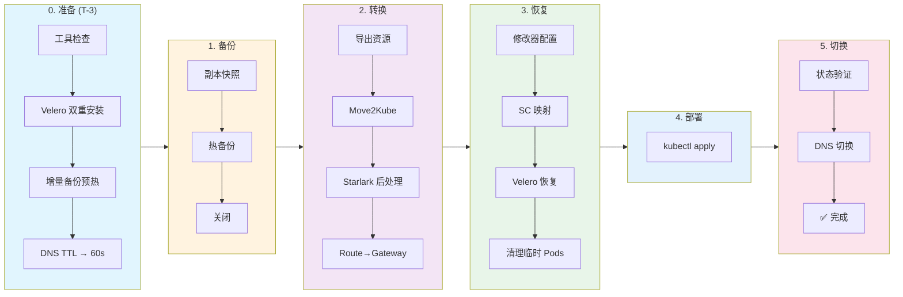

---
kind:
  - Solution
products:
  - Alauda Application Services
ProductsVersion:
  - 4.x
id: KB260100007
sourceSHA: 1eda3ca28c4e9646ebffb123462ad7eb44a47fd100ab102303e7a43d8eb4fc1e
---

# 从 OCP 迁移资源到 ACP (Move2Kube 和 Velero)

## 概述

本文档提供了从 **Red Hat OpenShift (OCP)** 迁移资源到 Alauda Container Platform (ACP) 的全面指南。它涵盖了资源转换、数据迁移和权限处理等关键步骤，帮助团队实现平滑且可回滚的迁移。

## 适用场景

| 场景                                         | 适用性 | 描述                                                      |
| -------------------------------------------- | ------ | ------------------------------------------------------- |
| OCP → ACP (Alauda Container Platform)        | ✅      | 适用，ACP 基于 K8s                                       |
| 有状态应用 (StatefulSet/PVC)                | ✅      | 支持 PV 数据迁移 + fsGroup 权限处理                     |
| 无状态应用 (Deployment)                      | ✅      | 完全支持                                                |
| DeploymentConfig → Deployment                | ✅      | 由 Move2Kube 自动转换                                   |
| Route → Gateway API (HTTPRoute/TLSRoute)    | ✅      | 自动转换，支持透传 TLS                                   |
| 数据库迁移 (MySQL/PostgreSQL/MongoDB)      | ⚠️      | 推荐使用原生备份工具，而非 Velero                       |
| 缓存迁移 (Redis/Memcached)                  | ❌      | 推荐在目标上重建，无需数据迁移                          |

## 迁移流程概述



> \[!NOTE] **阅读指南**：按阶段从左到右执行任务。每个阶段都有详细的命令和验证步骤。

## 0. 环境和工具准备

### 0.1 工具检查

确认在 **操作机器 (堡垒主机)** 上安装了：`oc`、`kubectl`、`velero`、`move2kube`、`yq`。

**下载链接**：

- **oc**: [OpenShift 镜像](https://mirror.openshift.com/pub/openshift-v4/clients/ocp/latest/) (注意：归档通常包括 `kubectl`)
- **kubectl**: [Kubernetes 文档](https://kubernetes.io/docs/tasks/tools/)
- **velero CLI**: [GitHub 发布](https://github.com/vmware-tanzu/velero/releases)
- **move2kube**: [Konveyor 文档](https://move2kube.konveyor.io/installation/cli)
- **yq**: [GitHub 发布](https://github.com/mikefarah/yq/releases) 或 `brew install yq`

### 0.2 Velero 集群安装

:::info
Velero 服务器组件必须在 **源集群 (OCP)** 和 **目标集群 (ACP)** 上安装，并且必须使用相同的对象存储 (S3/MinIO) 作为备份库。
:::

#### OCP 集群 (源)

**推荐使用 OADP (OpenShift 数据保护 API)**，这是 Red Hat 官方支持的 Velero 发行版：

```bash
# 1. 安装 OADP Operator
# 打开 OpenShift 控制台 → 生态系统 → 软件目录 → 搜索 "oadp" → 安装

# 2. 创建凭证密钥
oc create secret generic cloud-credentials -n openshift-adp \
  --from-file=cloud=<(cat <<EOF
[default]
aws_access_key_id=YOUR_ACCESS_KEY
aws_secret_access_key=YOUR_SECRET_KEY
EOF
)

# 3. 创建 DataProtectionApplication CR
cat << EOF | oc apply -f -
apiVersion: oadp.openshift.io/v1alpha1
kind: DataProtectionApplication
metadata:
  name: velero
  namespace: openshift-adp
spec:
  configuration:
    velero:
      defaultPlugins:
        - aws           # S3 兼容存储
        - openshift     # OCP 特定资源
    nodeAgent:
      enable: true      # 启用节点代理 (文件系统备份)
      uploaderType: kopia
  backupLocations:
    - velero:
        provider: aws
        default: true
        objectStorage:
          bucket: velero-backups
          prefix: migration
        config:
          region: us-east-1
          s3ForcePathStyle: "true"
          s3Url: https://minio.example.com  # 您的 S3/MinIO 地址
        credential:
          name: cloud-credentials
          key: cloud
EOF

# 4. 验证安装
oc get pods -n openshift-adp
```

#### ACP 集群 (目标)

参考 [Velero 安装文档](https://docs.alauda.io/container_platform/4.1/configure/backup/install.html) 安装 Velero，然后配置 BSL。

```bash
# 1. 创建对象存储访问的密钥 (ak/sk 必须与源集群匹配)
cat <<EOF | kubectl apply -f -
apiVersion: v1
kind: Secret
metadata:
  name: cloud-credentials
  namespace: cpaas-system  # Velero 命名空间
type: Opaque
stringData:
  cloud: |
    [default]
    aws_access_key_id = YOUR_ACCESS_KEY
    aws_secret_access_key = YOUR_SECRET_KEY
EOF

# 2. 创建 BackupStorageLocation (所有值必须与源集群匹配)
cat <<EOF | kubectl apply -f -
apiVersion: velero.io/v1
kind: BackupStorageLocation
metadata:
  name: default
  namespace: cpaas-system
spec:
  provider: aws
  objectStorage:
    bucket: velero-backups      # 必须与源匹配
    prefix: migration           # 必须与源匹配
  credential:
    name: cloud-credentials
    key: cloud
  config:
    region: us-east-1              # 必须与源匹配
    s3ForcePathStyle: "true"       # 对于 MinIO/非 AWS S3 是必需的
    s3Url: https://minio.example.com  # 必须与源匹配
EOF

# 3. 验证 BSL 状态
kubectl get bsl -n cpaas-system -w
# 等待 Phase 变为可用
```

:::info
目标集群的 Velero BSL 必须与源集群的配置 **完全相同**，以访问源创建的备份。
:::

### 0.3 镜像注册表准备

为了确保在目标 ACP 集群中应用程序的顺利部署，您需要确保容器镜像可访问。您可以根据网络环境和安全要求选择以下方法之一：

#### 选项 1：将 OCP 注册表连接到 ACP（推荐用于直接连接）

如果 ACP 集群可以直接访问 OCP 注册表所在的网络，您可以配置 ACP 信任并从 OCP 注册表中拉取镜像。

1. **信任 CA 证书**：将 OCP 内部注册表的 CA 证书导入 ACP 集群的信任库。这确保 ACP 可以与 OCP 注册表建立安全连接。
2. **配置拉取密钥**：在 ACP 集群中创建一个全局拉取密钥，包含 OCP 注册表的有效凭证（用户名和密码/令牌）。这授权 ACP 从受保护的 OCP 注册表中拉取镜像。

#### 选项 2：手动将镜像推送到 ACP 注册表（用于隔离环境）

如果集群之间没有直接的网络连接，或者您希望合并镜像，您可以手动转移它们。

1. **从 OCP 拉取**：在可以访问 OCP 注册表的堡垒主机上，将所需的应用程序镜像拉取到本地机器。
2. **重新标记镜像**：将本地镜像重新标记为与目标 ACP 注册表的地址和项目结构匹配。
3. **推送到 ACP**：将重新标记的镜像推送到 ACP 集群的内置注册表或您的外部组织注册表。

## 1. 倒计时准备阶段

**目标**：提前暴露风险，将数据同步时间从“小时”压缩到“分钟”。在维护窗口前 3 天开始此操作。

### 1.1 启用增量备份预热

**备份策略**：

- **💡 预热跳过逻辑**：如果总 PV 数据较小（例如 **< 20GB**），预热备份通常只需几分钟，**您可以选择跳过此阶段**，并在停机窗口期间直接执行最终备份。
- **✅ 必须备份**：配置数据、静态文件、用户上传（ReadWriteMany/ReadWriteOnce）。
- **❌ 推荐排除**：
  - **数据库 (MySQL/PgSQL/Mongo/Elasticsearch 等)**：推荐使用原生工具如 `mysqldump` / `pg_dump` 进行迁移，以确保强一致性。
  - **临时缓存 (Redis/Memcached)**：推荐在目标上重建，无需数据迁移。
  - **排除方法**：

    ```bash
    # 示例：排除名为 "cache-volume" 的 PVC
    oc annotate pod <pod-name> backup.velero.io/backup-volumes-excludes=cache-volume -n ${SOURCE_NS} --overwrite
    ```

```bash
# 1. 设置环境变量（根据需要修改）
export SOURCE_NS="demo"

# 2. 在 OCP 端执行预热备份（建议配置 Crontab 每日执行）
# --default-volumes-to-fs-backup: 使用文件系统备份以实现跨云/跨存储兼容性
# 备份整个命名空间（包括 Pods），以便节点代理可以访问 PV 数据
velero -n openshift-adp backup create migration-warmup-$(date +%F) \
  --include-namespaces ${SOURCE_NS} \
  --default-volumes-to-fs-backup

# 检查备份进度
velero -n openshift-adp backup describe migration-warmup-$(date +%F)
```

> \[!WARNING] `SOURCE_NS="demo"` -> 更改为您实际的迁移命名空间名称。<br/>
> `openshift-adp` 是 Velero 的命名空间，如果部署在其他地方，请替换。

### 1.2 降低 DNS TTL

**操作**：登录到 DNS 提供商控制台，将业务域名（例如 `myapp.example.com`）的 TTL 从默认值更改为 **60s**。

## 2. 最终备份和关闭

> \[!CAUTION] **Velero 文件系统备份范围**\
> ✅ 文件存储数据（日志、静态文件、配置等）\
> ❌ **数据库数据**（MySQL、PostgreSQL、MongoDB 等） - 请使用数据库原生备份工具。

### 2.1 执行最终热备份

:::info
**热备份原则**：在 Pod 运行时执行备份，然后 **立即关闭** 备份完成后的 Pod。
由于已执行预热备份，这是一个 **增量备份**（仅传输差异），速度极快，将停机窗口压缩到最小（秒/分钟）。
:::

**备份策略**：

- **✅ 必须备份**：配置数据、静态文件、用户上传。
- **❌ 建议跳过**：数据库（使用 dump）、临时缓存（Redis/Memcached）。
- **操作命令**：

  ```bash
  # 如果发现未排除的临时卷，添加注释以排除
  oc annotate pod <pod-name> backup.velero.io/backup-volumes-excludes=temp-vol -n <namespace> --overwrite
  ```

```bash
export SOURCE_NS="demo"
export BACKUP_NAME="migration-final-cutover"

# 1. 导出当前副本快照（回滚的救命稻草）
oc get dc,deploy,sts -n ${SOURCE_NS} -o jsonpath='{range .items[*]}{.kind}/{.metadata.name}{"="}{.spec.replicas}{"\n"}{end}' > replicas_backup.txt

# 2. 执行最终备份（Pod 正在运行，Velero 节点代理可以访问 PV 数据）
velero -n openshift-adp backup create ${BACKUP_NAME} \
  --include-namespaces ${SOURCE_NS} \
  --default-volumes-to-fs-backup \
  --wait

# 验证：Phase 必须为 "Completed"，错误数必须为 0
velero -n openshift-adp backup describe ${BACKUP_NAME} --details

# 3. 备份后立即关闭（防止新数据写入）
oc scale --replicas=0 dc,deploy,statefulset --all -n ${SOURCE_NS}

# 4. 检查迁移业务 Pods 是否不再运行
oc get pods -n ${SOURCE_NS} --field-selector=status.phase=Running
```

> \[!WARNING] `demo` → 您实际的命名空间名称。

## 3. 资源转换和自动注入

> \[!NOTE] **方案**：Move2Kube 运行所有内置转换（DeploymentConfig→Deployment、Route→Ingress 等），后处理脚本 **删除 Ingress**，并根据原始 Routes 生成 HTTPRoute/TLSRoute。

### 3.1 准备转换工作区

请复制下面的整个命令块并在终端中执行：

```bash
mkdir -p migration_workdir && cd migration_workdir

# 0. 导出源集群资源（推荐：单个文件 + 过滤系统配置 + 排除 STS PVC）
mkdir -p source
# 定义要导出的资源类型
# 此处无需导出 PV/PVC，Velero 已备份它们
KINDS="deployment,deploymentconfig,statefulset,daemonset,cronjob,service,route,configmap,secret,serviceaccount,role,rolebinding"
# 排除列表：系统证书、令牌、构建器配置等
EXCLUDE_REGEX="^(kube-root-ca\.crt|openshift-service-ca\.crt|config-service-cabundle|config-trusted-cabundle|builder-.*|deployer-.*|default-dockercfg-.*|default-token-.*)$"

for kind in $(echo $KINDS | tr ',' ' '); do
  oc get $kind -n ${SOURCE_NS} -o name 2>/dev/null | while read -r resource; do
    name=${resource#*/}
    if [[ "$name" =~ $EXCLUDE_REGEX ]]; then
      echo "跳过 (系统): $kind/$name"
      continue
    fi
    echo "导出: $kind/$name"
    oc get "$resource" -n ${SOURCE_NS} -o yaml > "source/${kind}-${name}.yaml"
  done
done

# 1. 处理 ImageStream 镜像引用（自动扫描集群并替换）
# DeploymentConfig 可能引用 ImageStream，转换后的 YAML 中的 'image' 字段可能是：
# - OCP 内部地址: image-registry.openshift-image-registry.svc:5000/...
# - ImageStream 标签: my-app:latest (没有完整的注册表前缀)
# - 引用其他命名空间: other-project/my-app:dev
# 这些在目标 ACP 集群中无法解析，需要替换为外部可访问的镜像地址（Docker 引用）

# 1.1 导出映射表

# 1.1.1 导出所有命名空间的完整路径映射（namespace/name:tag）
oc get is -A -o go-template='{{range .items}}{{$ns := .metadata.namespace}}{{$name := .metadata.name}}{{range .status.tags}}{{$ns}}/{{$name}}:{{.tag}}={{(index .items 0).dockerImageReference}}{{"\n"}}{{end}}{{end}}' > image_mappings.txt

# 1.1.2 导出当前命名空间的短名称映射（name:tag）
oc get is -n ${SOURCE_NS} -o go-template='{{range .items}}{{$name := .metadata.name}}{{range .status.tags}}{{$name}}:{{.tag}}={{(index .items 0).dockerImageReference}}{{"\n"}}{{end}}{{end}}' >> image_mappings.txt

# 1.1.3 导出 OCP 内部注册表完整地址映射
# 格式: image-registry.openshift-image-registry.svc:5000/ns/name:tag=dockerRef
INTERNAL_REG="image-registry.openshift-image-registry.svc:5000"
oc get is -A -o go-template='{{range .items}}{{$ns := .metadata.namespace}}{{$name := .metadata.name}}{{range .status.tags}}'"${INTERNAL_REG}"'/{{$ns}}/{{$name}}:{{.tag}}={{(index .items 0).dockerImageReference}}{{"\n"}}{{end}}{{end}}' >> image_mappings.txt

echo "导出 $(wc -l < image_mappings.txt) 镜像映射"

# 1.2 执行批量替换
echo "执行镜像地址替换..."
# 备份源目录
cp -r source source_bak_images

# 遍历映射进行替换
# 注意：仅替换 YAML 中 'image: ' 后的精确匹配
while IFS='=' read -r key value; do
  if [[ -n "$key" && -n "$value" ]]; then
     # 查找包含此键引用的文件（提高效率）
     grep -l "image: .*[\"']\?${key}[\"']\?$" source/*.yaml 2>/dev/null | sort | uniq | while read -r file; do
       # 使用 sed 替换：匹配 image: 后跟可选引号，然后是键，再跟可选引号，行尾
       # 替换为 image: value
       sed -i.bak "s|image: \([\"']\{0,1\}\)${key}\1$|image: $value|g" "$file"
       echo "更新 $file: $key"
     done
  fi
done < image_mappings.txt

# 2. 创建转换器配置
mkdir -p customizations/ocp-to-acp

cat << 'EOF' > customizations/ocp-to-acp/transformer.yaml
apiVersion: move2kube.konveyor.io/v1alpha1
kind: Transformer
metadata:
  name: ocp-to-acp
  labels:
    move2kube.konveyor.io/built-in: "false"
    # 设置排序顺序为 9999，确保在参数化器（10000）之前运行
    move2kube.konveyor.io/sort-order: "9999"
spec:
  class: "Starlark"
  config:
    starFile: "transformer.star"

  # 消费 KubernetesYamlsInSource（KubernetesVersionChanger 的输出类型）
  consumes:
    KubernetesYamlsInSource:
      merge: false
  
  # 产生相同类型，允许参数化器继续处理
  produces:
    KubernetesYamlsInSource:
      disabled: false
EOF

# 3. 创建 Starlark 脚本
cat << 'EOF' > customizations/ocp-to-acp/transformer.star
# Move2Kube Starlark: OCP 到 ACP 转换
# 
# 特性：
# 1. 清理无效/临时字段（status、uid、resourceVersion、generation、creationTimestamp 等）
# 2. 清理无效注释（pv.kubernetes.io、revision 等）
# 3. 设置 Pod SecurityContext fsGroup（处理 PVC 权限）
# 4. 清理 Service 中的动态字段，如 clusterIP、nodePort
# 5. 替换 StorageClass 名称（跨集群迁移场景）

# 配置参数
APP_GID = 1000
FS_GROUP_CHANGE_POLICY = "OnRootMismatch"

# StorageClass 映射: {"SourceClusterSC": "TargetClusterSC"}
# 示例：OCP ocs-storagecluster-ceph-rbd 映射到 ACP 的 sc-topolvm
STORAGECLASS_MAPPING = {
    "ocs-storagecluster-ceph-rbd": "sc-topolvm",
    "ocs-storagecluster-cephfs": "sc-topolvm",
    # 添加更多映射...
}

# 要从元数据中移除的字段
METADATA_FIELDS_TO_REMOVE = [
    "namespace",
    "uid", "resourceVersion", "generation", "creationTimestamp",
    "selfLink", "managedFields", "ownerReferences", "finalizers",
]

# 要从根级别移除的字段
ROOT_FIELDS_TO_REMOVE = ["status"]

# 要从 Service.spec 中移除的字段
SERVICE_SPEC_FIELDS_TO_REMOVE = ["clusterIP", "clusterIPs"]

# 要从 Pod spec（工作负载模板.spec）中移除的字段（OCP 特定）
POD_SPEC_FIELDS_TO_REMOVE = [
    "nodeSelector",       # 目标集群节点标签可能不同
    "runtimeClassName",   # 移除 OCP 特定运行时
    "priorityClassName",  # 目标集群可能没有相同的 PriorityClass
    "schedulerName",      # 使用默认调度程序
    "securityContext",    # 清除 OCP SCC 相关配置
]

# 要从容器（containers/initContainers）中移除的字段
CONTAINER_FIELDS_TO_REMOVE = [
    "securityContext",    # 清除容器级别的安全上下文
]

def directory_detect(dir):
    return {}

def transform(new_artifacts, old_artifacts):
    path_mappings = []
    created_artifacts = []
    
    for artifact in new_artifacts:
        paths = artifact.get("paths", {})
        yaml_paths = paths.get("KubernetesYamls", [])
        
        for yaml_dir in yaml_paths:
            modified_files = process_yaml_directory(yaml_dir)
            for filepath in modified_files:
                path_mappings.append({
                    "type": "Default",
                    "sourcePath": filepath,
                    "destinationPath": filepath
                })
        
        created_artifacts.append(artifact)
    
    return {"pathMappings": path_mappings, "createdArtifacts": created_artifacts}

def process_yaml_directory(yaml_dir):
    modified_files = []
    if not fs.exists(yaml_dir):
        return modified_files
    
    files = fs.read_dir(yaml_dir)
    for filename in files:
        if filename.endswith(".yaml") or filename.endswith(".yml"):
            filepath = fs.path_join(yaml_dir, filename)
            if process_yaml_file(filepath):
                modified_files.append(filepath)
    return modified_files

def process_yaml_file(filepath):
    content = fs.read_as_string(filepath)
    if content == None or content == "":
        return False
    
    doc = yaml.loads(content)
    if doc == None:
        return False
    
    kind = doc.get("kind", "")
    modified = False
    
    # 1. 清理所有资源的无效字段
    if cleanup_resource(doc):
        modified = True
    
    # 2. 清理 Service 的动态字段
    if kind == "Service":
        if cleanup_service(doc):
            modified = True
    
    # 3. 处理工作负载资源
    if kind in ["Deployment", "StatefulSet", "DaemonSet"]:
        # 修复标签和选择器不匹配（DeploymentConfig 转换中的常见问题）
        if fix_selector_labels(doc):
            modified = True
        # 首先清理 Pod 模板（包括 securityContext）
        if cleanup_pod_template(doc):
            modified = True
        # 注入 fsGroup（如果存在 PVC）
        if check_has_pvc(doc):
            if inject_fsgroup(doc):
                modified = True
        # StatefulSet volumeClaimTemplates 也需要替换 StorageClass
        if kind == "StatefulSet":
            if replace_storageclass_in_vcts(doc):
                modified = True
    
    if modified:
        new_content = yaml.dumps(doc)
        fs.write(filepath, new_content)
    
    return modified

def cleanup_resource(doc):
    modified = False
    for field in ROOT_FIELDS_TO_REMOVE:
        if field in doc:
            doc.pop(field)
            modified = True
    
    metadata = doc.get("metadata")
    if metadata != None:
        for field in METADATA_FIELDS_TO_REMOVE:
            if field in metadata:
                metadata.pop(field)
                modified = True
        
        # 清除所有注释
        if "annotations" in metadata:
            metadata.pop("annotations")
            modified = True
    
    return modified

def cleanup_service(doc):
    modified = False
    spec = doc.get("spec")
    if spec == None:
        return False
    
    for field in SERVICE_SPEC_FIELDS_TO_REMOVE:
        if field in spec:
            spec.pop(field)
            modified = True
    
    service_type = spec.get("type", "ClusterIP")
    if service_type not in ["NodePort", "LoadBalancer"]:
        ports = spec.get("ports", [])
        if ports != None:
            for port in ports:
                if "nodePort" in port:
                    port.pop("nodePort")
                    modified = True
    
    if "healthCheckNodePort" in spec:
        spec.pop("healthCheckNodePort")
        modified = True
    
    return modified

def replace_storageclass_in_vcts(doc):
    """在 StatefulSet volumeClaimTemplates 中替换 StorageClass
    
    StatefulSet 使用 volumeClaimTemplates 动态创建 PVC，需要单独处理
    """
    spec = doc.get("spec")
    if spec == None:
        return False
    
    vcts = spec.get("volumeClaimTemplates")
    if vcts == None or len(vcts) == 0:
        return False
    
    modified = False
    for vct in vcts:
        vct_spec = vct.get("spec")
        if vct_spec == None:
            continue
        
        storage_class = vct_spec.get("storageClassName")
        if storage_class == None:
            continue
        
        if storage_class in STORAGECLASS_MAPPING:
            new_sc = STORAGECLASS_MAPPING[storage_class]
            vct_spec["storageClassName"] = new_sc
            modified = True
    
    return modified

def fix_selector_labels(doc):
    """修复 Deployment/StatefulSet/DaemonSet 的标签和选择器不匹配
    
    问题：Move2Kube 从 DeploymentConfig 转换可能会产生：
    - spec.selector.matchLabels 与 spec.template.metadata.labels 不一致
    - 导致 Deployment 无法创建 ReplicaSet
    
    解决方案：确保 selector.matchLabels 是 template.metadata.labels 的子集
    """
    modified = False
    kind = doc.get("kind", "")
    
    spec = doc.get("spec")
    if spec == None:
        return False
    
    # 获取选择器
    selector = spec.get("selector")
    if selector == None:
        return False
    
    # 对于 Deployment/StatefulSet，使用 matchLabels
    if kind in ["Deployment", "StatefulSet"]:
        match_labels = selector.get("matchLabels")
        if match_labels == None:
            return False
    else:
        # DaemonSet 直接使用选择器作为 matchLabels
        match_labels = selector
    
    # 获取模板元数据标签
    template = spec.get("template")
    if template == None:
        return False
    
    template_metadata = template.get("metadata")
    if template_metadata == None:
        # 如果不存在，则创建 template.metadata
        template["metadata"] = {"labels": {}}
        template_metadata = template["metadata"]
        modified = True
    
    template_labels = template_metadata.get("labels")
    if template_labels == None:
        template_metadata["labels"] = {}
        template_labels = template_metadata["labels"]
        modified = True
    
    # 检查 matchLabels 是否全部在模板标签中
    for key, value in match_labels.items():
        if key not in template_labels:
            # 选择器中的标签但不在模板中 -> 添加到模板
            template_labels[key] = value
            modified = True
        elif template_labels[key] != value:
            # 值不一致 -> 选择器优先，更新模板
            template_labels[key] = value
            modified = True
    
    return modified

def cleanup_pod_template(doc):
    modified = False
    spec = doc.get("spec")
    if spec == None:
        return False
    
    template = spec.get("template")
    if template == None:
        return False
    
    template_metadata = template.get("metadata")
    if template_metadata == None:
        return False
    
    for field in METADATA_FIELDS_TO_REMOVE:
        if field in template_metadata:
            template_metadata.pop(field)
            modified = True
    
    extra_fields = ["name", "namespace", "resourceVersion", "uid"]
    for field in extra_fields:
        if field in template_metadata:
            template_metadata.pop(field)
            modified = True
    
    # 清理 Pod spec 中的 OCP 特定字段
    template_spec = template.get("spec")
    if template_spec != None:
        for field in POD_SPEC_FIELDS_TO_REMOVE:
            if field in template_spec:
                template_spec.pop(field)
                modified = True
        
        # 清理容器级别字段
        for container_list in ["containers", "initContainers"]:
            containers = template_spec.get(container_list, [])
            if containers != None:
                for container in containers:
                    for field in CONTAINER_FIELDS_TO_REMOVE:
                        if field in container:
                            container.pop(field)
                            modified = True
    
    return modified

def get_template_spec(resource):
    spec = resource.get("spec", {})
    if spec == None:
        return None
    template = spec.get("template", {})
    if template == None:
        return None
    return template.get("spec", None)

def ensure_template_spec(resource):
    if "spec" not in resource:
        resource["spec"] = {}
    spec = resource["spec"]
    if "template" not in spec:
        spec["template"] = {}
    template = spec["template"]
    if "spec" not in template:
        template["spec"] = {}
    return template["spec"]

def get_pvc_volume_names(resource):
    template_spec = get_template_spec(resource)
    if template_spec == None:
        return []
    
    volumes = template_spec.get("volumes", [])
    if volumes == None:
        volumes = []
    
    kind = resource.get("kind", "")
    spec = resource.get("spec", {})
    if spec == None:
        spec = {}
    
    pvc_vol_names = []
    for v in volumes:
        if v.get("persistentVolumeClaim") != None:
            vol_name = v.get("name", "")
            if vol_name != "":
                pvc_vol_names.append(vol_name)
    
    if kind == "StatefulSet":
        vcts = spec.get("volumeClaimTemplates", [])
        if vcts == None:
            vcts = []
        for vct in vcts:
            meta = vct.get("metadata", {})
            if meta == None:
                continue
            vct_name = meta.get("name", "")
            if vct_name != "":
                pvc_vol_names.append(vct_name)
    
    return pvc_vol_names

def check_has_pvc(resource):
    pvc_vol_names = get_pvc_volume_names(resource)
    return len(pvc_vol_names) > 0

def inject_fsgroup(resource):
    template_spec = ensure_template_spec(resource)
    
    if "securityContext" not in template_spec:
        template_spec["securityContext"] = {}
    
    security_context = template_spec["securityContext"]
    if security_context == None:
        template_spec["securityContext"] = {}
        security_context = template_spec["securityContext"]
    
    existing_fsgroup = security_context.get("fsGroup")
    if existing_fsgroup != None:
        return False
    
    security_context["fsGroup"] = APP_GID
    security_context["fsGroupChangePolicy"] = FS_GROUP_CHANGE_POLICY
    return True
EOF

# 4. 创建 Route → Gateway API 后处理脚本
# 特性：删除 Ingress + 从源 Route 生成 HTTPRoute/TLSRoute
cat << 'SCRIPT' > convert_routes_to_gateway.sh
#!/bin/bash
# Route 到 Gateway API 转换器
# 从源读取 Route，删除目标中的 Ingress，生成 HTTPRoute/TLSRoute
set -euo pipefail

GATEWAY_NAME="${GATEWAY_NAME:-default-gateway}"
GATEWAY_NS="${GATEWAY_NAMESPACE:-gateway-system}"

log() { echo -e "\033[0;32m[INFO]\033[0m $1"; }
step() { echo -e "\033[0;34m[STEP]\033[0m $1"; }

# 删除 Ingress
delete_ingress() {
    local count=0
    while IFS= read -r -d '' f; do
        yq -e '.kind == "Ingress"' "$f" &>/dev/null && { rm -f "$f"; log "已删除: $f"; ((count++)) || true; }
    done < <(find "$1" -name "*.yaml" -type f -print0 2>/dev/null)
    log "已删除 $count 个 Ingress 资源"
}

# 生成 HTTPRoute/TLSRoute
convert_route() {
    local rf="$1" od="$2"
    local name=$(yq '.metadata.name' "$rf")
    local host=$(yq '.spec.host' "$rf")
    local path=$(yq '.spec.path // "/"' "$rf")
    local svc=$(yq '.spec.to.name' "$rf")
    local port=$(yq '.spec.port.targetPort // 80' "$rf")
    local tls=$(yq '.spec.tls.termination // "none"' "$rf")
    [[ ! "$port" =~ ^[0-9]+$ ]] && port=80

    if [[ "$tls" == "passthrough" ]]; then
        [[ "$port" == "80" ]] && port=443
        cat > "${od}/${name}-tlsroute.yaml" << EOF
apiVersion: gateway.networking.k8s.io/v1alpha2
kind: TLSRoute
metadata:
  name: ${name}
spec:
  parentRefs:
    - name: ${GATEWAY_NAME}
      namespace: ${GATEWAY_NS}
      sectionName: tls
  hostnames:
    - "${host}"
  rules:
    - backendRefs:
        - name: ${svc}
          port: ${port}
EOF
        log "创建 TLSRoute: ${name}"
    else
        # 确定路径匹配类型（精确 vs 前缀）
        local path_type="PathPrefix"
        if [[ "$path" != */ && "$path" != *\* ]]; then
            # 没有尾随斜杠或通配符的路径表示精确匹配
            path_type="Exact"
        fi

        cat > "${od}/${name}-httproute.yaml" << EOF
apiVersion: gateway.networking.k8s.io/v1
kind: HTTPRoute
metadata:
  name: ${name}
spec:
  parentRefs:
    - name: ${GATEWAY_NAME}
      namespace: ${GATEWAY_NS}
  hostnames:
    - "${host}"
  rules:
    - matches:
        - path:
            type: ${path_type}
            value: "${path}"
      backendRefs:
        - name: ${svc}
          port: ${port}
EOF
        log "创建 HTTPRoute: ${name}"
    fi
}

main() {
    [[ $# -lt 2 ]] && { echo "用法: $0 <source_dir> <target_dir>"; exit 1; }
    local src="$1" tgt="$2"
    echo ""; echo "=== Route 到 Gateway API 转换器 ==="; echo ""
    log "源: $src, 目标: $tgt, 网关: ${GATEWAY_NS}/${GATEWAY_NAME}"
    
    step "1. 删除 Ingress"; delete_ingress "$tgt"; echo ""
    step "2. 从源生成 HTTPRoute/TLSRoute"
    
    local cnt=0 od="$tgt"
    [[ -d "$tgt/source/source-versionchanged-parameterized/kustomize/base" ]] && od="$tgt/source/source-versionchanged-parameterized/kustomize/base"
    
    while IFS= read -r -d '' f; do
        yq -e '.kind == "Route" and .apiVersion == "route.openshift.io/v1"' "$f" &>/dev/null && { convert_route "$f" "$od"; ((cnt++)) || true; }
    done < <(find "$src" -name "*.yaml" -type f -print0 2>/dev/null)
    
    log "处理了 $cnt 个 Routes"; echo ""; log "✅ 完成!"
}
main "$@"
SCRIPT
chmod +x convert_routes_to_gateway.sh
```

> \[!WARNING] **配置参数**：
>
> - `APP_GID = 1000` → 容器 GID，fsGroup 将使用此值
> - `FS_GROUP_CHANGE_POLICY = "OnRootMismatch"` → 仅在不匹配时更改权限（提高性能）
> - `STORAGECLASS_MAPPING = {...}` → StorageClass 名称映射，用于 StatefulSet volumeClaimTemplates
> - **TLS 映射**：`passthrough` → TLSRoute，其他 → HTTPRoute

### 3.2 执行转换

```bash
# 6. 手动检查：确认源目录中没有不需要的资源（例如排除列表中省略的 PV/PVC）
ls -l source/

# 7. 生成计划并执行转换
move2kube plan -s source -c customizations
move2kube transform --qa-skip

# 8. 后处理：删除 Ingress，生成 HTTPRoute/TLSRoute 基于原始 Route
# Arg1 source: 源资源目录（用于读取 Route 定义）
# Arg2 output: 转换后的工件目录（将在此处扫描 Deployments 以进行 Init 注入/Ingress 删除）
./convert_routes_to_gateway.sh source myproject/source/source-versionchanged
```

:::tip 自定义网关
**GATEWAY_NAME**=my-gw **GATEWAY_NAMESPACE**=ingress ./convert_routes_to_gateway.sh source myproject/source/source-versionchanged
:::

### 3.3 工件修正和命名空间准备

> \[!NOTE] **输出目录选择**：我们使用 `source-versionchanged` 目录，其中包含转换后的 ACP YAML（Deployment、Service 等），并具有最清晰的结构。

#### 3.3.1 fsGroup 配置

Starlark 脚本使用 `APP_GID = 1000` 作为默认值，通常适用于大多数应用镜像。

**机制**：Kubernetes 自动将 PVC 挂载点的组设置为 `fsGroup`，确保容器进程具有读写访问权限。

| 配置项               | 默认            | 描述                                                  |
| -------------------- | --------------- | ----------------------------------------------------- |
| `APP_GID`            | `1000`          | 挂载目录组 ID，兼容大多数镜像                          |
| `fsGroupChangePolicy`| `OnRootMismatch`| 仅在不匹配时更改权限，提高性能                       |

> \[!TIP]
> 要修改 GID，请编辑 `customizations/ocp-to-acp/transformer.star` 中的 `APP_GID` 常量，并重新运行 `move2kube transform`。

#### 3.3.2 工件验证列表

根据需要调整 `myproject/source/source-versionchanged` 目录下的工件。

:::warning 调整工件
确保 **镜像注册表** 对 ACP 集群可访问。

记得根据需要调整副本和其他配置。
:::

#### 3.3.3 命名空间和 PSA 配置

```bash
# 1. 创建目标命名空间（如果不存在）
kubectl create ns ${TARGET_NS} 2>/dev/null || true

# 2. 可选：Pod 安全准入配置
# 仅在 Pod 因权限错误而失败时考虑放宽：
kubectl label ns ${TARGET_NS} pod-security.kubernetes.io/enforce=baseline --overwrite
```

## 4. 恢复

**顺序**：恢复 PVC 数据 → 部署应用程序（fsGroup 处理权限）。

### 4.1 恢复存储层

:::info
**跨集群先决条件**：目标集群 Velero 必须与源集群配置相同的 BackupStorageLocation (BSL) 以访问备份。
:::

#### 4.1.1 准备恢复配置

由于备份的 Pods 可能包含 OCP 特定配置（如 `runtimeClassName`、`priorityClassName`、特殊调度程序），直接恢复将导致 Pods 启动失败。我们需要创建：

**1. 资源修改器 ConfigMap** - 修改 Pod 配置：

**修改说明**：

| 字段                     | 修改                           | 原因                                                |
| ------------------------ | ------------------------------ | --------------------------------------------------- |
| `metadata.annotations`    | 清除                           | 移除 OCP 特定注释                                   |
| `spec.serviceAccountName` | 设置为 `default`               | 避免依赖源 SA                                      |
| `spec.nodeSelector`       | 清除                           | 目标节点可能有不同的标签                           |
| `spec.runtimeClassName`   | 清除                           | 移除 OCP 特定运行时                                 |
| `spec.priorityClassName`  | 清除                           | 目标可能没有相同的 PriorityClass                   |
| `spec.schedulerName`      | 清除                           | 使用默认调度程序                                   |
| `spec.securityContext`    | 清除                           | 移除 Pod 级别的安全上下文（OCP SCC 相关）         |
| `spec.containers`         | **替换为临时容器**            | 只需恢复数据，而不运行原始应用                      |

```yaml
apiVersion: v1
data:
  modifier.yaml: |-
    version: v1
    resourceModifierRules:
    - conditions:
        groupResource: pods
        resourceNameRegex: ".*"
      mergePatches:
      - patchData: |
          {
            "metadata": {
              "annotations": null
            },
            "spec": {
              "serviceAccountName": "default",
              "nodeSelector": null,
              "runtimeClassName": null,
              "priorityClassName": null,
              "schedulerName": null,
              "securityContext": null,
              "containers": [
                {
                  "name": "restore-data",
                  "image": "alpine:latest",
                  "command": ["sleep", "3600"],
                  "resources": {
                    "limits": {
                      "cpu": "100m",
                      "memory": "128Mi"
                    },
                    "requests": {
                      "cpu": "100m",
                      "memory": "128Mi"
                    }
                  },
                  "securityContext": {
                    "allowPrivilegeEscalation": false,
                    "capabilities": {
                      "drop": ["ALL"]
                    },
                    "runAsNonRoot": true,
                    "runAsUser": 1000
                  }
                }
              ]
            }
          }
kind: ConfigMap
metadata:
  name: restore-helper-modifiers
  namespace: cpaas-system
```

\[!WARNING] **UID 一致性**：`runAsUser: 1000` 必须与 Starlark 转换器中配置的 `APP_GID` 匹配。如果您修改了 APP_GID，请相应更新此值。

> \[!TIP] **镜像替换**：将 `alpine:latest` 替换为您环境中可访问的镜像。

**2. StorageClass 映射 ConfigMap** - 转换 Storage Classes：

```yaml
apiVersion: v1
kind: ConfigMap
metadata:
  name: change-storage-class
  namespace: cpaas-system
  labels:
    velero.io/change-storage-class: RestoreItemAction
    velero.io/plugin-config: ""
data:
  # 格式: <源 SC>: <目标 SC>
  ocs-storagecluster-ceph-rbd: sc-topolvm
  ocs-storagecluster-cephfs: sc-topolvm
```

> \[!WARNING] 将 `ocs-storagecluster-ceph-rbd` 替换为源 OCP SC 名称，将 `sc-topolvm` 替换为目标 ACP SC 名称。

**应用配置**：

```bash
# 将上述 ConfigMaps 保存为 YAML 并应用
kubectl apply -f restore-helper-modifiers.yaml
kubectl apply -f change-storage-class.yaml
```

#### 4.1.2 执行数据恢复

```bash
# 0. 确认目标集群可以看到源备份
velero -n cpaas-system backup get
# 如果不可见，请检查 BSL 状态：
velero -n cpaas-system backup-location get

# 1. 设置命名空间变量
export SOURCE_NS="demo"        # 源命名空间
export TARGET_NS="demo-new"    # 目标命名空间
export BACKUP_NAME="migration-final-cutover"
export RESTORE_NAME="restore-data-v1"

# 2. 执行恢复
# - pods: Velero 需要 Pod 来执行文件系统恢复（通过注入恢复初始化容器）
# - 其他资源以保持一致性/依赖关系

velero -n cpaas-system restore create ${RESTORE_NAME} \
  --from-backup ${BACKUP_NAME} \
  --include-resources pods,configmaps,secrets,serviceaccounts,persistentvolumeclaims,persistentvolumes \
  --namespace-mappings ${SOURCE_NS}:${TARGET_NS} \
  --resource-modifier-configmap restore-helper-modifiers \
  --wait

# 3. 验证恢复状态
velero -n cpaas-system restore describe ${RESTORE_NAME}

# 4. 检查 Pod 状态（应该都在运行 sleep 命令）
kubectl get pods -n ${TARGET_NS} -l velero.io/restore-name=${RESTORE_NAME}
```

> \[!NOTE] **恢复原则**：
>
> - Velero 文件系统备份需要 **运行中的 Pod** 来将数据恢复到 PVC
> - 资源修改器将原始应用容器替换为简单的 `sleep` 容器
> - Velero 注入的恢复初始化容器 **首先** 运行，以将数据恢复到 PVC
> - 恢复完成后，`sleep` 容器启动并保持 Pod 运行

> \[!WARNING] **关于 Pod 启动失败**：
>
> 由于资源修改器 **不会清理原始 initContainers**，某些 initContainer 可能由于特定配置（例如缺少 ConfigMap 依赖项）而失败。
>
> **这不会影响数据恢复！** Velero 的恢复初始化容器 **首先** 执行。只要它成功完成，数据就会恢复到 PVC。后续其他 initContainers 或主容器的失败不会危及恢复的数据。

#### 4.1.3 清理恢复临时资源

数据恢复完成后，删除这些临时 Pods（正式应用将使用 Move2Kube 转换的 YAML 部署）：

```bash
# 1. 删除用于恢复的临时 Pods（PVC 和数据保留）
kubectl delete pods -n ${TARGET_NS} -l velero.io/restore-name=${RESTORE_NAME}

# 2. 清理相关临时资源（ServiceAccount、Secret、ConfigMap）
kubectl delete serviceaccounts -n ${TARGET_NS} -l velero.io/restore-name=${RESTORE_NAME} --ignore-not-found=true
kubectl delete secrets -n ${TARGET_NS} -l velero.io/restore-name=${RESTORE_NAME} --ignore-not-found=true
kubectl delete configmaps -n ${TARGET_NS} -l velero.io/restore-name=${RESTORE_NAME} --ignore-not-found=true

# 3. 验证 PVC 仍然存在且数据完好
kubectl get pvc -n ${TARGET_NS}

# 4. 清理 Velero 配置 ConfigMaps（可选）
kubectl delete cm change-storage-class restore-helper-modifiers -n cpaas-system
```

> \[!WARNING] **注意**：删除 Pod 不会删除 PVC 及其数据。后续应用部署将自动挂载这些现有 PVC。

### 4.2 部署应用层

Starlark 脚本已自动为具有 PVC 挂载的 StatefulSet 和 Deployment 注入 fsGroup。Kubernetes 将自动处理权限。

:::warning 调整副本和配置
记得在部署之前根据需要调整 `myproject/source/source-versionchanged/` 中的副本和其他配置。
:::

```bash
# 在 myproject/source/source-versionchanged 中应用所有转换后的资源
kubectl -n ${TARGET_NS} apply -f myproject/source/source-versionchanged/
```

## 5. 验证和切换

### 5.1 状态检查

```bash
# 1. 检查 Pod 状态
kubectl get pods -n ${TARGET_NS}
# 正常：运行中（没有等待 InitContainer）

# 2. 检查应用日志（确认没有权限被拒绝错误）
kubectl logs -l app=my-core-app -n ${TARGET_NS}
```

> \[!WARNING] `app=my-core-app` -> 您的应用标签选择器

### 5.2 模拟用户验证

根据业务逻辑模拟 API 调用或 Web 访问。

### 5.3 正式 DNS 切换

修改 DNS A 记录以指向网关 IP。流量将在 1 分钟内切换到新集群（TTL 在 T-3 时已调整）。

## 6. 回滚方案

如果 ACP 端失败且无法快速修复，请执行：

1. **DNS 还原**：指向 OCP 路由器 IP（需要 60s）。

2. **源恢复**：

   ```bash
   # 使用备份文件恢复副本计数
   while IFS='=' read -r resource replicas; do
     oc scale --replicas=$replicas $resource -n ${SOURCE_NS}
   done < replicas_backup.txt
   ```

3. 将 DNS TTL 恢复为正常值（3600s）。

## \[相关信息]

- [从 Kubernetes 迁移应用程序到 ACP](https://cloud.alauda.io/knowledges#solutions/How_to_Migrating_Applications_From_Kubernetes.html)
- [如何从 OCP 迁移应用程序](https://cloud.alauda.io/knowledges#solutions/How_to_Migrating_Applications_From_OCP.html)
