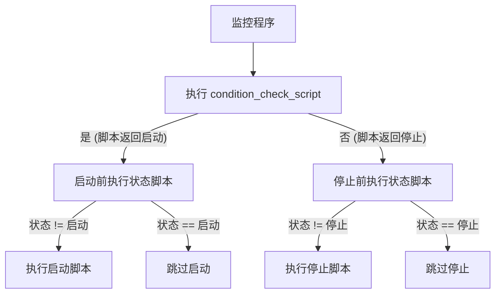

---
kind:
  - Solution
products:
  - Alauda DevOps
ProductsVersion:
  - 4.x
id: KB251000012
sourceSHA: f505b4bf1ca71fbde03bd845afe8cdb0d48f456ac817c0e5fa7d4d3045a0bcbc
---

# 如何为 Harbor 执行灾难恢复

## 问题

本解决方案描述了如何基于对象存储和 PostgreSQL 灾难恢复能力构建 Harbor 灾难恢复解决方案。该解决方案主要关注数据灾难恢复处理，用户需要实现自己的 Harbor 访问地址切换机制。

## 环境

Harbor CE Operator: >=v2.12.4

## 术语

| 术语                               | 描述                                                                                                                                                                   |
| ---------------------------------- | --------------------------------------------------------------------------------------------------------------------------------------------------------------------- |
| **主 Harbor**                       | 处理正常业务操作和用户请求的活动 Harbor 实例。该实例完全可用，所有组件均在运行。                                                                                      |
| **备 Harbor**                       | 部署在不同集群/地域的待命 Harbor 实例，副本数为零。在灾难恢复场景中，该实例保持休眠状态，直到被激活。                                                                   |
| **主 PostgreSQL**                  | 处理所有数据事务的活动 PostgreSQL 数据库集群，并作为数据复制到备数据库的源。                                                                                      |
| **备 PostgreSQL**                  | 热备 PostgreSQL 数据库，接收来自主数据库的实时数据复制。在故障转移期间可以提升为主角色。                                                                             |
| **主对象存储**                     | 存储所有 Harbor 注册表数据的活动 S3 兼容对象存储系统，并作为存储复制的源。                                                                                          |
| **备对象存储**                     | 同步备份对象存储系统，接收来自主存储的数据复制。在灾难恢复期间确保数据可用性。                                                                                      |
| **恢复点目标 (RPO)**              | 在时间上可接受的最大数据丢失量（例如，5 分钟，1 小时）。它定义了在灾难期间可以丢失多少数据，超过这个量就变得不可接受。                                               |
| **恢复时间目标 (RTO)**            | 在时间上可接受的最大停机时间（例如，15 分钟，2 小时）。它定义了系统在灾难后必须多快恢复。                                                                            |
| **故障转移**                       | 当主系统不可用或失败时，从主系统切换到备系统的过程。                                                                                                                |
| **数据同步**                       | 将数据从主系统复制到备系统的持续过程，以保持一致性并启用灾难恢复。                                                                                                |
| **冷备**                           | 与主系统未持续同步的待命系统，需要手动激活，并在灾难恢复期间可能会导致数据丢失。                                                                                      |

## 架构


### 架构概述

Harbor 灾难恢复解决方案实现了 Harbor 服务的 **冷备架构** 和 **热备数据库复制**。这种混合方法通过实时数据库同步和手动 Harbor 服务故障转移程序提供灾难恢复能力。该架构由两个部署在不同集群或地域的 Harbor 实例组成，备 Harbor 实例在灾难场景中保持休眠状态，数据库层保持持续同步。

#### 核心组件

- **主 Harbor**：处理正常业务操作和用户请求的活动实例
- **备 Harbor**：副本数为零的待命实例，准备进行故障转移场景
- **主 PostgreSQL**：处理所有数据事务的活动数据库
- **备 PostgreSQL**：具有实时数据复制的热备数据库
- **主对象存储**：用于注册表数据的活动 S3 兼容存储
- **备对象存储**：具有数据复制的同步备份存储

#### 数据同步策略

该解决方案利用两个独立的数据同步机制：

1. **数据库层**：PostgreSQL 流复制确保主数据库和备数据库之间的实时事务日志同步
2. **存储层**：对象存储复制保持主存储和备存储系统之间的数据一致性

#### 灾难恢复配置

1. **部署主 Harbor**：配置主实例以连接到主 PostgreSQL 数据库，并使用主对象存储作为注册表后端
2. **部署备 Harbor**：配置备实例以连接到备 PostgreSQL 数据库，并使用备对象存储作为注册表后端
3. **初始化待命状态**：将所有备 Harbor 组件的副本数设置为 0，以防止不必要的后台操作和资源消耗

#### 故障转移程序

当发生灾难时，以下步骤确保切换到备环境：

1. **验证主故障**：确认所有主 Harbor 组件均不可用
2. **提升数据库**：使用数据库故障转移程序将备 PostgreSQL 提升为主角色（由于热备，不会丢失数据）
3. **提升存储**：将备对象存储激活为主存储系统
4. **激活 Harbor**：通过将副本数设置为大于 0 来扩展备 Harbor 组件
5. **更新路由**：切换外部访问地址以指向备 Harbor 实例

## 使用 `Alauda Build of Rook-Ceph` 和 `Alauda support for PostgreSQL` 设置 Harbor 灾难恢复

### 先决条件

1. 事先准备一个主集群和一个灾难恢复集群（或包含不同地域的集群）。
2. 完成 `Alauda Build of Rook-Ceph` 和 `Alauda support for PostgreSQL` 的部署。
3. 参考 `Alauda Build of Rook-Ceph`、`Alauda support for PostgreSQL` 和 [Harbor 实例部署指南](https://docs.alauda.io/alauda-build-of-harbor/2.12/install/03_harbor_deploy.html) 提前规划所需的系统资源。

### 使用 `Alauda support for PostgreSQL` 构建 PostgreSQL 灾难恢复集群

参考 `PostgreSQL Hot Standby Cluster Configuration Guide` 使用 `Alauda support for PostgreSQL` 构建灾难恢复集群。

确保主 PostgreSQL 和备 PostgreSQL 在不同的集群（或不同的地域）中。

您可以在 [Alauda Knowledge](https://cloud.alauda.io/knowledges#/) 上搜索 `PostgreSQL Hot Standby Cluster Configuration Guide` 以获取该文档。

:::warning

`PostgreSQL Hot Standby Cluster Configuration Guide` 是一份描述如何使用 `Alauda support for PostgreSQL` 构建灾难恢复集群的文档。请确保在使用此配置时与适当的 ACP 版本兼容。

:::

### 使用 `Alauda Build of Rook-Ceph` 构建对象存储灾难恢复集群

使用 `Alauda Build of Rook-Ceph` 构建灾难恢复集群。参考 [对象存储灾难恢复](https://docs.alauda.io/container_platform/4.1/storage/storagesystem_ceph/how_to/disaster_recovery/dr_object.html) 构建灾难恢复集群。

您需要提前创建一个 CephObjectStoreUser 以获取对象存储的访问凭证，并在主对象存储上准备一个 Harbor 注册表桶：

1. 在主对象存储上创建一个 CephObjectStoreUser 以获取访问凭证：[创建 CephObjectStoreUser](https://docs.alauda.io/container_platform/4.1/storage/storagesystem_ceph/how_to/create_object_user.html)。

   :::info
   您只需在主对象存储上创建 CephObjectStoreUser。用户信息将通过灾难恢复复制机制自动同步到备对象存储。
   :::

2. 此 `PRIMARY_OBJECT_STORAGE_ADDRESS` 是对象存储的访问地址，您可以从 `对象存储灾难恢复` 的步骤 [配置主区域的外部访问](https://docs.alauda.io/container_platform/4.1/storage/storagesystem_ceph/how_to/disaster_recovery/dr_object.html#address) 中获取。

3. 使用 mc 在主对象存储上创建一个 Harbor 注册表桶，在此示例中，桶名称为 `harbor-registry`。

   ```bash
   $ mc alias set primary-s3 <PRIMARY_OBJECT_STORAGE_ADDRESS> <PRIMARY_OBJECT_STORAGE_ACCESS_KEY> <PRIMARY_OBJECT_STORAGE_SECRET_KEY>
   Added `primary-s3` successfully.
   $ mc alias list
   primary-s3  
   URL       : <PRIMARY_OBJECT_STORAGE_ADDRESS> 
   AccessKey : <PRIMARY_OBJECT_STORAGE_ACCESS_KEY>
   SecretKey : <PRIMARY_OBJECT_STORAGE_SECRET_KEY>
   API       : s3v4
   Path      : auto
   Src       : /home/demo/.mc/config.json
   $ mc mb primary-s3/harbor-registry
   Bucket created successfully `primary-s3/harbor-registry`
   $ mc ls primary-s3/harbor-registry
   ```

### 设置主 Harbor

按照 [Harbor 实例部署](https://docs.alauda.io/alauda-build-of-harbor/2.12/install/03_harbor_deploy.html) 指南部署主 Harbor 实例。配置它以连接到主 PostgreSQL 数据库，并使用主对象存储作为 [注册表存储后端](https://docs.alauda.io/alauda-build-of-harbor/2.12/install/03_harbor_deploy.html#storage-yaml-snippets)。

配置示例：

```yaml
apiVersion: operator.alaudadevops.io/v1alpha1
kind: Harbor
metadata:
  name: dr-harbor
spec:
  externalURL: http://dr-harbor.example.com
  helmValues:
    core:
      replicas: 1
      resources:
        limits:
          cpu: 400m
          memory: 512Mi
        requests:
          cpu: 200m
          memory: 256Mi
    database:
      external:
        coreDatabase: harbor
        existingSecret: primary-pg
        existingSecretKey: password
        host: acid-primary-pg.harbor.svc
        port: 5432
        sslmode: require
        username: postgres
      type: external
    existingSecretAdminPassword: harbor-account
    existingSecretAdminPasswordKey: password
    expose:
      ingress:
        hosts:
          core: dr-harbor.example.com
      tls:
        enabled: false
      type: ingress
    jobservice:
      replicas: 1
      resources:
        limits:
          cpu: 400m
          memory: 512Mi
        requests:
          cpu: 200m
          memory: 256Mi
    persistence:
      enabled: true
      imageChartStorage:
        disableredirect: true
        s3:
          existingSecret: object-storage-secret
          bucket: harbor-registry
          regionendpoint: <PRIMARY_OBJECT_STORAGE_ADDRESS>
          v4auth: true
        type: s3
      persistentVolumeClaim:
        jobservice:
          jobLog:
            accessMode: ReadWriteMany
            size: 10Gi
            storageClass: nfs
        trivy:
          accessMode: ReadWriteMany
          size: 10Gi
          storageClass: nfs
    portal:
      replicas: 1
      resources:
        limits:
          cpu: 400m
          memory: 512Mi
        requests:
          cpu: 200m
          memory: 256Mi
    redis:
      external:
        addr: primary-redis-0.primary-redis-hl.harbor.svc:26379
        existingSecret: redis-redis-s3-default-credential
        existingSecretKey: password
        sentinelMasterSet: mymaster
      type: external
    registry:
      controller:
        resources:
          limits:
            cpu: 200m
            memory: 410Mi
          requests:
            cpu: 100m
            memory: 200Mi
      registry:
        resources:
          limits:
            cpu: 600m
            memory: 1638Mi
          requests:
            cpu: 300m
            memory: 419Mi
      replicas: 1
    trivy:
      offlineScan: true
      replicas: 1
      resources:
        limits:
          cpu: 800m
          memory: 2Gi
        requests:
          cpu: 400m
          memory: 200Mi
      skipUpdate: true
  version: 2.12.4
```

### 设置备 Harbor

按照 [Harbor 实例部署](https://docs.alauda.io/alauda-build-of-harbor/2.12/install/03_harbor_deploy.html) 指南部署备 Harbor 实例。配置它以连接到备 PostgreSQL 数据库，并使用备对象存储作为 [注册表存储后端](https://docs.alauda.io/alauda-build-of-harbor/2.12/install/03_harbor_deploy.html#storage-yaml-snippets)。

:::info

主 Harbor 和备 Harbor 的实例名称必须相同。
:::

将所有备 Harbor 实例的副本数设置为 0，以防止备 Harbor 执行不必要的后台操作。

配置 YAML 片段示例：

```yaml
apiVersion: operator.alaudadevops.io/v1alpha1
kind: Harbor
metadata:
  name: dr-harbor
spec:
  helmValues:
    core:
      replicas: 0
    portal:
      replicas: 0
    jobservice:
      replicas: 0
    registry:
      replicas: 0
    trivy:
      replicas: 0
```

### 故障转移

1. 首先确认所有主 Harbor 组件处于非工作状态，否则请先停止所有主 Harbor 组件。

2. 将备 PostgreSQL 提升为主 PostgreSQL。参考 `PostgreSQL Hot Standby Cluster Configuration Guide`，执行切换程序。

3. 将备对象存储提升为主对象存储。参考 [Alauda Build of Rook-Ceph 故障转移](https://docs.alauda.io/container_platform/4.1/storage/storagesystem_ceph/how_to/disaster_recovery/dr_object.html#procedures-1)，执行切换程序。

4. 通过将副本数修改为大于 0 来扩展所有备 Harbor 组件：

   配置 YAML 片段示例：

   ```yaml
   apiVersion: operator.alaudadevops.io/v1alpha1
   kind: Harbor
   metadata:
     name: dr-harbor
   spec:
     helmValues:
       core:
         replicas: 1
       portal:
         replicas: 1
       jobservice:
         replicas: 1
       registry:
         replicas: 1
       trivy:
         replicas: 1
   ```

5. 测试镜像推送和拉取，以验证 Harbor 是否正常工作。

6. 切换外部访问地址到备 Harbor。

### 灾难恢复

当主集群从灾难中恢复时，您可以将原主 Harbor 恢复为备 Harbor。按照以下步骤执行恢复：

1. 将所有 Harbor 组件的副本数设置为 0。
2. 根据 `PostgreSQL Hot Standby Cluster Configuration Guide` 配置原主 PostgreSQL 作为备 PostgreSQL。
3. 将原主对象存储转换为备对象存储。

```bash
# 从恢复的区域中，拉取当前主区域的最新域配置：
radosgw-admin realm pull --url={url-to-master-zone-gateway} \
                          --access-key={access-key} --secret={secret}
# 将恢复的区域设为主区域和默认区域：
radosgw-admin zone modify --rgw-realm=<realm-name> --rgw-zonegroup=<zone-group-name> --rgw-zone=<primary-zone-name> --master
```

完成这些步骤后，原主 Harbor 将作为备 Harbor 运行。

如果您需要将原主 Harbor 恢复为继续作为主 Harbor 运行，请按照故障转移程序将当前备 Harbor 提升为主 Harbor，然后配置新的主 Harbor 作为备 Harbor。

### 数据同步检查

检查对象存储和 PostgreSQL 的同步状态，以确保灾难恢复成功。

- 检查 Ceph 对象存储同步状态：[对象存储灾难恢复](https://docs.alauda.io/container_platform/4.1/storage/storagesystem_ceph/how_to/disaster_recovery/dr_object.html#check-ceph-object-storage-synchronization-status)
- 检查 PostgreSQL 同步状态：参考 `PostgreSQL Hot Standby Cluster Configuration Guide` 的状态检查部分。

### 恢复目标

#### 恢复点目标 (RPO)

RPO 表示在灾难恢复场景中可接受的最大数据丢失量。在此 Harbor 灾难恢复解决方案中：

- **数据库层**：由于 PostgreSQL 热备和流复制，数据丢失接近零
- **存储层**：由于同步对象存储复制，数据丢失接近零
- **整体 RPO**：由于数据库和对象存储层的同步复制，数据丢失接近零

**影响 RPO 的因素：**

- 主集群和备集群之间的网络延迟
- 对象存储的同步复制和一致性模型
- 数据库复制延迟和提交确认设置

#### 恢复时间目标 (RTO)

RTO 表示在灾难恢复期间可接受的最大停机时间。该解决方案提供：

- **手动组件**：Harbor 服务激活和外部路由更新需要手动干预
- **典型 RTO**：完整服务恢复需要 5-15 分钟

**RTO 分解：**

- 数据库故障转移：1-2 分钟（手动）
- 存储故障转移：1-2 分钟（手动）
- Harbor 服务激活：2-5 分钟（手动，冷备需要启动时间）
- 外部路由更新：1-5 分钟（手动，取决于 DNS 传播）

## 使用其他对象存储和 PostgreSQL 构建 Harbor 灾难恢复解决方案

操作步骤与使用 `Alauda Build of Rook-Ceph` 和 `Alauda support for PostgreSQL` 构建 Harbor 灾难恢复解决方案类似。只需将对象存储和 PostgreSQL 替换为其他对象存储和 PostgreSQL 解决方案。

确保对象存储和 PostgreSQL 解决方案支持灾难恢复能力。

## 灾难恢复实例的自动启动/停止

在主集群和备集群中部署控制程序以及一组脚本，以自动控制 Harbor 实例的启动和停止。

该机制在发生灾难时启用备 Harbor 实例的自动激活。它通过用户定义的脚本支持自定义检查机制，并提供对 Harbor 依赖配置的控制。



### 先决条件

- 完成 Harbor 灾难恢复解决方案的主集群和备集群的设置。
- 下载灾难恢复程序镜像并将其导入集群注册表。

  灾难恢复程序镜像适用于不同架构：

  ```bash
  # AMD64 架构的下载链接：
  # https://cloud.alauda.cn/attachments/knowledge/KB251000012/harbor-dr-amd-v2.13.0-g590be78.tgz
  # https://cloud.alauda.io/attachments/knowledge/KB251000012/harbor-dr-amd-v2.13.0-g590be78.tgz


  # ARM64 架构的下载链接：
  # https://cloud.alauda.cn/attachments/knowledge/KB251000012/harbor-dr-arm-v2.13.0-g590be78.tgz
  # https://cloud.alauda.io/attachments/knowledge/KB251000012/harbor-dr-arm-v2.13.0-g590be78.tgz
  ```

  **将镜像导入到您的集群注册表：**

  1. 根据集群的架构（AMD64 或 ARM64）下载相应的镜像归档。

  2. 加载镜像归档并将其导入到您的集群注册表：

     ```bash
     # 从归档中加载镜像
     docker load -i harbor-dr-amd-v2.13.0-g590be78.tgz  # 或者对于 ARM64 使用 harbor-dr-arm-v2.13.0-g590be78.tgz

     # 使用您的集群注册表地址标记镜像
     # 将 <REGISTRY_ADDRESS> 替换为您的实际集群注册表地址
     docker tag build-harbor.alauda.cn/devops/harbor-disaster-recovery:v2.13.0-g590be78 <REGISTRY_ADDRESS>/devops/harbor-disaster-recovery:v2.13.0-g590be78

     # 将镜像推送到您的集群注册表
     docker push <REGISTRY_ADDRESS>/devops/harbor-disaster-recovery:v2.13.0-g590be78
     ```

  3. 在部署 YAML 中更新镜像引用（见下文的部署部分），使用您的集群注册表地址替换 `build-harbor.alauda.cn/devops/harbor-disaster-recovery:v2.13.0-g590be78`。

  :::info
  如果您使用的是需要身份验证的私有注册表，请确保您已使用 `docker login` 登录或在 Kubernetes 集群中配置了适当的镜像拉取秘密。
  :::

### 如何配置和运行自动启动/停止程序

1. 准备配置文件 `config.yaml`：

   ```yaml
   condition_check_script: /path/to/condition_check.sh # 条件检查脚本的路径。定期在 check_interval 间隔执行。返回 "start" 以触发 start_script 或 "stop" 以触发 stop_script。
   start_script: /path/to/start.sh # 激活 Harbor 及其依赖项的脚本路径。执行提升 PostgreSQL 为主、激活对象存储和扩展 Harbor 组件等操作。
   stop_script: /path/to/stop.sh # 停止 Harbor 和依赖项的脚本路径（例如，缩减 Harbor 组件，配置依赖项为待命模式）。
   status_script: /path/to/status.sh # 检查系统状态的脚本路径。必须输出 "started"、"stopped" 或 "unknown"。
   check_interval: 30s # 条件检查脚本执行之间的间隔
   failure_threshold: 6 # 触发停止脚本所需的连续失败次数。防止因瞬时网络问题导致的误报。
   script_timeout: 120s # 每个脚本的最大执行时间。超过此超时的脚本将被终止。
   ```

2. 创建相应的脚本文件：

   - **condition_check.sh**：请根据您的实际故障转移决策过程自定义此脚本。该脚本应输出 `start` 如果集群节点应被激活，并输出 `stop` 如果应被停用。如果脚本执行失败，将不会调用任何脚本。以下是一个参考示例——简单的 DNS IP 检查（不建议在生产环境中使用）：

     ```bash
     set -euo pipefail
     HARBOR_DOMAIN="${HARBOR_DOMAIN:-}"
     HARBOR_IP="${HARBOR_IP:-}"

     RESOLVED_IP=$(nslookup "$HARBOR_DOMAIN" 2>/dev/null | grep -A 1 "Name:" | grep "Address:" | awk '{print $2}' | head -n 1)
     if [ "$RESOLVED_IP" = "$HARBOR_IP" ]; then
       echo start
       exit 0
     else
       echo stop
       exit 0
     fi
     ```

   - **status.sh**：检查系统状态的脚本路径。必须输出 "started"、"stopped" 或 "unknown"。如果脚本执行失败，将被视为未知状态，不会进行任何更改。

     ```bash
     set -euo pipefail

     # 灾难恢复的状态脚本
     # 此脚本将在停止脚本之前执行，以验证 Harbor 是否实际运行

     # 读取环境变量并进行验证
     HARBOR_NAMESPACE="${HARBOR_NAMESPACE:-harbor-ns}"
     HARBOR_NAME="${HARBOR_NAME:-harbor}"
     HARBOR_REPLICAS="${HARBOR_REPLICAS:-1}"

     # 通过健康端点检查 Harbor 健康状态
     # 如果可用则使用 HTTPS，内部集群通信回退为 HTTP
     HARBOR_SVC="${HARBOR_NAME}-core.${HARBOR_NAMESPACE}.svc"

     set +e
     # 使用适当的超时和错误处理检查健康端点
     HTTP_CODE=$(curl -sf --max-time 10 --connect-timeout 5 \
       -o /dev/null -w "%{http_code}" \
       "http://${HARBOR_SVC}/api/v2.0/health" 2>/dev/null)
     set -e

     # 获取运行中的 pod 数量并进行适当的错误处理
     RUNNING_PODS=$(kubectl -n "$HARBOR_NAMESPACE" \
       get pods -l release="$HARBOR_NAME" \
       --field-selector=status.phase=Running \
       --no-headers 2>/dev/null | wc -l | tr -d ' ')

     # 验证 pod 数量是否为数字
     if [[ ! "$RUNNING_PODS" =~ ^[0-9]+$ ]]; then
       RUNNING_PODS="0"
     fi

     # 根据 HTTP 代码和运行中的 pod 数量确定状态
     # 至少需要 MIN_PODS_REQUIRED 个运行中的 pod（core、portal、jobservice、registry、trivy）
     # 当服务没有端点（pod 未运行）时，curl 将失败，HTTP_CODE 将为空或 "000"
     if [ "$HTTP_CODE" = "200" ] && [ -n "$RUNNING_PODS" ] && [ "$RUNNING_PODS" -ge 5 ]; then
       # Harbor 健康：HTTP 200 和足够的 pod 正在运行
       echo "started"
     elif ([ -z "$HTTP_CODE" ] || [ "$HTTP_CODE" = "000" ] || [ "$HTTP_CODE" = "" ]) && \
          ([ -z "$RUNNING_PODS" ] || [ "$RUNNING_PODS" -eq 0 ]); then
       echo "stopped"
     else
       # 其他网络错误、意外的 HTTP 代码或不一致的状态
       # 这包括以下情况：
       # - HTTP 5xx 错误（服务降级但 pod 正在运行）
       # - HTTP 4xx 错误（身份验证/授权问题）
       # - 部分 pod 失败（某些 pod 正在运行但并非全部）
       # - 网络超时或连接被拒绝
       echo "unknown"
     fi
     ```

   - **start.sh**：启动脚本应包括对 Harbor 依赖项的检查和 Harbor 实例的启动。

     ```bash
     set -euo pipefail
     # 检查和控制依赖项，例如验证数据库是否为主实例
     # 以及对象存储是否准备就绪
     #####################################
     # 在此处添加您的 PostgreSQL 启动脚本。
     # 此脚本应提升备 PostgreSQL 为主角色，并确保
     # 数据库准备好为 Harbor 提供服务，然后启动 Harbor 组件。
     #####################################

     #####################################
     # 在此处添加您的 S3/对象存储启动脚本。
     # 此脚本应提升备对象存储为主角色，并确保
     # 存储系统准备好为 Harbor 提供服务，然后启动 Harbor 组件。
     #####################################

     # 启动 Harbor 脚本 - 此部分是必需的
     HARBOR_NAMESPACE="${HARBOR_NAMESPACE:-harbor-ns}"
     HARBOR_NAME="${HARBOR_NAME:-harbor}"
     HARBOR_REPLICAS="${HARBOR_REPLICAS:-1}"
     kubectl -n "$HARBOR_NAMESPACE" patch harbor "$HARBOR_NAME" --type=merge -p "{\"spec\":{\"helmValues\":{\"core\":{\"replicas\":$HARBOR_REPLICAS},\"portal\":{\"replicas\":$HARBOR_REPLICAS},\"jobservice\":{\"replicas\":$HARBOR_REPLICAS},\"registry\":{\"replicas\":$HARBOR_REPLICAS},\"trivy\":{\"replicas\":$HARBOR_REPLICAS}}}}"
     ```

   - **stop.sh**：停止脚本应包括对 Harbor 依赖项和 Harbor 实例的关闭程序。

     ```bash
     set -euo pipefail
     # 停止 Harbor 脚本 - 此部分是必需的
     HARBOR_NAMESPACE="${HARBOR_NAMESPACE:-harbor-ns}"
     HARBOR_NAME="${HARBOR_NAME:-harbor}"
     kubectl -n "$HARBOR_NAMESPACE" patch harbor "$HARBOR_NAME" --type=merge -p '{"spec":{"helmValues":{"core":{"replicas":0},"portal":{"replicas":0},"jobservice":{"replicas":0},"registry":{"replicas":0},"trivy":{"replicas":0}}}}'

     # 检查和控制依赖项，例如将数据库设置为副本模式
     #####################################
     # 在此处添加您的 PostgreSQL 停止脚本。
     # 此脚本应将 PostgreSQL 集群配置为操作为副本
     # 并在停止 Harbor 组件时缩减实例。
     #####################################

     #####################################
     # 在此处添加您的 S3/对象存储停止脚本。
     # 此脚本应处理停止 Harbor 组件时
     # 对对象存储的任何必要清理或配置更改。
     #####################################
     ```

3. 将控制程序作为 Deployment 部署到 Harbor 命名空间。注意：这必须在主集群和备集群中都部署，参数根据目标集群进行调整：

```yaml
---
apiVersion: v1
automountServiceAccountToken: true
kind: ServiceAccount
metadata:
  name: disaster-recovery
  namespace: system # 替换为您自己的命名空间
---
apiVersion: rbac.authorization.k8s.io/v1
kind: ClusterRole
metadata:
  name: disaster-recovery-clusterrole
rules: []  # 添加必要的权限
---
apiVersion: rbac.authorization.k8s.io/v1
kind: ClusterRoleBinding
metadata:
  name: disaster-recovery-clusterrolebinding
roleRef:
  apiGroup: rbac.authorization.k8s.io
  kind: ClusterRole
  name: disaster-recovery-clusterrole
subjects:
- kind: ServiceAccount
  name: disaster-recovery
  namespace: system # 替换为您自己的命名空间
---
apiVersion: v1
data:
  config.yaml: |
    condition_check_script: /opt/scripts/check.sh
    start_script: /opt/scripts/start.sh
    stop_script: /opt/scripts/stop.sh
    status_script: /opt/scripts/status.sh
    check_interval: 10s
    failure_threshold: 3
    script_timeout: 120s
  check.sh: |
    # 替换为您自己的脚本，参考前面的部分以满足脚本要求
  start.sh: |
    # 替换为您自己的脚本，参考前面的部分以满足脚本要求
  status.sh: |
    # 替换为您自己的脚本，参考前面的部分以满足脚本要求
  stop.sh: |
    # 替换为您自己的脚本，参考前面的部分以满足脚本要求
kind: ConfigMap
metadata:
  name: disaster-recovery-config
  namespace: system # 替换为您自己的命名空间
---
apiVersion: apps/v1
kind: Deployment
metadata:
  labels:
    app: disaster-recovery
  name: disaster-recovery
  namespace: system # 替换为您自己的命名空间
spec:
  replicas: 1
  selector:
    matchLabels:
      app: disaster-recovery
  template:
    metadata:
      labels:
        app: disaster-recovery
    spec:
      containers:
      - command:
        - sh
        - -c
        - |
          exec /opt/bin/disaster-recovery -config /opt/config/config.yaml
        image: <disaster-recovery image with monitoring sequence and test script tools> # 替换为您的灾难恢复镜像，包含监控序列和测试脚本工具
        name: controller
        resources:
          limits:
            cpu: 500m
            memory: 512Mi
          requests:
            cpu: 100m
            memory: 128Mi
        volumeMounts:
        - mountPath: /opt/bin/
          name: bin
          readOnly: true
        - mountPath: /opt/config
          name: config
          readOnly: true
        - mountPath: /opt/scripts
          name: scripts
          readOnly: true
      initContainers:
      - command:
        - sh
        - -c
        - |
          cp /disaster-recovery /opt/bin/disaster-recovery && chmod +x /opt/bin/disaster-recovery
        image: harbor-disaster-recovery:v2.13.0-g590be78 # 替换为导入到集群的镜像地址。
        imagePullPolicy: Always
        name: copy-binary
        volumeMounts:
        - mountPath: /opt/bin/
          name: bin
      serviceAccountName: disaster-recovery
      volumes:
      - emptyDir: {}
        name: bin
      - configMap:
          name: disaster-recovery-config
        name: scripts
      - configMap:
          items:
          - key: config.yaml
            path: config.yaml
          name: disaster-recovery-config
        name: config
```

> **注意**：确保 Deployment 使用的 ServiceAccount 具有操作 Harbor 资源和您自定义脚本控制的任何其他资源（如数据库资源、对象存储配置等）的必要 RBAC 权限。控制程序需要权限修改 Harbor CRD 资源以启动和停止 Harbor 组件，以及自定义启动/停止脚本管理的任何资源的权限。以下是 Harbor 操作所需的权限：

```yaml
apiVersion: rbac.authorization.k8s.io/v1
kind: ClusterRole
metadata:
  name: disaster-recovery-clusterrole
rules:
- apiGroups:
  - operator.alaudadevops.io
  resources:
  - harbors
  verbs:
  - get
  - list
  - watch
  - update
  - patch
- apiGroups:
  - ""
  resources:
  - pods
  verbs:
  - get
  - list
  - watch
- apiGroups:
  - ""
  resources:
  - pods/exec
  verbs:
  - create
```

### `Alauda support for PostgreSQL` 启动/停止脚本示例

在使用 `Alauda support for PostgreSQL` 解决方案与 `PostgreSQL Hot Standby Cluster Configuration Guide` 配置灾难恢复集群时，您需要在主 PostgreSQL 和备 PostgreSQL 集群中配置复制信息。这确保在自动故障转移期间，您只需修改 `clusterReplication.isReplica` 和 `numberOfInstances` 即可完成切换：

**主配置：**

```yaml
clusterReplication:
  enabled: true
  isReplica: false
  peerHost: < Secondary cluster node IP >  # 备集群节点 IP
  peerPort: < Secondary cluster NodePort >  # 备集群节点 NodePort
  replSvcType: NodePort
  bootstrapSecret: standby-bootstrap-secret
```

`standby-bootstrap-secret` 应根据 `PostgreSQL Hot Standby Cluster Configuration Guide` 中的 `Standby Cluster Configuration` 部分进行配置，使用与备集群相同的值。

**备配置：**

```yaml
clusterReplication:
  enabled: true
  isReplica: true
  peerHost: < Primary cluster node IP >  # 主集群节点 IP
  peerPort: < Primary cluster NodePort >            # 主集群节点 NodePort
  replSvcType: NodePort
  bootstrapSecret: standby-bootstrap-secret
```

**注意**：以下 RBAC 权限是必需的：

```yaml
apiVersion: rbac.authorization.k8s.io/v1
kind: ClusterRole
metadata:
  name: disaster-recovery-clusterrole
rules:
- apiGroups:
  - acid.zalan.do
  resources:
  - postgresqls
  verbs:
  - get
  - list
  - watch
  - update
  - patch
- apiGroups:
  - ""
  resources:
  - pods
  verbs:
  - get
  - list
  - watch
- apiGroups:
  - ""
  resources:
  - pods/exec
  verbs:
  - create
```

#### 启动脚本示例

> 注意：以下是示例脚本。请勿直接在生产环境中使用。

```bash
POSTGRES_NAMESPACE="${POSTGRES_NAMESPACE:-pg-namespace}"
POSTGRES_CLUSTER="${POSTGRES_CLUSTER:-acid-pg}"
kubectl -n "$POSTGRES_NAMESPACE" patch pg "$POSTGRES_CLUSTER" --type=merge -p '{"spec":{"clusterReplication":{"isReplica":false},"numberOfInstances":2}}'
```

#### 停止脚本示例

> 注意：以下是示例脚本。请勿直接在生产环境中使用。

```bash
POSTGRES_NAMESPACE="${POSTGRES_NAMESPACE:-pg-namespace}"
POSTGRES_CLUSTER="${POSTGRES_CLUSTER:-acid-pg}"
kubectl -n "$POSTGRES_NAMESPACE" patch pg "$POSTGRES_CLUSTER" --type=merge -p '{"spec":{"clusterReplication":{"isReplica":true},"numberOfInstances":1}}'
```

### Alauda Build of Rook-Ceph 启动/停止脚本示例

**注意**：以下 RBAC 权限是必需的：

```yaml
apiVersion: rbac.authorization.k8s.io/v1
kind: ClusterRole
metadata:
  name: disaster-recovery-clusterrole
rules:
- apiGroups:
  - ""
  resources:
  - secrets
  verbs:
  - get
  - list
  - watch
- apiGroups:
  - ""
  resources:
  - configmaps
  verbs:
  - get
  - list
  - watch
- apiGroups:
  - ceph.rook.io
  resources:
  - cephobjectzones
  verbs:
  - get
  - list
  - watch
- apiGroups:
  - ""
  resources:
  - pods
  verbs:
  - get
  - list
  - watch
- apiGroups:
  - ""
  resources:
  - pods/exec
  verbs:
  - create
```

- **启动脚本示例**：以下是示例脚本。请勿直接在生产环境中使用。根据 [对象存储灾难恢复](https://docs.alauda.io/container_platform/4.1/storage/storagesystem_ceph/how_to/disaster_recovery/dr_object.html) 中的说明自定义脚本。

  ```bash
  REALM_NAME="${REALM_NAME:-realm}"
  ZONE_GROUP_NAME="${ZONE_GROUP_NAME:-group}"
  ZONE_NAME="${ZONE_NAME:-zone}"

  ACCESS_KEY=$(kubectl -n rook-ceph get secrets "${REALM_NAME}-keys" -o jsonpath='{.data.access-key}' 2>/dev/null | base64 -d)
  SECRET_KEY=$(kubectl -n rook-ceph get secrets "${REALM_NAME}-keys" -o jsonpath='{.data.secret-key}' 2>/dev/null | base64 -d)
  ENDPOINT=$(kubectl -n rook-ceph get cephobjectzone ${ZONE_NAME} -o jsonpath='{.spec.customEndpoints[0]}')
  TOOLS_POD=$(kubectl -n rook-ceph get po -l app=rook-ceph-tools -o jsonpath='{.items[0].metadata.name}' 2>/dev/null)

  kubectl -n rook-ceph exec "$TOOLS_POD" -- radosgw-admin realm pull --url="$ENDPOINT" --access-key="$ACCESS_KEY" --secret="$SECRET_KEY";
  kubectl -n rook-ceph exec "$TOOLS_POD" -- radosgw-admin zone modify --rgw-realm="$REALM_NAME" --rgw-zonegroup="$ZONE_GROUP_NAME" --rgw-zone="$ZONE_NAME" --master
  ```

- **停止脚本**：停止 Alauda Build of Rook-Ceph 时不需要任何操作，因此您可以添加一个空脚本或跳过此步骤。
