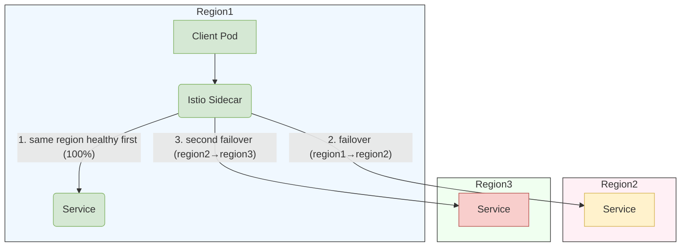
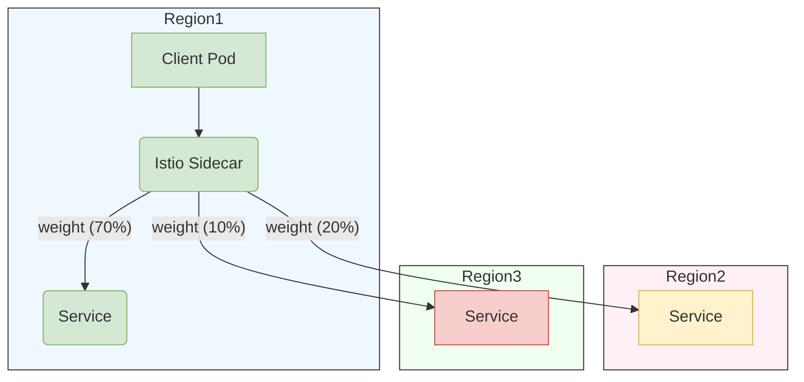

# 多主模式跨网络服务网格架构安装指南

## 概述

本指南将引导您在两个业务集群上部署 Istio 控制平面，并将两个集群都配置为主集群。该方案采用多网络模型，不同集群中的工作负载无法直接通信，必须通过 Istio 东西向网关路由流量。

该架构为业务运行提供了更强的隔离性和高可用性。

## 前提条件

- 准备两个业务集群。
- 准备以下统一存储组件：
  - ACP Elasticsearch（用于集中存储链路追踪数据）。
  - ACP VictoriaMetrics（用于集中存储监控指标）。
  - 为每个集群单独部署一个 ACP Redis 哨兵模式实例（用于服务限流）。
- 网络：
  - 每个集群的 K8S API server 必须能够被服务网格中的其他集群访问。
  - 每个集群中负载均衡器服务为东西向网关分配的 IP:15443 必须能够被其他集群访问。

## 安装步骤

按照以下步骤依次在两个集群上安装服务网格。安装涉及两类参数：

**全局参数**（两个集群保持一致）：

| 参数                  | 示例                                  | 描述                                         |
| --------------------- | ------------------------------------- | -------------------------------------------- |
| MESH_NAME             | multi-cluster-mesh                    | 服务网格名称                                 |
| GLOBAL_INGRESS_HOST   | https://1.2.3.4/                      | ACP 访问地址                                 |
| REGISTRY_ADDRESS      | 1.2.3.4:4567                          | 镜像仓库地址                                 |
| ELASTICSEARCH_CLUSTER | global                                | Elasticsearch 所部署的集群名称               |
| ELASTICSEARCH_URL     | https://1.2.3.4/es_proxy              | Elasticsearch 访问 URL                       |
| VICTORIAMETRICS_URL   | https://1.2.3.4/clusters/xxx/vmselect | VictoriaMetrics 访问 URL                     |

**业务集群参数**（根据实际集群信息进行配置）：

| 参数          | 示例         | 描述                                                                        |
| ------------- | ------------ | --------------------------------------------------------------------------- |
| CLUSTER_NAME  | cluster1     | 业务集群名称                                                                |
| REDIS_ADDRESS | 1.2.3.4:4567 | Redis 访问地址                                                              |
| REDIS_PASSWD  | passwd       | Redis 访问密码（安装后自动存储为 Secret）                                   |


### 为 Alauda Service Mesh 配置 Kubernetes 集群拓扑

#### 节点标签配置

1. 应用地域标签（集群级别）
```bash
# For all nodes in US-West region cluster
kubectl label nodes topology.kubernetes.io/region=us-west-1 --all
```

2. 应用可用区标签（可用区级别）
```bash
# For all nodes in Zone 1A
kubectl label nodes topology.kubernetes.io/zone=us-west-1a --all
```

3. 验证命令
```bash
# Check labels for all nodes
kubectl get nodes -L topology.kubernetes.io/region,topology.kubernetes.io/zone

# Detailed label inspection
kubectl describe nodes | grep "Labels" -A 5
```

#### 多集群配置示例

| 集群角色           | 地域标签           | 可用区标签         | 命令模板                                  |
|--------------------|--------------------|--------------------|-------------------------------------------|
| 主集群             | `us-east-1`        | `us-east-1a`       | `kubectl label nodes topology.kubernetes.io/region=us-east-1 --all` |
| 从集群             | `us-east-1`        | `us-east-1b`       | `kubectl label nodes topology.kubernetes.io/zone=us-east-1b --all` |
| 容灾集群           | `eu-west-1`        | `eu-west-1a`       | `kubectl label nodes topology.kubernetes.io/region=eu-west-1 --all` |


#### 配置说明
**标签规范**
```yaml
# Official Kubernetes labels (do NOT modify key names)
topology.kubernetes.io/region: "<cloud-region-id>"  # e.g. us-east1
topology.kubernetes.io/zone: "<region-id>-<zone-id>" # e.g. us-east1-a
```


### 安装第一个服务网格

#### 执行网格部署

设置好安装参数后，在 `global` 集群上执行以下命令：

```bash
# please set global arguments
MESH_NAME=""
REGISTRY_ADDRESS=""
GLOBAL_INGRESS_HOST=""
ELASTICSEARCH_CLUSTER=""
ELASTICSEARCH_URL=""
VICTORIAMETRICS_URL=""
# please set business cluster arguments
CLUSTER_NAME=""
REDIS_ADDRESS=""
REDIS_PASSWD=""

# create service mesh
kubectl apply -f - <<EOF
apiVersion: asm.alauda.io/v1alpha1
kind: ServiceMesh
metadata:
  labels:
    servicemesh.cpaas.io/managedBy: operator
    asm.cpaas.io/meshgroup: "${MESH_NAME}"
    asm.cpaas.io/cluster: "${CLUSTER_NAME}"
  name: "${CLUSTER_NAME}"
  namespace: cpaas-system
  annotations:
    asm.cpaas.io/display-name: ''
spec:
  withoutIstio: false
  istioVersion: "1.22.4+202408291030"
  cluster: "${CLUSTER_NAME}"
  registryAddress: ${REGISTRY_ADDRESS}
  multiCluster:
    enabled: true
    isMultiNetwork: true
    istioNetwork: ""
  istioSidecarInjectorPolicy: false
  ipranges:
    ranges:
      - '*'
  ingressH2Enabled: false
  ingressScheme: https
  caConfig:
    certmanager: {}
  componentConfig:
    - name: istioCni
      group: istio
      replicaCount: 0
      resources: {}
      hpaSpec:
        enabled: false
      cni:
        namespace: kube-system
    - name: istiod
      group: istio
      replicaCount: 1
      hpaSpec:
        enabled: false
      resources:
        requests:
          cpu: '0.5'
          memory: 512Mi
        limits:
          cpu: '2'
          memory: 2048Mi
    - name: asmController
      group: controller
      replicaCount: 1
      hpaSpec:
        enabled: false
      resources:
        requests:
          cpu: '0.25'
          memory: 512Mi
        limits:
          cpu: '1'
          memory: 1Gi
    - name: eastwestGateways
      group: istio
      replicaCount: 1
      hpaSpec:
        enabled: false
      resources:
        requests:
          cpu: '0.25'
          memory: 128Mi
        limits:
          cpu: '2'
          memory: 1024Mi
      deployMode: FixedRequired
      parameters: null
      affinity:
        nodeAffinity:
          requiredDuringSchedulingIgnoredDuringExecution:
            nodeSelectorTerms:
              - matchExpressions:
                  - key: "kubernetes.io/os"
                    operator: In
                    values:
                      - "linux"
    - name: flagger
      group: controller
      replicaCount: 1
      hpaSpec:
        enabled: false
      resources:
        requests:
          cpu: '0.25'
          memory: 128Mi
        limits:
          cpu: '1'
          memory: 512Mi
    - name: jaegerCollector
      group: tracer
      replicaCount: 1
      hpaSpec:
        enabled: false
      resources:
        requests:
          cpu: '0.25'
          memory: 512Mi
        limits:
          cpu: '3'
          memory: 512Mi
    - name: jaegerQuery
      group: tracer
      replicaCount: 1
      hpaSpec:
        enabled: false
      resources:
        requests:
          cpu: '0.25'
          memory: 512Mi
        limits:
          cpu: '1'
          memory: 512Mi
    - name: asmCore
      group: controller
      replicaCount: 1
      hpaSpec:
        enabled: false
      resources:
        requests:
          cpu: '0.25'
          memory: 128Mi
        limits:
          cpu: '1'
          memory: 512Mi
    - name: asmOtelCollector
      group: tracer
      replicaCount: 1
      hpaSpec:
        enabled: false
      resources:
        requests:
          cpu: '0.25'
          memory: 512Mi
        limits:
          cpu: '2'
          memory: 1Gi
    - name: asmOtelCollectorLB
      group: tracer
      replicaCount: 1
      hpaSpec:
        enabled: false
      resources:
        requests:
          cpu: '0.25'
          memory: 512Mi
        limits:
          cpu: '1'
          memory: 1Gi
    - name: tier2ingressGateways
      group: istio
      replicaCount: 1
      hpaSpec:
        enabled: false
      resources:
        requests:
          cpu: '0.25'
          memory: 128Mi
        limits:
          cpu: '2'
          memory: 1024Mi
  requiredAntiAffinity: true
  elasticsearch:
    url: "${ELASTICSEARCH_URL}"
    isDefault: true
    cluster: "${ELASTICSEARCH_CLUSTER}"
  redis:
    address: "${REDIS_ADDRESS}"
    authType: basic
    enabled: true
    # kind support: single, sentinel, cluster
    kind: sentinel
    # only sentinel kind need masterName
    masterName: mymaster
    password: "${REDIS_PASSWD}"
  istioSidecar:
    resources:
      requests:
        cpu: 100m
        memory: 128Mi
      limits:
        cpu: 500m
        memory: 512Mi
  istioConfig:
    cni:
      enabled: true
    defaultHttpRetryPolicy:
      attempts: 2
  traceSampling: 100
  globalIngressHost: "${GLOBAL_INGRESS_HOST}"
  monitorType: victoriametrics
  prometheusURL: "${VICTORIAMETRICS_URL}"
  isDefaultMonitor: true
  clusterType: Baremetal
  kafka:
    enabled: false
EOF
```

#### 验证部署状态

在 `global` 集群上，使用以下命令检查服务网格的安装状态：

```bash
kubectl -n cpaas-system get servicemesh
```

当 `PHASE` 字段显示为 `Deployed` 时，表示安装成功。输出示例：

```bash
NAME        STATE   SYNTHESISPHASE   PHASE      VERSION   DESIREDVERSION
cluster1            Deployed         Deployed   v4.0.20    v4.0.20
```

在业务集群上，使用以下命令检查服务网格组件的运行状态：

```bash
kubectl -n istio-system get pod
kubectl -n kube-system get pod | grep "istio-cni"
kubectl -n cpaas-system get pod | grep "asm-"
```

当所有 `STATUS` 字段都显示为 `Running` 时，表示服务网格组件已成功启动。输出示例：

```bash
# kubectl -n istio-system get pod
NAME                                                         READY   STATUS      RESTARTS       AGE
asm-operator-65f89b7c55-x4n7d                                1/1     Running     0              27h
flagger-7966f44f64-dldrl                                     1/1     Running     0              27h
flagger-operator-5fcdf67cd4-txr8m                            1/1     Running     0              27h
istio-eastwestgateway-795d4949ff-z9md8                       1/1     Running     0              27h
istio-ingressgateway-549fb4d56f-xs86q                        1/1     Running     0              27h
istio-operator-122-7bd55874b7-pdhj5                          1/1     Running     0              27h
istiod-1-22-975c6c44-bx7kq                                   1/1     Running     0              27h
jaeger-operator-6dd74f89b4-9kgks                             1/1     Running     0              27h
jaeger-prod-collector-86f5748f8f-g6tg6                       1/1     Running     0              27h
jaeger-prod-query-df8c457dd-dh7gc                            2/2     Running     0              27h
opentelemetry-operator-controller-manager-5dbd9c5bb7-hzdmc   1/1     Running     0              27h
# kubectl -n cpaas-system get pod | grep "asm-"
asm-controller-8bbc86c69-l5zdf                               1/1     Running     0              27h
asm-core-67c7c66cb-spscl                                     1/1     Running     0              22h
asm-otel-backend-collector-7dbfd9d877-m2scw                  1/1     Running     0              27h
asm-otel-collector-7d54bddccd-2sxhm                          1/1     Running     0              27h
# kubectl -n kube-system get pod | grep "istio-cni"
istio-cni-node-5cn5n                                         1/1     Running     0              27h
istio-cni-node-b55xg                                         1/1     Running     0              27h
istio-cni-node-jf584                                         1/1     Running     0              27h
```

### 安装第二个服务网格

第一个服务网格部署完成后，更新业务集群参数，并按照相同流程部署第二个服务网格。

## 服务网格双向 TLS 安全

### Istio 认证与 mTLS

Istio 使用 **PeerAuthentication** 资源，通过双向 TLS（mTLS）控制工作负载之间的通信安全。启用 mTLS 后，Envoy sidecar 会自动从 Istio 的 CA 获取证书，使每个服务连接都被加密且身份得到验证，无需额外配置。


### 默认 PERMISSIVE 模式

* 工作负载同时接受明文流量和 mTLS 加密流量。
* Sidecar 会通告 mTLS 能力，但不会拒绝普通 HTTP 流量。

这可确保现有（未注入 sidecar 的）服务持续正常工作，直到您准备好将流量“锁定”为仅允许 mTLS。

### Namespace 级 PeerAuthentication

要为特定 namespace 中的所有工作负载强制启用严格 mTLS，请应用：

```yaml
apiVersion: security.istio.io/v1
kind: PeerAuthentication
metadata:
  name: default
  namespace: <namespace>
spec:
  mtls:
    mode: STRICT
```

* **作用范围：** 仅影响 `<namespace>` 中的工作负载。
* **效果：** `<namespace>` 中的 Envoy sidecar 会拒绝任何入站明文流量。`<namespace>` 之外未使用 mTLS 的客户端在接入 sidecar 之前将无法访问。

### 网格级 PeerAuthentication

要在整个网格范围内强制启用 mTLS，请在 `istio-system` 中创建网格级策略：

```yaml
apiVersion: security.istio.io/v1
kind: PeerAuthentication
metadata:
  name: default
  namespace: istio-system
spec:
  mtls:
    mode: STRICT
```

* **作用范围：** 应用于所有 namespace（除非被 namespace 级或工作负载级策略覆盖）。
* **效果：** 所有服务都必须使用 mTLS 通信；任何明文或未注入 sidecar 的工作负载都会在整个网格范围内被拦截。

## 使用 Alauda ServiceMesh 管理跨集群流量

### 多集群流量管理的核心要求

**服务身份**
跨集群的服务必须在关键属性上保持一致：

| 属性                  | 要求                                  | 示例                       |
|-----------------------|---------------------------------------|----------------------------|
| `metadata.name`       | 跨集群保持一致                        | `product-service`          |
| `metadata.namespace`  | 跨集群保持一致                        | `global-svc`               |
| `spec.ports`          | 端口号、名称和协议                    | `port: 80`, `name: http`   |
| `spec.selector`           | 服务选择器保持一致                    | `app: product`             |


### 集群级故障转移配置

#### 完整配置（应用于所有服务）
```bash
kubectl apply -f - <<EOF
apiVersion: networking.istio.io/v1alpha3
kind: DestinationRule
metadata:
  name: global 
  namespace: istio-system #required in this namespace
spec:
  host: "*.cluster.local"
  trafficPolicy:
    loadBalancer:
      localityLbSetting:
        enabled: true
        failover:
          - from: region1 #be your current cluster region 
            to: region2
    outlierDetection:
      baseEjectionTime: 600s
      consecutive5xxErrors: 1
      interval: 10s
      maxEjectionPercent: 100
EOF
```
关键参数说明：

| 参数                       | 值                  | 描述                                         |
|----------------------------|---------------------|----------------------------------------------|
| `host`                     | `*.cluster.local`   | 应用于所有集群本地服务                       |
| `failover.from/to`         | 地域对              | 定义故障转移链的顺序                         |
| `consecutive5xxErrors`     | 1                   | 较高的阈值可防止过于敏感的触发               |
| `maxEjectionPercent`       | 100                  | 限制驱逐范围以维持服务容量                  |

更多参数可参考如下内容
- [异常点检测](https://istio.io/latest/docs/reference/config/networking/destination-rule/#OutlierDetection)
  用于 `server` 服务。这是故障转移正常
  工作所必需的。具体来说，它让 sidecar 代理能够感知
  某个服务的端点何时不健康，并最终触发
  到下一个 locality 的故障转移。

- [故障转移](https://istio.io/latest/docs/reference/config/networking/destination-rule/#LocalityLoadBalancerSetting-Failover)
  跨地域的故障转移策略。这可确保跨越地域边界的故障转移
  行为可预测。


示例：假设您有三个集群，每个集群的地域如下

优先级 | Locality | 详情
-------- | -------- | -------
0 | `region1` | 当前集群，客户端与服务端地域匹配。
1 | `region2` | 不匹配，但已为 `region1`->`region2` 定义了故障转移。
2 | `region3` | 不匹配，且未为 `region1`->`region3` 定义故障转移。

应用以下 DestinationRule 后，流量如下



在内部，[Envoy 优先级](https://www.envoyproxy.io/docs/envoy/latest/intro/arch_overview/upstream/load_balancing/priority.html)
被用于控制故障转移。


### 集群级加权分发配置

#### 完整配置（应用于所有服务）
```bash
kubectl apply -f - <<EOF
apiVersion: networking.istio.io/v1alpha3
kind: DestinationRule
metadata:
  name: global 
  namespace: istio-system #required in this namespace
spec:
  host: "*.cluster.local"
  trafficPolicy:
    loadBalancer:
      localityLbSetting:
        enabled: true
		distribute:
        - from: region1/*  #shoule be your current cluster region,format like ${region}/*
          to:
            "region1/*": 70
            "region2/*": 20
            "region3/*": 10
    outlierDetection:
      baseEjectionTime: 600s
      consecutive5xxErrors: 1
      interval: 10s
      maxEjectionPercent: 100
EOF
```
关键参数说明：

| 参数                       | 值                  | 描述                                         |
|----------------------------|---------------------|----------------------------------------------|
| `distribute.from/to`         | 地域对              | 定义从某个地域分发到哪些地域                 |

- [分发](https://istio.io/latest/docs/reference/config/networking/destination-rule/#LocalityLoadBalancerSetting-Distribute)
  跨地域的分发策略。这可确保源自 'from' 地域或可用区的流量在分发到一组 'to' 地域时
  行为可预测。

- [Envoy 加权分发](https://www.envoyproxy.io/docs/envoy/latest/intro/arch_overview/upstream/load_balancing/locality_weight.html?highlight=weight)
  用于 `server` 服务，如下表所述。

示例：假设您有三个集群，每个集群的地域如下

地域 |  流量百分比
------ |  ------------
`region1` | 70
`region2` | 20
`region3` | 10

那么流量如下



### 将 Namespace 添加到服务网格

使用前需要先将 namespace 添加到服务网格。

```shell
kubectl label namespace my-namespace cpaas.io/serviceMesh=enabled istio.io/rev=1-22
```

验证 namespace 的标签：

```shell
kubectl get ns my-namespace -o yaml
```

输出应包含：

```yaml
apiVersion: v1
kind: Namespace
metadata:
  name: my-namespace
  labels:
    # existing labels
    cpaas.io/serviceMesh: enabled
    istio.io/rev: 1-22
```

**标签说明：**

- `cpaas.io/serviceMesh: enabled`：表示该 namespace 应由 Alauda Service Mesh 管理
- `istio.io/rev: 1-22`：指定要使用的 Istio 控制平面修订版本（本例中为 1.22）


## 卸载流程

**重要提醒：** 卸载前请确保已从服务网格中删除所有微服务。

按照与安装相反的顺序，从各集群中卸载服务网格。

### 卸载第二个服务网格

在 `global` 集群上，使用以下命令卸载第二个服务网格：

```bash
# Replace {cluster-name} with the cluster name of the second service mesh
kubectl -n cpaas-system delete servicemesh {cluster-name} --wait
```

### 卸载第一个服务网格

在 `global` 集群上，使用以下命令卸载第一个服务网格：

```bash
# Replace {cluster-name} with the cluster name of the first service mesh
kubectl -n cpaas-system delete servicemesh {cluster-name} --wait
```
