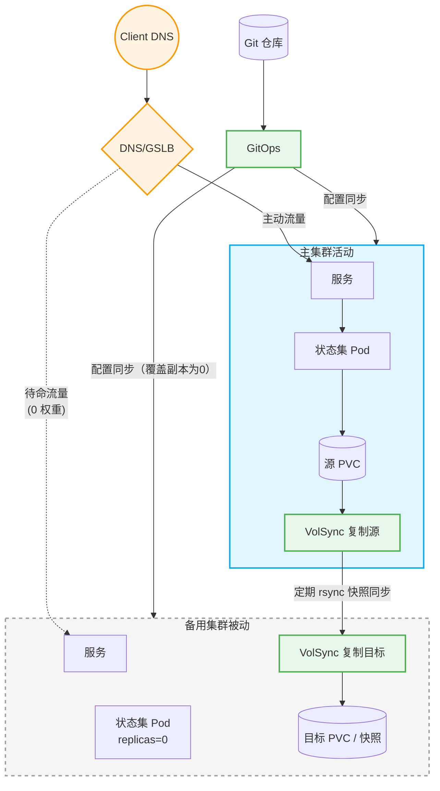
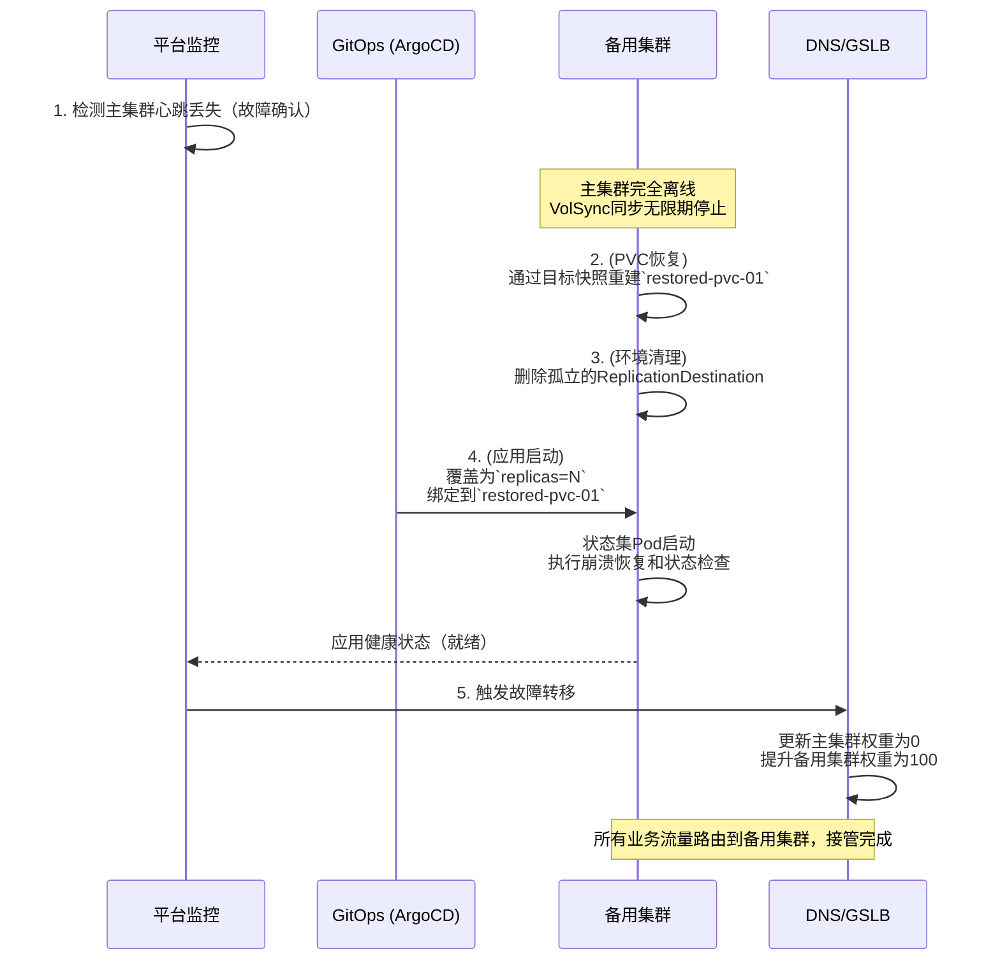

---
products:
  - Alauda Container Platform
kind:
  - Solution
id: KB260400007
sourceSHA: 17ed109a215cfd2b330148e31512c27a571f5142035dec48a7f06d024b7b6e3d
---

# 跨集群状态应用灾难恢复

## 1. 架构概述

该解决方案针对Kubernetes上状态应用（如MySQL、Redis或维护存储状态的业务模块）的灾难恢复（DR）需求。它结合了多集群服务流量分配能力与[Alauda Build of VolSync](https://docs.alauda.cn/container_platform/main/en/configure/storage/how_to/configuring_pvc_dr.html#deploy-alauda-build-of-volsync)提供的底层PVC异步数据同步，以实现跨地域或跨集群的应用灾难恢复。

与可以相对容易实现主动-主动地理分散的无状态应用相比，状态应用的核心关注点是**数据一致性**和**冲突预防**。该解决方案采用**主动-被动DR模型（双中心）**。在正常情况下，主集群处理所有读写流量，而数据快照在后台持续增量同步到备用集群。在发生灾难时，通过平台编排恢复存储卷，外部流量自动引导至备用集群以完成灾难级故障转移。

### 1.1 核心组件及职责

- **集群角色**：
  - **主集群**：在正常条件下处理读写流量；运行状态应用的主副本。
  - **备用集群（待命）**：保持待命或静默状态；包含完整配置但不直接处理主业务流量；持有来自主集群的存储数据的异步备份。
- **流量管理（DNS/GSLB）**：管理请求的外部流量网关，使用健康检查。在发生故障时，它们调整域名解析优先级或权重，以在几分钟内实现流量故障转移。
- **状态数据同步（VolSync）**：依赖底层CSI存储的快照能力，定期（或通过手动触发）将持久配置（PVC）同步到远程集群，使用`rsync-tls`等方法。
- **配置同步（GitOps）**：确保应用的基础配置文件（StatefulSet、ConfigMap、Service等）在两个集群之间保持一致的基线，消除配置漂移。

### 1.2 架构图



1. **流量路由（GSLB）**：外部用户客户端通过全球服务器负载均衡器（GSLB）或智能DNS访问应用。在正常操作条件下，此路由网关配置为将100%的主动流量发送到**主集群**，而**备用集群**保持0（或严格待命）权重。
2. **GitOps基础配置同步**：一个集中式Git仓库通过GitOps将相同的基线应用清单推送到两个集群。为了构建“主动-被动”设置，使用Kustomize覆盖来操控`replicas`计数——确保主集群设置为活动实例大小（例如，`N`），而备用集群接收`replicas=0`配置，保持静默、无资源的待命状态。
3. **数据复制管道（VolSync）**：实时应用将其操作状态持久化到主集群的源PVC。`ReplicationSource`机制持续通过CSI驱动程序查询快照差异，并将增量`rsync`快照安全地推送到等待在备用集群的`ReplicationDestination`，从而保持“热”持久状态，以备任何故障转移事件。

---

## 2. DR基础配置阶段

### 2.1 跨集群GitOps配置同步

在将状态应用部署到灾难恢复集群时，还应遵循GitOps最佳实践。ACP GitOps为两侧提供一致的环境，同时利用`kustomize`应用主集群和备用集群的参数差异。

1. **组织代码仓库**：将应用的Kubernetes清单（包括PVC、StatefulSet和Service模板）存储在Git中。例如：

   ```yaml
   apiVersion: v1
   kind: PersistentVolumeClaim
   metadata:
     name: pvc-01
     namespace: <application-namespace>
   spec:
     accessModes:
       - ReadWriteMany
     resources:
       requests:
         storage: 10Gi
     storageClassName: sc-cephfs
     volumeMode: Filesystem
   ---
   apiVersion: apps/v1
   kind: StatefulSet
   metadata:
     name: my-stateful-app
     namespace: <application-namespace>
   spec:
     replicas: 1 # 这将在备用集群中修补为0
     selector:
       matchLabels:
         app: my-stateful-app
     serviceName: "my-stateful-app-headless"
     template:
       metadata:
         labels:
           app: my-stateful-app
       spec:
         containers:
         - name: app-container
           image: my-app-image:latest
           volumeMounts:
           - name: data-volume
             mountPath: /data
         volumes:
         - name: data-volume
           persistentVolumeClaim:
             claimName: pvc-01
   ---
   apiVersion: v1
   kind: Service
   metadata:
     name: my-stateful-app-headless
     namespace: <application-namespace>
   spec:
     clusterIP: None
     selector:
       app: my-stateful-app
     ports:
     - name: tcp
       port: 80
       targetPort: 8080
   ```

2. **ApplicationSet同步**：配置一个ApplicationSet以同时将资源分发到主集群和备用集群。由于**主动-被动模型**，在正常操作期间：
   - **主集群**的实例`replicas`设置为`N`。
   - **备用集群**的实例`replicas`必须使用kustomize中的`patches`设置为`0`（以避免在未发生故障转移时的无效连接和数据损坏）。

### 2.2 VolSync异步数据同步配置

在成功部署状态应用并创建PVC后，通过VolSync配置底层存储的定期同步。

> **前提条件**：主集群和备用集群必须安装`Alauda Build of VolSync`，以及支持快照功能的相应CSI存储驱动程序。

**1. 准备信任凭证密钥**

在主集群和备用集群中创建一个统一的`rsync-tls`密钥，定义用于安全身份验证的PSK。

```yaml
apiVersion: v1
data:
  psk.txt: MToyM2I3Mzk1ZmFmYzNlODQyYmQ4YWMwZmUxNDJlNmFkMQ==
kind: Secret
metadata:
  name: volsync-rsync-tls
  namespace: <application-namespace>
type: Opaque
```

**参数**：

| **参数**                   | **说明**                                                                                                                                                                                                 |
| :------------------------ | :----------------------------------------------------------------------------------------------------------------------------------------------------------------------------------------------------- |
| **application-namespace** | 密钥的命名空间，应与应用相同                                                                                                                                                                           |
| **psk.txt**               | 此字段遵循stunnel所期望的格式：`<id>:<至少32个十六进制数字>`。<br></br>例如，`1:23b7395fafc3e842bd8ac0fe142e6ad1`。 |

**2. 在备用集群上配置接收器（ReplicationDestination）**

创建一个`ReplicationDestination`以定义DR接收端的闲置目标，指定用于复制的快照和网络暴露方法（建议在跨集群环境中使用`LoadBalancer`或`NodePort`）。这将生成一个暴露的地址，备用集群等待接收数据。

```yaml
apiVersion: volsync.backube/v1alpha1
kind: ReplicationDestination
metadata:
  name: rd-pvc-01
  namespace: <application-namespace>
spec:
  rsyncTLS:
    copyMethod: Snapshot
    destinationPVC: pvc-01
    keySecret: volsync-rsync-tls
    serviceType: NodePort
    storageClassName: sc-cephfs
    volumeSnapshotClassName: csi-cephfs-snapshotclass
    moverSecurityContext:
      fsGroup: 65534
      runAsGroup: 65534
      runAsNonRoot: true
      runAsUser: 65534
      seccompProfile:
        type: RuntimeDefault
```

**参数**：

| **参数**                   | **说明**                                                                                                                                                                                                 |
| :------------------------ | :----------------------------------------------------------------------------------------------------------------------------------------------------------------------------------------------------- |
| **namespace**             | 目标PVC的命名空间，应与应用相同                                                                                                                                                                           |
| **destinationPVC**        | 备用集群上**预先存在**的PVC的名称                                                                                                                                                                           |
| **keySecret**             | 包含TLS-PSK密钥的密钥名称，在步骤1中创建                                                                                                                                                                           |
| **serviceType**           | VolSync创建的服务类型，以允许源连接。允许的值为`ClusterIP`、`LoadBalancer`或`NodePort`。                                                                                                               |
| **storageClassName**      | 目标PVC使用的存储类                                                                                                                                                                                       |
| **volumeSnapshotClassName** | 与存储类对应的快照类                                                                                                                                                                                       |

**3. 在主集群上配置发送器（ReplicationSource）**

提取上面生成的备用集群的暴露地址，并在主业务应用所在的命名空间中实例化相应的`ReplicationSource`。在`trigger.schedule`中定义Cron表达式（例如，`*/10 * * * *`表示每10分钟进行一次快照级增量同步），以确保业务变更定期持久化到备用集群。

```yaml
apiVersion: volsync.backube/v1alpha1
kind: ReplicationSource
metadata:
  name: rs-pvc-01
  namespace: <application-namespace>
spec:
  rsyncTLS:
    address: <destination-address> # 来自备用集群的ReplicationDestination的地址
    copyMethod: Snapshot
    keySecret: volsync-rsync-tls
    port: 30532 # 来自备用集群的ReplicationDestination的端口
    storageClassName: sc-cephfs
    volumeSnapshotClassName: csi-cephfs-snapshotclass
    moverSecurityContext:
      fsGroup: 65534
      runAsGroup: 65534
      runAsNonRoot: true
      runAsUser: 65534
      seccompProfile:
        type: RuntimeDefault
  sourcePVC: pvc-01
  trigger:
    schedule: "*/10 * * * *"
```

**参数**：

| **参数**                   | **说明**                                                                                                                                                                                                                                                                                         |
| :------------------------ | :------------------------------------------------------------------------------------------------------------------------------------------------------------------------------------------------------------------------------------------------------------------------------------------------------ |
| **namespace**             | 源PVC的命名空间，与应用命名空间相同                                                                                                                                                                                                                                                               |
| **address**               | 备用集群上ReplicationDestination的实际访问地址。地址由`ReplicationDestination`中配置的`serviceType`决定：对于`NodePort`，使用备用集群的任何节点IP；对于`LoadBalancer`，使用分配给服务的外部IP。                                                                                      |
| **port**                  | 连接到备用集群的ReplicationDestination的端口。端口由`serviceType`决定：对于`NodePort`，使用分配给服务的节点端口号（`.spec.ports[*].nodePort`）；对于`LoadBalancer`，使用服务的端口（`.spec.ports[*].port`）。                                                                 |
| **keySecret**             | 在步骤1中创建的VolSync密钥的名称                                                                                                                                                                                                                                                                  |
| **storageClassName**      | 源PVC使用的存储类                                                                                                                                                                                                                                                                                  |
| **volumeSnapshotClassName** | 与存储类对应的快照类                                                                                                                                                                                                                                                                                  |
| **sourcePVC**             | 主集群上活动应用PVC的名称                                                                                                                                                                                                                                                                              |
| **schedule**              | 由cronspec定义的同步计划（例如，`*/10 * * * *`表示每10分钟一次）                                                                                                                                                                                                                                      |

**替代方案：配置一次性同步（ReplicationSource）**

如果您只需要触发手动同步而不是持续计划，可以用`trigger.manual`替换`trigger.schedule`定义。同步作业将在应用配置时运行一次。

```yaml
apiVersion: volsync.backube/v1alpha1
kind: ReplicationSource
metadata:
  name: rs-pvc-01-latest
  namespace: <application-namespace>
spec:
  rsyncTLS:
    address: <destination-address>
    copyMethod: Snapshot
    keySecret: volsync-rsync-tls
    port: 30532
    storageClassName: sc-cephfs
    volumeSnapshotClassName: csi-cephfs-snapshotclass
    moverSecurityContext:
      fsGroup: 65534
      runAsGroup: 65534
      runAsNonRoot: true
      runAsUser: 65534
      seccompProfile:
        type: RuntimeDefault
  sourcePVC: pvc-01
  trigger:
    manual: single-sync-id-1 # 更新此手动ID以重新触发一次性同步
```

**4. 检查同步状态**

````
检查`ReplicationSource`的同步状态。

```bash
kubectl -n <application-namespace> get ReplicationSource rs-pvc-01 -o jsonpath='{.status}'
```

* 上次同步完成时间为`.status.lastSyncTime`，耗时`.status.lastSyncDuration`秒。
* 下次计划同步时间为`.status.nextSyncTime`。
````

---

## 3. 操作程序

灾难恢复执行分为**计划迁移**（停机维护/升级）和**紧急故障转移**（主集群的意外完全故障）。

### 3.1 场景一：计划迁移

**适用背景**：主集群和备用集群均健康；由于数据中心迁移或计划切换，主动-待命反转顺利执行。

1. **停止流量和写入**：使用GitOps通过将`replicas`设置为`0`来缩减主集群上的状态工作负载，完全隔离主应用的底层写入。
2. **执行最终全量同步**：
   - 删除主集群上的原始定期`ReplicationSource`。
   - 在主集群上创建一个带有`trigger.manual`标签的一次性`ReplicationSource`。这确保在主集群关闭时生成的任何尾部数据都传输到备用集群。
3. **切断同步链接**：
   - 一旦最终同步完成，删除新创建的一次性`ReplicationSource`和备用集群上的`ReplicationDestination`。
   - 这标志着备用集群上的数据现在是主磁盘的完整镜像，并且是独立解耦的。
4. **启动备用集群服务**：通过GitOps，将备用集群上的`replicas`恢复到正常数量。业务Pods将在备用集群上完全启动，挂载同步的PVC。
5. **切换网络流量**：操控全球GSLB或DNS，将所有外部请求入口点指向备用集群。
6. **建立反向备份链**：在新激活的备用集群上创建一个定期的`ReplicationSource`，并将原主集群转换为`ReplicationDestination`。顺利的主动-待命反转完成。

### 3.2 场景二：主动灾难故障转移

**适用背景**：主集群遭遇重大、不可逆转的故障并失去连接；原始数据同步链接断开，导致业务完全不可用。

1. **确认故障并接管**：操作通过监控系统探测到主集群完全失去心跳。

在启动故障转移之前，确保主集群完全隔离（例如，网络围栏或管理关闭），以防止分裂脑场景。



2. **重建业务存储（PVC恢复）**：
   由于主集群已关闭，备用集群最后接收到的数据成为唯一的真实来源（取决于同步频率的RPO）。在备用集群中，使用`dataSourceRef`从最近的数据重建持久卷PVC：

   ```yaml
   apiVersion: v1
   kind: PersistentVolumeClaim
   metadata:
     name: restored-pvc-01
   spec:
     accessModes: [ReadWriteMany] # 必须与原始业务存储访问模式匹配
     dataSourceRef:
       kind: ReplicationDestination
       apiGroup: volsync.backube
       name: rd-pvc-01
     storageClassName: sc-cephfs # 必须与原始业务存储类匹配
     resources:
       requests:
         storage: 10Gi
   ```

3. **（可选）数据验证**：在备用集群上启动一个短暂的本地复制同步源，利用恢复的`restored-pvc-01`验证重建的数据结构是否安全且未损坏。

4. **清理孤立连接**：删除该命名空间中的`ReplicationDestination`，以确保其拒绝来自故障主集群的干扰。

5. **启动备用集群业务模块**：通过GitOps强制更新备用集群上目标模块的`replicas`至预期数量，并修改状态集的卷声明以挂载新生成的`restored-pvc-01`存储声明。业务将自动恢复。

6. **流量故障转移**：调整DNS/GSLB，重新配置备用集群的权重至最大，并接管流量。

### 3.3 场景三：故障恢复（灾后恢复）

**适用背景**：之前故障的主集群已修复并重新上线。

1. **缩减并隔离原主集群**：一旦原主集群上线，确保其保持在静默、隔离的状态（即，`replicas=0`），由GitOps强制执行。
2. **从备用集群拉取最新数据**：
   - （修复后的）主集群上的数据当前是脏的/过时的。
   - 删除原主集群上的旧`ReplicationSource`。
   - 在主集群上创建一个`ReplicationDestination`以接收数据。
   - 在当前运行的备用集群（正在积极提供流量）上手动触发一次性`ReplicationSource`，将新积累的操作数据推送回主集群。
3. **完成反向覆盖**：在数据完全推送回后，清除此次反向同步生成的源和目标。
4. **后续步骤**与`3.1 计划迁移`相同：停止备用集群的流量，增加主集群上的应用副本，并恢复操作。

---

## 4. 解决方案限制和风险考虑

尽管基于VolSync的状态应用DR解决方案解耦了底层存储硬件并降低了实施成本，但在将其推广到生产环境之前，必须严格评估以下限制和技术风险：

- **数据一致性挑战（RPO > 0）**
  受限于`VolSync`的定期异步复制机制（基于快照），数据同步本质上存在延迟。
  - 在突发灾难（强制故障转移）期间，由于主集群瞬间崩溃并未能完成最终同步周期，**在最近的同步窗口期间生成的数据将无疑丢失**（例如，如果每10分钟同步一次，则有可能丢失最多10分钟的新数据）。
  - 该机制**仅足以实现最终一致性**。对于金融、交易或订单处理等核心业务，具有严格零数据丢失要求（RPO=0），该解决方案是**不适用**的。这类应用必须依赖于高度可用数据库固有的强制多点同步协议（即在应用层确保一致性）。
- **延长的恢复时间目标（RTO）**
  该解决方案中的故障转移并不是一个真正的“热备份接管”。备用集群的接管过程包括一系列的配置操作和延迟（即RTO = 重建PVC的时间 + 目标状态集启动 + 内部数据库/应用恢复和初始化）。通常，自动灾难恢复时间在**分钟级别**。
- **冷备资源的低效性**
  在常规操作期间，备用集群上的存储卷仅作为`ReplicationDestination`运行。存储和计算资源在灾难发生之前处于闲置状态，无法访问外部网络，也无法像主动-主动架构那样卸载查询压力。这在本质上导致长期基础设施成本增加。
- **应用数据兼容性风险**
  在运行的应用上直接创建CSI快照（崩溃一致性）可能导致数据库触发长时间的事务日志回滚，甚至在被强制启动到备用侧时经历数据页损坏。强烈建议利用`VolSync`或容器原生的预执行钩子（Pre-hook）强制将应用内存/事务刷新到磁盘，并在启动快照之前短暂暂停应用机制，从而确保快照数据一致性。
