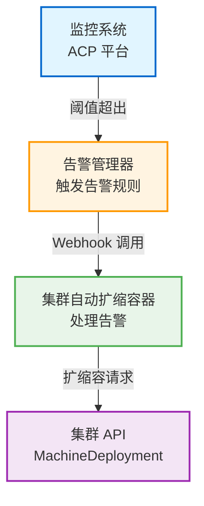

---
products:
  - Alauda Container Platform
ProductsVersion:
  - 4.2
kind:
  - Solution
id: KB260100025
sourceSHA: 6fc8cf98ee2c8138e97c999a0523b1713c220963faf1f90204a1b9e01348dc9b
---

# 集群自动扩缩容解决方案

:::warning
此解决方案目前处于 **技术预览** 阶段，不建议用于生产环境。功能和特性可能会在未来版本中发生变化。在考虑部署之前，请在非生产环境中进行充分测试。

有关生产部署规划，请联系您的 Alauda 平台支持代表。
:::

## 摘要

Alauda Container Platform 集群自动扩缩容器是一个基于告警驱动的 Kubernetes 集群自动扩缩容解决方案。通过监控 CPU 利用率和内存利用率指标，当资源阈值被突破时，该解决方案会自动触发计算节点的扩缩容。这一解决方案使企业能够实现 Kubernetes 集群的弹性资源管理，降低运营成本，提高业务连续性。

---

## 架构

### 概述

该解决方案通过以下工作流程实现事件驱动的扩缩容机制：

1. **监控阶段**：ACP 平台持续收集集群级别的 CPU 和内存利用率指标
2. **告警触发**：当指标超过阈值时，告警规则触发并通过 Webhook 发送通知
3. **扩缩容决策**：自动扩缩容器接收告警并根据配置的策略执行扩缩容（默认间隔：3600秒）
4. **资源调整**：自动扩缩容器通过 Kubernetes API 调整 MachineDeployment 的副本数量
5. **扩缩容完成**：新节点被配置并加入集群；历史记录被记录在 ConfigMap 中

### 图示



---

## 前提条件与约束

### 功能限制

| 限制                  | 描述                                                                                                                                    |
| --------------------- | ------------------------------------------------------------------------------------------------------------------------------------------ |
| **告警类型**          | 仅支持集群级别的告警（集群告警）。不支持 Pod 或其他资源级别的告警                                                                        |
| **指标类型**          | 仅支持默认指标告警（默认指标告警）。不支持自定义指标告警（自定义指标告警）                                                              |
| **集群范围**          | 仅支持来自业务集群的告警规则（业务集群）。不支持来自全球集群的告警规则（全球集群）                                                     |
| **扩缩容方向**        | 当前版本主要支持扩展（水平扩缩容）                                                                                                      |

### 扩缩容间隔限制

- **默认扩缩容间隔**：3600 秒（1 小时）
- **描述**：如果在单个集群内重复触发告警，则在扩缩容间隔内仅执行第一次扩缩容操作
- **配置**：通过组件启动命令 `--scale-interval=<seconds>` 修改间隔时间

### 多个 MachineDeployment 选择

- 当集群有多个工作节点池（即多个 MachineDeployment 资源）时，通过启动参数指定目标 MachineDeployment
- **配置参数**：
  - `--machine-deployment-selector-key=<label-key>`
  - `--machine-deployment-selector-value=<label-value>`

### 资源依赖

- **DCSIpHostnamePool**：自动扩缩容要求与 MachineDeployment 的 DCSMachineTemplate 关联的 DCSIpHostnamePool 必须有可用的 IP 地址。否则，新扩展的机器将无法创建。

---

## 开始之前

### 要求

- 已安装并运行 ACP 平台 4.2.x
- 全球集群管理员访问权限
- `kubectl` 配置为全球集群上下文
- 至少一个配置了 MachineDeployment 的业务集群
- DCSIpHostnamePool 中有可用的 IP 地址

### 所需权限

- 全球集群的集群管理员权限
- 创建 AlaudaFeatureGate 资源的权限
- 创建通知规则和告警规则的权限

---

## 安装指南

### 第 1 步：下载镜像文件

1. 登录 Alauda 客户门户
2. 导航到 Marketplace
3. 下载 **Alauda Container Platform 集群自动扩缩容器** 插件
4. 下载的文件是一个镜像归档（`.tar` 或 `.tar.gz` 格式）

### 第 2 步：加载并推送镜像

```bash
# 使用 nerdctl（containerd 原生 CLI）加载镜像
nerdctl load -i alert-triggered-autoscaler.tar

# 将镜像推送到您的 ACP 平台镜像注册表
# 注意：将 <REGISTRY_ADD> 替换为您的平台镜像注册表地址
export REGISTRY_ADD=<Replace with the platform's image registry address>
nerdctl tag registry.alauda.cn:60080/ait/alert-triggered-autoscaler:v4.0.0-beta.4.g515c3af7-arm64 \
  $REGISTRY_ADD/ait/alert-triggered-autoscaler:v4.0.0-beta.4.g515c3af7
nerdctl push $REGISTRY_ADD/ait/alert-triggered-autoscaler:v4.0.0-beta.4.g515c3af7
```

**注意：** `nerdctl` 是具有 Docker 兼容语法的 containerd 原生 CLI 工具。在继续之前，请确保您的系统上已安装 `nerdctl`。

### 第 3 步：创建 YAML 配置文件

**注意**：以下所有操作必须在 **全球集群** 中执行。

```bash
export REGISTRY_ADD=<Replace with the platform's image registry address>

cat <<EOF> alert-triggered-autoscaler.yaml
---
apiVersion: v1
kind: ServiceAccount
metadata:
  name: alert-triggered-autoscaler
  namespace: cpaas-system
---
apiVersion: rbac.authorization.k8s.io/v1
kind: ClusterRole
metadata:
  name: alert-triggered-autoscaler
rules:
  - apiGroups:
      - ""
    resources:
      - configmaps
    verbs:
      - get
      - list
      - watch
      - update
      - create
      - patch
  - apiGroups:
      - infrastructure.cluster.x-k8s.io
    resources:
      - "dcsmachinetemplates"
      - "dcsiphostnamepools"
    verbs:
      - get
      - list
      - watch
  - apiGroups:
      - cluster.x-k8s.io
    resources:
      - "machinedeployments"
    verbs:
      - get
      - list
      - watch
      - update
      - create
      - patch
---
apiVersion: rbac.authorization.k8s.io/v1
kind: ClusterRoleBinding
metadata:
  name: alert-triggered-autoscaler
roleRef:
  kind: ClusterRole
  apiGroup: rbac.authorization.k8s.io
  name: alert-triggered-autoscaler
subjects:
  - kind: ServiceAccount
    namespace: cpaas-system
    name: alert-triggered-autoscaler
---
apiVersion: apps/v1
kind: Deployment
metadata:
  labels:
    service_name: alert-triggered-autoscaler
  name: alert-triggered-autoscaler
  namespace: cpaas-system
spec:
  progressDeadlineSeconds: 600
  replicas: 1
  revisionHistoryLimit: 10
  selector:
    matchLabels:
      service_name: alert-triggered-autoscaler
  strategy:
    rollingUpdate:
      maxSurge: 1
      maxUnavailable: 1
    type: RollingUpdate
  template:
    metadata:
      creationTimestamp: null
      labels:
        service_name: alert-triggered-autoscaler
    spec:
      affinity:
        podAntiAffinity:
          requiredDuringSchedulingIgnoredDuringExecution:
          - labelSelector:
              matchExpressions:
              - key: service_name
                operator: In
                values:
                - alert-triggered-autoscaler
            topologyKey: kubernetes.io/hostname
      containers:
      - command:
        - /alert-triggered-autoscaler
        - --v=0
        # 可选：配置扩缩容间隔（默认 3600 秒）
        # - --scale-interval=3600
        # 可选：指定目标 MachineDeployment（多节点池场景）
        # - --machine-deployment-selector-key=cluster.x-k8s.io/cluster-name
        # - --machine-deployment-selector-value=<cluster-name>
        env:
        - name: POD_NAME
          valueFrom:
            fieldRef:
              apiVersion: v1
              fieldPath: metadata.name
        - name: NAMESPACE
          valueFrom:
            fieldRef:
              apiVersion: v1
              fieldPath: metadata.namespace
        image: $REGISTRY_ADD/ait/alert-triggered-autoscaler:v4.0.0-beta.4.g515c3af7
        imagePullPolicy: Always
        name: alert-triggered-autoscaler
        ports:
        - containerPort: 8080
          protocol: TCP
        resources:
          limits:
            cpu: "2"
            memory: 4Gi
          requests:
            cpu: 95m
            memory: 32Mi
        securityContext:
          runAsGroup: 697
          runAsUser: 697
        terminationMessagePath: /dev/termination-log
        terminationMessagePolicy: File
      dnsPolicy: ClusterFirst
      nodeSelector:
        kubernetes.io/os: linux
      restartPolicy: Always
      schedulerName: default-scheduler
      securityContext:
        fsGroup: 697
      serviceAccount: alert-triggered-autoscaler
      serviceAccountName: alert-triggered-autoscaler
      terminationGracePeriodSeconds: 30
      tolerations:
      - effect: NoSchedule
        key: node-role.kubernetes.io/master
        operator: Exists
      - effect: NoSchedule
        key: node-role.kubernetes.io/control-plane
        operator: Exists
      - effect: NoSchedule
        key: node-role.kubernetes.io/cpaas-system
        operator: Exists
---
apiVersion: v1
kind: Service
metadata:
  labels:
    service_name: alert-triggered-autoscaler
  name: alert-triggered-autoscaler
  namespace: cpaas-system
spec:
  internalTrafficPolicy: Cluster
  ipFamilies:
  - IPv4
  ipFamilyPolicy: SingleStack
  ports:
  - name: api
    port: 8080
    protocol: TCP
    targetPort: 8080
  selector:
    service_name: alert-triggered-autoscaler
  type: ClusterIP
EOF
```

### 第 4 步：部署自动扩缩容组件

```bash
# 应用 YAML 配置
kubectl apply -f alert-triggered-autoscaler.yaml

# 验证部署状态
kubectl get deployment alert-triggered-autoscaler -n cpaas-system
kubectl get pods -n cpaas-system -l service_name=alert-triggered-autoscaler
```

---

## 配置指南

### 第 1 步：启用平台 Webhook 功能

在全球集群的任何控制平面节点上执行以下命令：

```bash
# 启用 Webhook 模板功能
kubectl patch AlaudaFeatureGate webhook-template -n cpaas-system \
  --type='json' -p='[{"op": "replace", "path": "/spec/enabled", "value": true}]'

# 启用 Webhook 通知服务器功能
kubectl patch AlaudaFeatureGate webhook-notification-server -n cpaas-system \
  --type='json' -p='[{"op": "replace", "path": "/spec/enabled", "value": true}]'
```

### 第 2 步：创建通知模板

1. 登录 ACP 平台并进入 **管理员** 视图
2. 导航到 **运营中心 → 通知**
3. 切换到 **模板** 标签
4. 点击 **创建模板** 按钮

#### 表单配置

| 字段                          | 配置                                   |
| ----------------------------- | -------------------------------------- |
| **基本信息 → 消息类型**      | 选择 `告警消息`                        |
| **基本信息 → 语言类型**      | 默认 `英语`（无功能影响）             |
| **模板设置 → Webhook**       | 输入以下 JSON 模板                    |

#### Webhook JSON 模板

```json
{
  "annotations": {{ MarshalIndent .annotations "  " "  "}},
  "labels": {{ MarshalIndent .labels "  " "  "}},
  "startsAt": "{{ .startsAt }}",
  "endsAt": "{{ .endsAt }}",
  "status": "{{ .status }}",
  "fingerprint": "{{ .fingerprint }}",
  "generatorURL": "{{ .generatorURL }}"
}
```

其他模板类型（电子邮件、Slack 等）无需修改；保持默认值。

### 第 3 步：创建接收者组

1. 在通知页面，切换到 **接收者组** 标签
2. 点击 **创建接收者组** 按钮
3. 在 **Webhook** 输入字段中输入以下地址：

```
http://alert-triggered-autoscaler.cpaas-system.svc.cluster.local:8080/platform/alerts.cpaas.io/v1/autoscaler
```

其他可选字段可以留空。直接提交。

### 第 4 步：创建通知规则

1. 在通知页面，切换到 **规则** 标签
2. 点击 **创建规则** 按钮
3. 配置以下字段：

| 字段                   | 配置                                   |
| ---------------------- | -------------------------------------- |
| **接收者组**           | 选择在第 3 步中创建的接收者组        |
| **通知方式**           | 勾选 `Webhook`                        |
| **模板**               | 选择在第 2 步中创建的模板            |

### 第 5 步：关联告警规则

1. 导航到 **运营中心 → 告警 → 规则**
2. 切换到页面顶部的目标集群
3. 过滤名为 `cpaas-cluster-rules` 的告警规则
4. 在操作列中点击 **更新**
5. 在 **规则配置 → 通知规则** 输入框中输入并选择新创建的通知规则名称
6. 点击 **更新** 确认

### 触发条件

完成上述配置后，当以下任一告警指标达到阈值时，集群将自动执行计算节点扩缩容：

- `所有集群节点的平均 CPU 利用率`
- `所有集群节点的平均内存利用率`

---

## 验证与监控

### 验证部署状态

```bash
# 检查部署状态
kubectl get deployment alert-triggered-autoscaler -n cpaas-system

# 检查 Pod 运行状态
kubectl get pods -n cpaas-system -l service_name=alert-triggered-autoscaler

# 查看 Pod 日志
kubectl logs -n cpaas-system -l service_name=alert-triggered-autoscaler --tail=50
```

### 查看扩缩容历史

每次扩缩容操作后，自动扩缩容组件会在 ConfigMap 中记录扩缩容历史：

```bash
# 查看 ConfigMap
kubectl get configmap scale-history-config -n cpaas-system -o yaml
```

#### ConfigMap 数据结构示例

```yaml
apiVersion: v1
data:
  cluster-1: |
    [
      {
        "alert_name": "autoscaler/cluster.resource.request.cpu.utilization-4pBud",
        "scale_time": 1749189108
      },
      {
        "alert_name": "autoscaler/cluster.resource.request.cpu.utilization-4pBud",
        "scale_time": 1749191210
      }
    ]
  cluster-2: |
    [
      {
        "alert_name": "autoscaler/cluster.resource.request.cpu.utilization-4pBud",
        "scale_time": 1749189108
      }
    ]
kind: ConfigMap
metadata:
  name: scale-history-config
  namespace: cpaas-system
```

### 监控指标

| 监控项目                     | 描述                                            |
| ---------------------------- | ----------------------------------------------- |
| **Pod 状态**                 | 确保 Pod 处于 `Running` 状态                    |
| **扩缩容历史**               | 通过 ConfigMap 查看最近的扩缩容记录            |
| **MachineDeployment 副本数量** | 验证副本数量是否按预期调整                      |
| **集群节点数量**             | 确认新节点是否成功加入集群                      |

---

## 常见问题与故障排除

### 常见问题

#### Q1: 为什么在告警触发后没有进行扩缩容？

**可能原因及故障排除步骤**：

1. **检查扩缩容间隔限制**
   - 检查最近的扩缩容时间以确认是否在扩缩容间隔内（默认 3600 秒）
   - 解决方案：等待间隔到期或调整 `--scale-interval` 参数

2. **检查 MachineDeployment 状态**
   ```bash
   kubectl get machinedeployment -A
   ```

3. **检查 DCSIpHostnamePool IP 资源**
   - 确认关联的 DCSIpHostnamePool 有可用 IP
   - IP 不足将导致新节点创建失败

4. **检查自动扩缩容 Pod 日志**
   ```bash
   kubectl logs -n cpaas-system -l service_name=alert-triggered-autoscaler --tail=100
   ```

#### Q2: 如何在多个 MachineDeployment 场景中指定扩缩容目标？

**解决方案**：

修改部署启动命令以添加标签选择器参数：

```yaml
command:
  - /alert-triggered-autoscaler
  - --v=0
  - --machine-deployment-selector-key=<label-key>
  - --machine-deployment-selector-value=<label-value>
```

重新应用配置：

```bash
kubectl apply -f alert-triggered-autoscaler.yaml
```

#### Q3: 如何修改扩缩容间隔时间？

**解决方案**：

修改部署启动命令参数 `--scale-interval`：

```yaml
command:
  - /alert-triggered-autoscaler
  - --v=0
  - --scale-interval=1800  # 修改为 30 分钟
```

重新应用配置：

```bash
kubectl apply -f alert-triggered-autoscaler.yaml
```

#### Q4: 是否支持自定义指标告警？

**回答**：当前版本 **不支持** 自定义指标告警（自定义指标告警），仅支持默认指标告警（默认指标告警）：

- `所有集群节点的平均 CPU 利用率`
- `所有集群节点的平均内存利用率`

#### Q5: 是否支持全球集群的自动扩缩容？

**回答**：当前版本 **不支持** 全球集群（全球集群）告警规则触发，仅支持业务集群（业务集群）。

#### Q6: 为什么新节点创建失败？

**可能原因**：

1. **IP 地址不足**
   - 检查 DCSIpHostnamePool 中可用 IP 数量
   ```bash
   kubectl get dcsiphostnamepool -A
   ```

2. **DCSMachineTemplate 配置错误**
   - 验证 DCS VM 模板是否有效
   - 检查 MachineDeployment 与 DCSMachineTemplate 之间的关联

3. **底层 DCS 平台资源限制**
   - 确认 DCS 平台配额和资源限制

### 故障排除检查清单

- [ ] 自动扩缩容 Pod 是否处于 `Running` 状态？
- [ ] Webhook URL 是否配置正确？
- [ ] 通知规则是否与告警规则关联？
- [ ] 告警规则是否启用并触发？
- [ ] 是否在扩缩容间隔限制内？
- [ ] DCSIpHostnamePool 是否有可用 IP？
- [ ] MachineDeployment 标签选择器是否正确？
